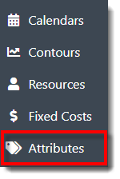
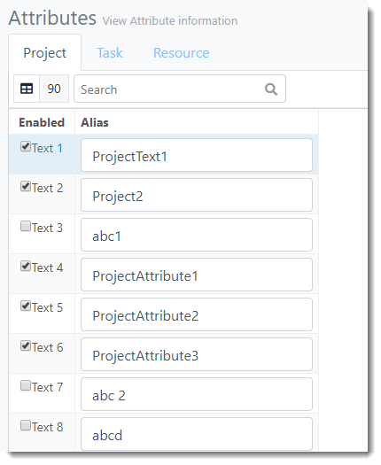



You are here: Attributes

----
## Attributes 

The Attributes view allows users to create categories that can be used to filter and stack certain aspects of the project in the output results. Attributes are variables associated with an object such as size, condition, or other descriptors. This added layer is useful, as you can view and organize simulation results by attributes in the output reports. Attributes are also used to carry information for decision making or output reporting. 

This view consists of three tabs - one per each Object Type: **Project**, **Task** and **Resource**. For each Object Type, the user can define a certain number of each Attribute Type: **Text**, **Flag**, **Number**, or **Date**. 

### _Navigation_
**1.** Select the **Attributes link** in the navigation pane on the left-hand side of the screen. 

**2.** The user is directed to the Attributes view, as depicted below.

### _Terminology_
- **Project**: One of three Object Types an Attribute may reference. Select the Project, Task or Resource tab to enter an associated Attribute.
 
- **Task**: One of three Object Types an Attribute may reference. Select the Project, Task or Resource tab to enter an associated Attribute.
- **Resource**: One of three Object Types an Attribute may reference. Select the Project, Task or Resource tab to enter an associated Attribute.
- **Enabled**: When this checkbox is selected, the Attribute is enabled throughout the PMAD application.
- **Alias**: A unique name identifying the Attribute. 

##
Related Content: 

- [Define and Enable Attribute](C:/_git/ProModelAutodeskEdition/PorfolioSimulator.Help/wwwroot/Help/Docs/Attributes/DefineAttribute/DefineAttribute.md)
- [Disable Attribute](C:/_git/ProModelAutodeskEdition/PorfolioSimulator.Help/wwwroot/Help/Docs/Attributes/DisableAttribute/DisableAttribute.md)
- [Search Attributes](C:/_git/ProModelAutodeskEdition/PorfolioSimulator.Help/wwwroot/Help/Docs/Attributes/SearchAttributes/SearchAttributes.md)

##
 &copy; 2020 ProModel Corporation  705 E Timpanogos Parkway  Orem, UT 84097  Support: 888-776-6633  www.promodel.com {style ="align: left"}

