

You are here: [Attributes](C:/_git/ProModelAutodeskEdition/ProModelAutodeskEdition.Help/wwwroot/Help/Docs/Attributes/Attributes.md) > Define and Enable Attribute

----
### _Define and Enable Attribute_ 

**Please note that the Attribute must be defined and enabled within the PMAD application prior to Project import.*

**1.** From the Attributes page, select the desired **Object Type tab** for the new Attribute. In the example below, the user intends to define a Project Attribute. 

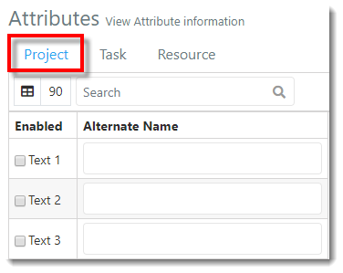

**2.** Scroll down to view the additional Attribute Types. The Attribute Types are listed in the following order from the top to bottom of the screen: Text, Number, Flag, and Date. 
Locate the desired Attribute Type and key in the **Attribute Alias** (note that this must match column header in the Excel import template) in the next available (blank) Alias field. In the example below, the user is defining the Project Text Attribute Alias so the corresponding values entered in the Excel template display in PMAD once the file is imported.

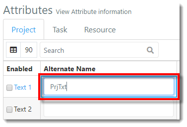

**3.** A green pop-up notification displays, indicating the Attribute Project Text (#) Alias name has been updated.

**4.** Enable the Attribute throughout the PMAD application by selecting the **'Enabled' checkbox** to the left of the corresponding Alias field. If not enabled, the Attribute will not display in the Repository.

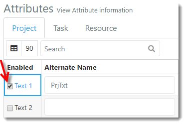

**5.** A green pop-up notification displays, indicating the Attribute Project Text (#) has been enabled. 

**6.** The user now needs to add the Attribute to the Excel file to be imported, aligned with the associated Project or Task. Attributes are entered in the Task Information sheet of the Excel template.
Key in the **"PrjTxt" Attributes** (column header must match Alias entered in PMAD). Note that the additional Attributes shown in the Excel template in this example have not been enabled in PMAD.

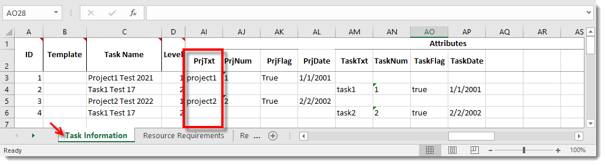

**7.** Save the Excel template once all desired fields are complete. Select **File** > **Save As** > and select the **save destination**. 

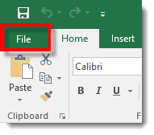  

**8.** The 'Save As' modal populates. Key in the desired **file name** and select the **save button** in the lower right-hand corner of the modal.

**9.** In PMAD, select the **Repository link** in the navigation pane on the left-hand side of the screen. 

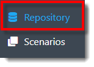

**10.** The user is directed to the Repository view. Select the **Import** button.  

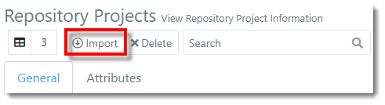

**11.** The Excel Import modal populates. Drag the desired Excel file to the Excel Import modal (and skip step 12), or select the text **"click to Browse"**.

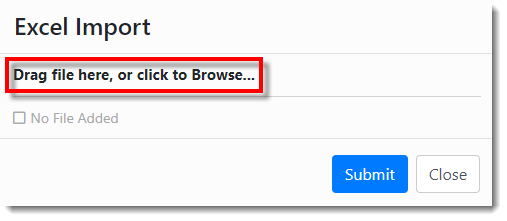

**12.** The File Explorer modal populates. Select the **Excel Import Template**, then select **Open**.

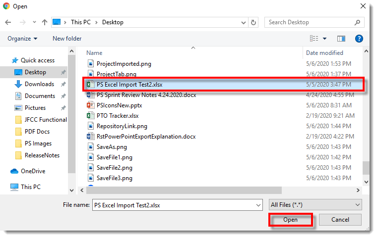

**13.** The file is selected for upload in the Excel Import modal. Select **Submit** to import the file.

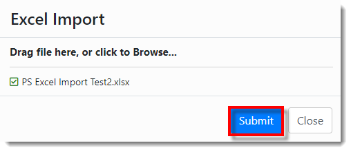

**14.** An 'Import Job Created' notification populates, as depicted below.

**15**. The user is directed to the Diagnostics view. In the Jobs table, locate the recently created **Import Job** (Import "file name"). 

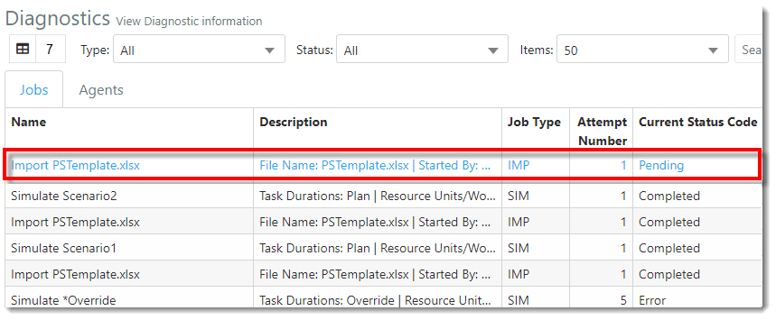

**16.** Once the **Current Status Code** displays as **Completed**, the file has been successfully imported into PMAD.

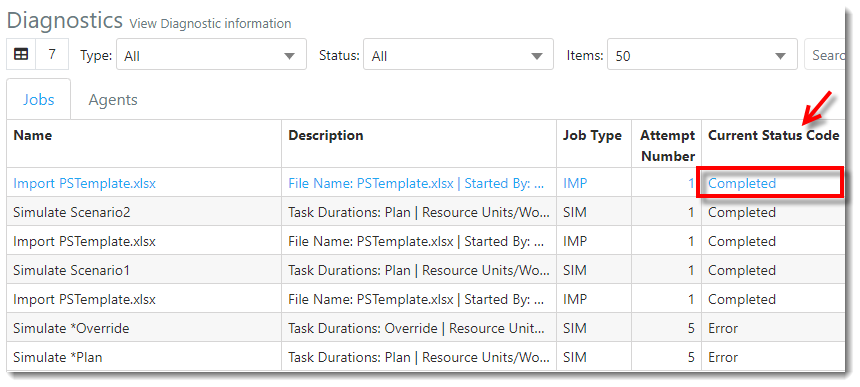

**17.** Select the **Respository link** displayed in the navigation pane on the left-hand side of the screen.

**18.** The Project(s) and associated Task(s) appear in the Repository Projects and Repository Project Tasks tables.

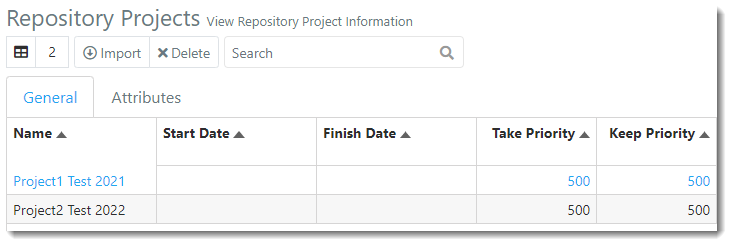

**19.** From the Repository Projects table, select the **Attributes** tab. 

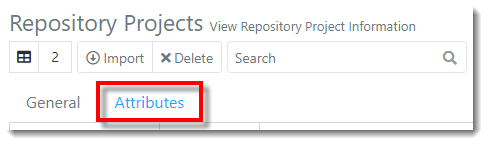

**20.** The enabled Attributes display, reflecting the value entered in the Excel import. 

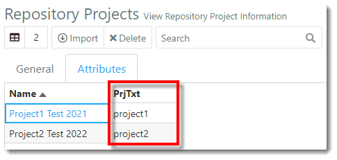

##
Related Content: 

- [Attributes (overivew)](C:/_git/ProModelAutodeskEdition/ProModelAutodeskEdition.Help/wwwroot/Help/Docs/Attributes/Attributes.md)
- [Disable Attribute](C:/_git/ProModelAutodeskEdition/PorfolioSimulator.Help/wwwroot/Help/Docs/Attributes/DisableAttribute/DisableAttribute.md)
- [Search Attributes](C:/_git/ProModelAutodeskEdition/PorfolioSimulator.Help/wwwroot/Help/Docs/Attributes/SearchAttributes/SearchAttributes.md)

---
 &copy; 2020 ProModel Corporation  705 E Timpanogos Parkway  Orem, UT 84097  Support: 888-776-6633  www.promodel.com {style ="align: left"}

