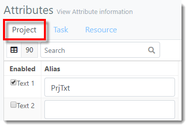
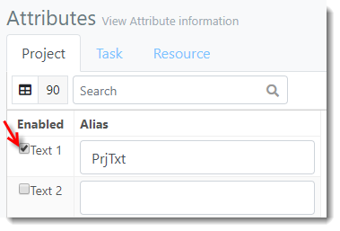
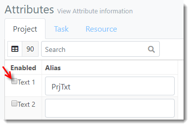
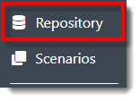
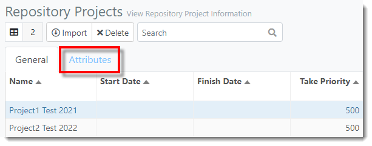
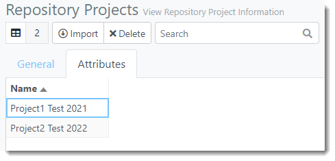



You are here: [Attributes](C:/_git/ProModelAutodeskEdition/PorfolioSimulator.Help/wwwroot/Help/Docs/Attributes/Attributes.md) > Disable Attribute

----
### _Disable Attribute_ 

**1.** From the Attributes view, select the **Object Type tab** of the Attribute to be disabled. In the example below, the user intends to delete a Project Attribute.

**2.** Locate the Attribute to be disabled. De-select the corresponding **Enabled checkbox** to disable the Attribute in the application.

 

**3.** A green pop-up notification displays, indicating the Attribute Project Text (#) has been disabled.

**4.** Select the **Repository link** in the navigation pane on the left-hand side of the screen.

**5.** The user is directed to the Repository view. Select the **Attributes tab** in the Repository Projects table.

**6.** The disabled Attribute column is no longer displayed, as depicted in the image below.

##
Related Content: 
- [Attributes (overivew)](C:/_git/ProModelAutodeskEdition/PorfolioSimulator.Help/wwwroot/Help/Docs/Attributes/Attributes.md)
- [Define/Enable Attribute](C:/_git/ProModelAutodeskEdition/PorfolioSimulator.Help/wwwroot/Help/Docs/Attributes/DefineAttribute/DefineAttribute.md)
- [Search Attributes](C:/_git/ProModelAutodeskEdition/PorfolioSimulator.Help/wwwroot/Help/Docs/Attributes/SearchAttributes/SearchAttributes.md)

##
 &copy; 2020 ProModel Corporation  705 E Timpanogos Parkway  Orem, UT 84097  Support: 888-776-6633  www.promodel.com {style ="align: left"}

