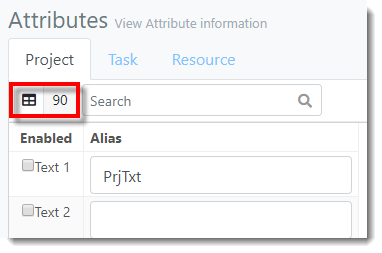

You are here: [Attributes](C:/_git/ProModelAutodeskEdition/PorfolioSimulator.Help/wwwroot/Help/Docs/Attributes/Attributes.md) > Search Attributes

----
### _Search Attributes_ 

**1.** From the Attributes view, select the **Object Type tab** in which you would like to search. In this example, the user intends to search the Project Attributes. 

**2.** The The Project Attributes **item count** is displayed in the top left of the toolbar. This number represents the number of Project Attributes available, whether or not the Attribute is defined or enabled (90).

**3.** Key in the Attribute Alias in the **Search bar** at the top of the tab. Results auto populate as criteria is entered. **Search encompasses values in both the Enabled and Alias columns.*

**4.** Notice the **item count** updates to correspond with the number of items found in the search results (10). 

**5.** To clear the search, hover the cursor over the **search bar**, then select the **X** displayed within.

##
Related Content: 
- [Attributes (overview)](C:/_git/ProModelAutodeskEdition/PorfolioSimulator.Help/wwwroot/Help/Docs/Attributes/Attributes.md)
- [Define and Enable Attribute](C:/_git/ProModelAutodeskEdition/PorfolioSimulator.Help/wwwroot/Help/Docs/Attributes/DefineAttribute/DefineAttribute.md)
- [Disable Attribute](C:/_git/ProModelAutodeskEdition/PorfolioSimulator.Help/wwwroot/Help/Docs/Attributes/DisableAttribute/DisableAttribute.md)

##
 &copy; 2020 ProModel Corporation  705 E Timpanogos Parkway  Orem, UT 84097  Support: 888-776-6633  www.promodel.com {style ="align: left"}

