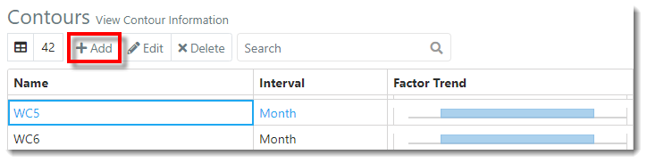
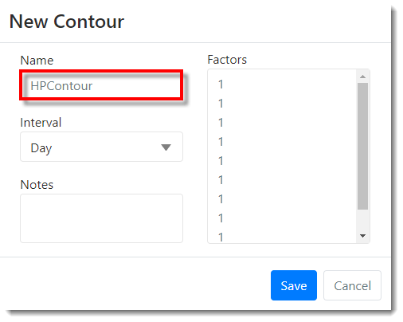
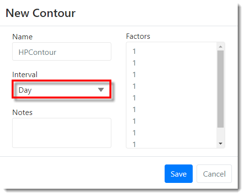
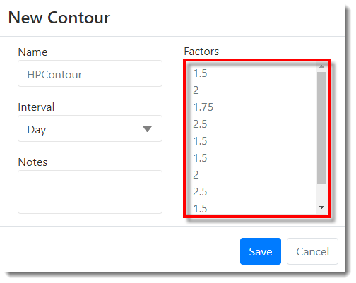
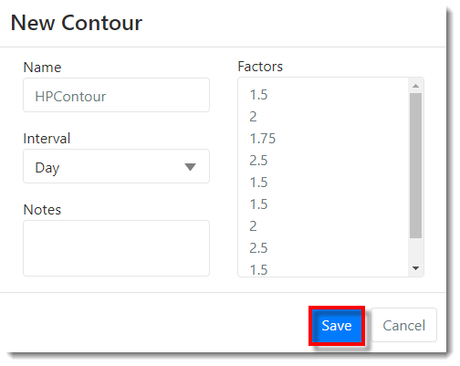
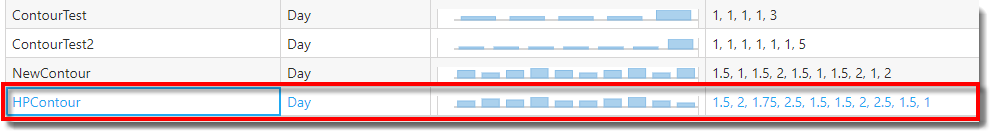



You are here: [Contours](C:/_git/ProModelAutodeskEdition/PorfolioSimulator.Help/wwwroot/Help/Docs/Contours/Contours.md) > Add Contour

----
## _**Add Contour**_ 

**1.** From the Contours view, select the **Add button** located in the Contours toolbar.

**2.** The New Contour modal populates. Key in the **Contour Name** (must be unique).

**3.** Select the **Interval drop-down**, then select the desired **Interval** (Day / Week / Month / Quarter / Year).

**4.** Key in the desired **Factors** (the default is 10 factors of 1). 

**5.** Once all Contour data has been entered, select **Save**.

**6.** The newly added Contour appears at the bottom of the Contours table, as depicted in the image below. The Factor Trend displays within the newly added Contour row.

---

**Related Content**:
* [Contours (overview)](C:/_git/ProModelAutodeskEdition/PorfolioSimulator.Help/wwwroot/Help/Docs/Contours/Contours.md)
* [Edit Contour](C:/_git/ProModelAutodeskEdition/PorfolioSimulator.Help/wwwroot/Help/Docs/Contours/EditContour/EditContour.md)
* [Delete Contour](C:/_git/ProModelAutodeskEdition/PorfolioSimulator.Help/wwwroot/Help/Docs/Contours/DeleteContour/DeleteContour.md)
* [Search Contours](C:/_git/ProModelAutodeskEdition/PorfolioSimulator.Help/wwwroot/Help/Docs/Contours/SearchContours/SearchContours.md)

---

 &copy; 2020 ProModel Corporation  705 E Timpanogos Parkway  Orem, UT 84097  Support: 888-776-6633  www.promodel.com {style ="align: left"}

