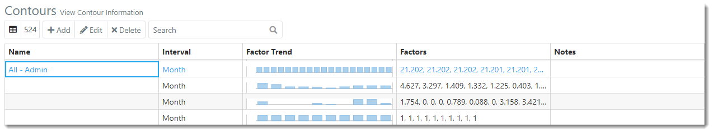

You are here: Contours

----
# **Contours** 

Contours represent a reusable list of factors applied at regular intervals to such things as cycle times,
survival percentages, revenues, resource standard rates, resource assignments and resource capacities. 
The contours created can then be applied in the Resources, Repository and Scenarios sections of ProModel AutoCAD Edition.  

### _**Contour Examples**_

* If a task has a Base Survival % of 50, the user may apply a contour to it in order to change 
the Base Survival % over time. 
 
* Assume a research resource is assigned to work on a task. 
The researcher may not do a lot of work at the beginning of the assignment, but as a deadline approaches,
the resource may devote all of its available time to work on the assignment. This is an example of a 
back-loaded work contour.

### _**Navigation**_

**1.** After logging in, select the **Contours link** from the navigation pane located on the left-hand side of the screen.

**2.** The user is directed to the Contours view, as depicted in the image below.

### _**Terminology**_

**Name**: The Contour name should uniquely identify the contour. This name is used when assigning contours to tasks, resource requirements, or scenarios.
It may be helpful to name the contour after the factors it uses, or the area in the portfolio it will be 
applied to.  

**Interval**: Specifies whether the time values defined represent days, weeks, months, quarters,
or years.  

**Factor Trend**: Represented via proportionately sized bars displayed in the Contours table. 
This makes it easier to visualize contour trends.

**Factors**: Represent the multiplication factor applied at the specified time value, or in the case of a 
work contour, for the given segment. For example, when applying duration contour, if a task is five months 
long and the contour has 10 factors with monthly intervals, when the task starts duration simulation it 
will be multiplied by the contour factor for the task start date, only five factors will be applied and 
the remaining factors will be ignored.

**Notes**: The user may add notes to each Contour (not required).

---

**Related Content**:
* [Add Contour](C:/_git/ProModelAutodeskEdition/PorfolioSimulator.Help/wwwroot/Help/Docs/Contours/AddContour/AddContour.md)
* [Edit Contour](C:/_git/ProModelAutodeskEdition/PorfolioSimulator.Help/wwwroot/Help/Docs/Contours/EditContour/EditContour.md)
* [Delete Contour](C:/_git/ProModelAutodeskEdition/PorfolioSimulator.Help/wwwroot/Help/Docs/Contours/DeleteContour/DeleteContour.md)
* [Search Contours](C:/_git/ProModelAutodeskEdition/PorfolioSimulator.Help/wwwroot/Help/Docs/Contours/SearchContours/SearchContours.md)

---

 &copy; 2020 ProModel Corporation  705 E Timpanogos Parkway  Orem, UT 84097  Support: 888-776-6633  www.promodel.com {style ="align: left"}

