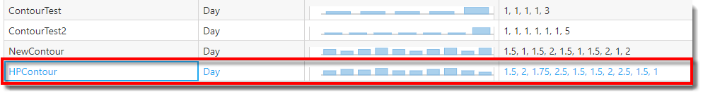
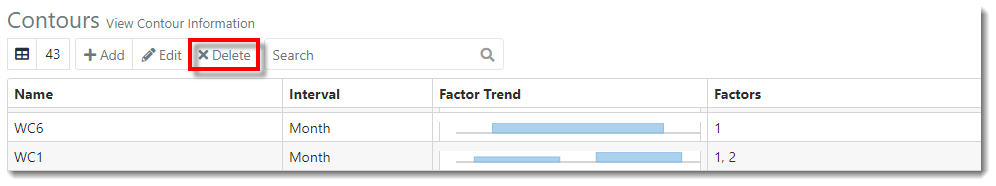
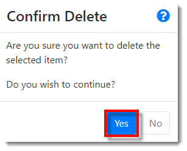
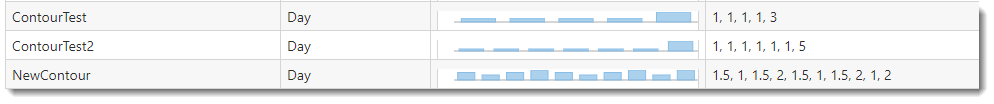



You are here: [Contours](C:/_git/ProModelAutodeskEdition/PorfolioSimulator.Help/wwwroot/Help/Docs/Contours/Contours.md) > Delete Contour

----
## _**Delete Contour**_ 

**1.** Select the **Contour** to be deleted from the Contours table. The selected Contour is indicated with a blue highlight.

**2.** Next, select the **Delete button** located in the toolbar.

**3.** A 'Confirm Delete' modal window populates. Select **Yes** to continue and delete the Contour.

**4.** The deleted Contour no longer appears in the Contours table.

---

**Related Content**:
* [Contours (overview)](C:/_git/ProModelAutodeskEdition/PorfolioSimulator.Help/wwwroot/Help/Docs/Contours/Contours.md)
* [Add Contour](C:/_git/ProModelAutodeskEdition/PorfolioSimulator.Help/wwwroot/Help/Docs/Contours/AddContour/AddContour.md)
* [Edit Contour](C:/_git/ProModelAutodeskEdition/PorfolioSimulator.Help/wwwroot/Help/Docs/Contours/EditContour/EditContour.md)
* [Search Contours](C:/_git/ProModelAutodeskEdition/PorfolioSimulator.Help/wwwroot/Help/Docs/Contours/SearchContours/SearchContours.md)

---

 &copy; 2020 ProModel Corporation  705 E Timpanogos Parkway  Orem, UT 84097  Support: 888-776-6633  www.promodel.com {style ="align: left"}

