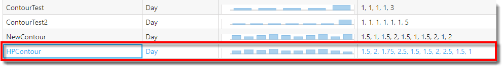
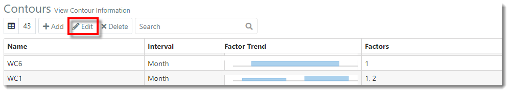
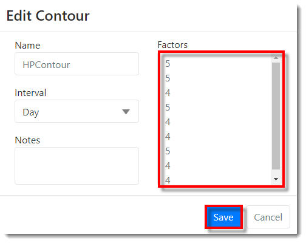
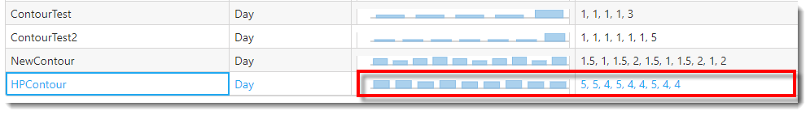



You are here: [Contours](C:/_git/ProModelAutodeskEdition/PorfolioSimulator.Help/wwwroot/Help/Docs/Contours/Contours.md) > Edit Contour

----
## _**Edit Contour**_ 

**1.** Select a **Contour** to be edited from the Contours table. The selected Contour is indicated with a blue highlight.

**2.** Next, select the **Edit button** located in the toolbar *(alternatively, double-click the Contour row to open the Edit Contour modal)*.

**3.** The Edit Contour modal populates as depicted in the image below. Make the desired changes. 
In the example below, the user intends to change the Contour **Factors**.  Once complete, select **Save**. 

**4.** The Contour factors are updated, as depicted in the image below.

---

**Related Content**:
* [Contours (overview)](C:/_git/ProModelAutodeskEdition/PorfolioSimulator.Help/wwwroot/Help/Docs/Contours/Contours.md)
* [Add Contour](C:/_git/ProModelAutodeskEdition/PorfolioSimulator.Help/wwwroot/Help/Docs/Contours/AddContour/AddContour.md)
* [Delete Contour](C:/_git/ProModelAutodeskEdition/PorfolioSimulator.Help/wwwroot/Help/Docs/Contours/DeleteContour/DeleteContour.md)
* [Search Contours](C:/_git/ProModelAutodeskEdition/PorfolioSimulator.Help/wwwroot/Help/Docs/Contours/SearchContours/SearchContours.md)

---

 &copy; 2020 ProModel Corporation  705 E Timpanogos Parkway  Orem, UT 84097  Support: 888-776-6633  www.promodel.com {style ="align: left"}

