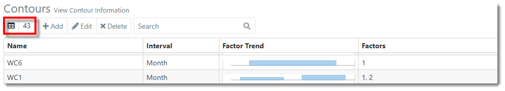
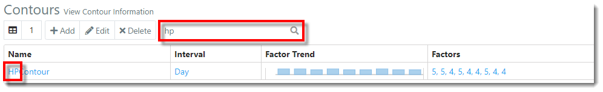
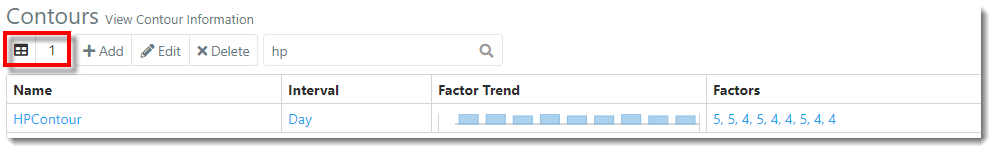
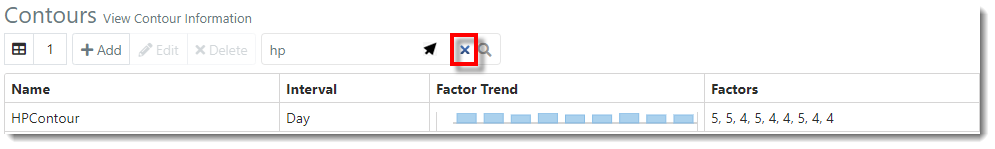



You are here: [Contours](C:/_git/ProModelAutodeskEdition/PorfolioSimulator.Help/wwwroot/Help/Docs/Contours/Contours.md) > Search Contours

----
## _**Search Contours**_ 

**1.** The Contours **Item Count** is displayed in the top left of the toolbar. 
This number represents the number of Contours available (23).

**2.** Users may search the Contours table by Contour name. 
Simply key in the Contour name in the **search bar** located in the toolbar. 
Search results populate as criteria is entered. 

**3.** Note that the **Item Count** updates to reflect the number of Contours displayed in the search results (1).

**4.** To clear the search, hover the cursor over the **search bar**, then select the **X** displayed within.

---

**Related Content**:
* [Contours (overview)](C:/_git/ProModelAutodeskEdition/PorfolioSimulator.Help/wwwroot/Help/Docs/Contours/Contours.md)
* [Add Contour](C:/_git/ProModelAutodeskEdition/PorfolioSimulator.Help/wwwroot/Help/Docs/Contours/AddContour/AddContour.md)
* [Edit Contour](C:/_git/ProModelAutodeskEdition/PorfolioSimulator.Help/wwwroot/Help/Docs/Contours/EditContour/EditContour.md)
* [Delete Contour](C:/_git/ProModelAutodeskEdition/PorfolioSimulator.Help/wwwroot/Help/Docs/Contours/DeleteContour/DeleteContour.md)

---

 &copy; 2020 ProModel Corporation  705 E Timpanogos Parkway  Orem, UT 84097  Support: 888-776-6633  www.promodel.com {style ="align: left"}

