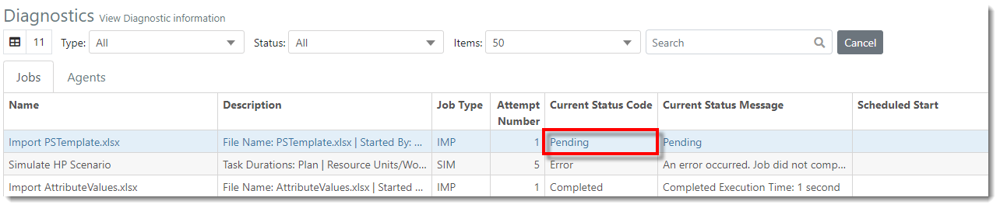
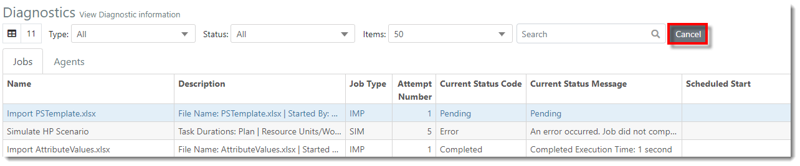
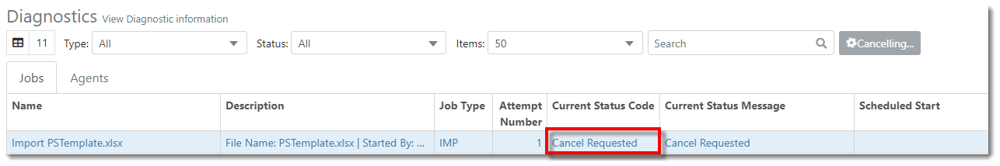



You are here: [Diagnostics](C:/_git/ProModelAutodeskEdition/PorfolioSimulator.Help/wwwroot/Help/Docs/Diagnostics1/Diagnostics.md) > Clear Pending Job

----
## _**Clear Pending Job**_ 

**1.** After importing or simulating a scenario, the user may wish to cancel the Job. This is possible while the Job is still in **Pending** status. 

**2.** Select the **Cancel button** located on the right-side of the toolbar to cancel the Job.

**3.** A 'succeeded to cancel job' message populates, as depicted below.

**4.** In the table, the Job status updates to "Cancel Requested". 

---

**Related Content**:
- [Diagnostics (overview)](C:/_git/ProModelAutodeskEdition/PorfolioSimulator.Help/wwwroot/Help/Docs/Diagnostics1/Diagnostics.md)
- [Filter and Search Diagnostics](C:/_git/ProModelAutodeskEdition/PorfolioSimulator.Help/wwwroot/Help/Docs/Diagnostics1/SearchDiagnostics/SearchDiagnostics.md)

---

  &copy; 2020 ProModel Corporation  705 E Timpanogos Parkway  Orem, UT 84097  Support: 888-776-6633  www.promodel.com {style ="align: left"}

