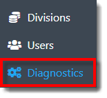
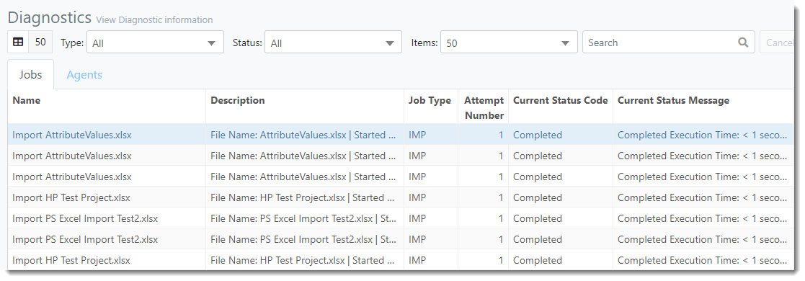



You are here: Diagnostics

----
# **Diagnostics** 

The Diagnostics view displays the Jobs executed within a Division of PMAD. Here, the user can see which Import and/or Simulation Jobs are pending, completed, or resulted in error. A description, status code, status message and start/finish date and time is displayed for each Job listed.

### _**Navigation**_

**1.** Select the **Diagnostics link** in the navigation pane on the left-hand side of the screen.

**2.** The user is directed to the Diagnostics view, as displayed in the image below.

### _**Terminology**_
##
###### **Jobs Tab**:
- **Name**: Name of the Job.

- **Description**: Description of the Job.
- **Job Type**: Job type (Import or Simulate).
- **Attempt Number**: Number of attempts made to complete the Job.
- **Current Status Code**: Status of the Job (Pending, Completed, Canceled, Error)
- **Current Status Message**: Message regarding Job Status (Completed Execution Time, Error Description, etc.).
- **Started**: Date and time the Job started. 
- **Finished**: Date and time the Job finished.
- **Is Recurring**: Checkbox selected if the Job is recurring within PMAD.
- **Is Enabled**: Checkbox selected if the Job is enabled within PMAD.
- **Recurrence Invterval Seconds**: Number of seconds between each recurrence. 
- **Recurrence End Date**: Date and Time the Recurrence ends.
- **Assigned Agent**: Name of Assigned Agent (if applicable).

##
###### **Agents Tab**:
- **Agent Name**: Name of the Agent (executes the Jobs).

- **Host Name**: Name of the Site Host (computer the Agent performs Jobs on).
- **Max Capacity**: Number of Jobs the Agent can execute simultaneously.
- **Load**: Current number of Jobs the Agent is performing. 
- **Registered**: Date and time the Agent was created.
- **Refreshed**: Most recent date and time the Agent checked on new Jobs and updated the status of current Jobs.

---

**Related Content**:
- [Filter and Search Diagnostics](C:/_git/ProModelAutodeskEdition/PorfolioSimulator.Help/wwwroot/Help/Docs/Diagnostics1/SearchDiagnostics/SearchDiagnostics.md)
- [Clear Pending Job](C:/_git/ProModelAutodeskEdition/PorfolioSimulator.Help/wwwroot/Help/Docs/Diagnostics1/ClearJob/ClearJob.md)

---

  &copy; 2020 ProModel Corporation  705 E Timpanogos Parkway  Orem, UT 84097  Support: 888-776-6633  www.promodel.com {style ="align: left"}

