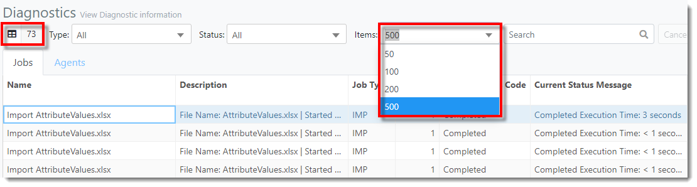
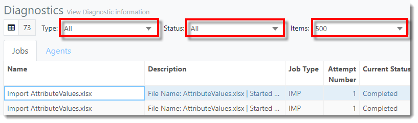
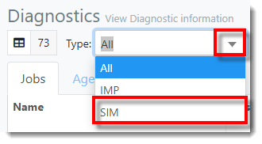
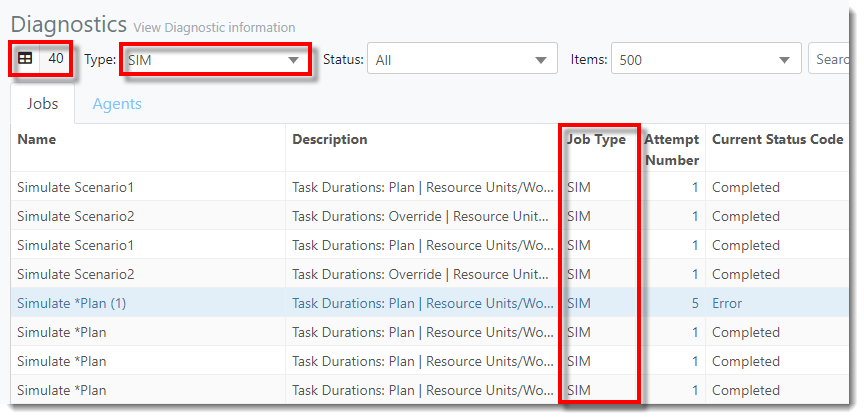
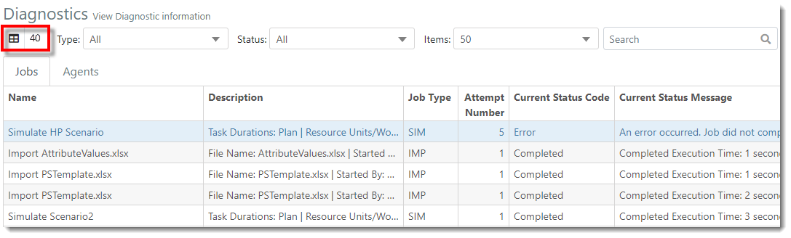
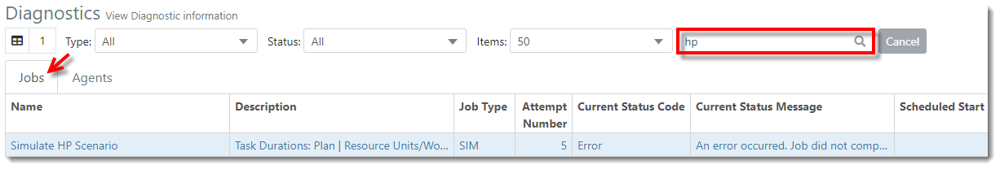
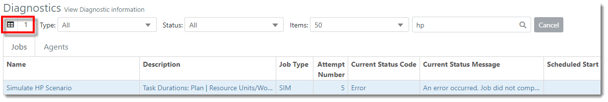
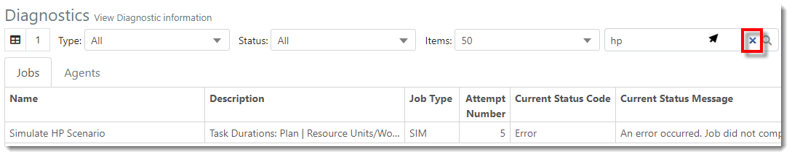



You are here: [Diagnostics](C:/_git/ProModelAutodeskEdition/PorfolioSimulator.Help/wwwroot/Help/Docs/Diagnostics1/Diagnostics.md) > Filter and Search Diagnostics

----
## _**Filter and Search Diagnostics**_ 

### **Filter**

**1.** The **Item Count** is displayed in the top-left corner of the Diagnostics view. The Item Count represents the number of Jobs displayed in the table (73). **Note: the number of Jobs displayed is dependant on the **Items drop-down selection**. Users may choose to view 50, 100, 200 or 500 Jobs (if available).*

**2.** The user may filter the Jobs table by the following drop-downs: **Type**, **Status** and **Items**.

**3.** In the example below, the user intends to search Jobs by Type: SIM (Simulate). Therefore, the user would select **SIM** from the **Type drop-down**. 

**4.** The table updates to display only those Jobs with a **Job Type** = **SIM**, as depicted below. Note that the **Item Count** at the top-left corner of the screen has updated to reflect the number of Jobs displayed with the current filter (40)

### **Search**
**1.** The **Item Count** is displayed in the top-left corner of the Jobs table. The Item Count represents the number of Jobs executed in the Division (40). 

**2.** Users may search the Jobs table found in the Diagnostics view. With the Jobs tab selected, enter the criteria in the **search bar** located in the toolbar. Results auto populate as criteria is entered.

**3.** Note that the **Item Count** at the top-left corner of the screen has updated to reflect the number of Jobs displayed in the search results (1).

**4.** To clear the search, hover the cursor over the **search bar** and select the **X** displayed within.

---

**Related Content**:
- [Diagnostics (overview)](C:/_git/ProModelAutodeskEdition/PorfolioSimulator.Help/wwwroot/Help/Docs/Diagnostics1/Diagnostics.md)
- [Clear Pending Job](C:/_git/ProModelAutodeskEdition/PorfolioSimulator.Help/wwwroot/Help/Docs/Diagnostics1/ClearJob/ClearJob.md)

---

  &copy; 2020 ProModel Corporation  705 E Timpanogos Parkway  Orem, UT 84097  Support: 888-776-6633  www.promodel.com {style ="align: left"}

