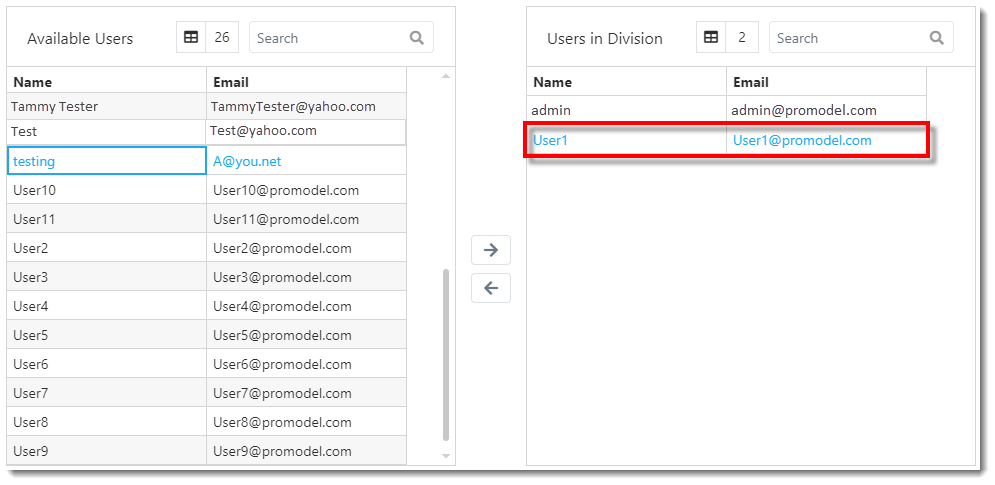

You are here: [Divisions](C:/_git/ProModelAutodeskEdition/PorfolioSimulator.Help/wwwroot/Help/Docs/Divisions1/Divisions.md) > Add Division

---

## _**Add Division**_ 

**1.** From the Divisions page, select the **Add button** from the Divisions toolbar.

**2.** The New Division modal populates. Key in the **Division Name** (must be unique). 

**3.** The user creating the Division is automatically added to the Division, as depicted below. Select a **user name** in the Available Users table, then select the **right-facing arrow** to add an additional user to the new Division.

**4.** The user is removed from the 'Available Users' table to the 'Users in Division' table, as depicted in the image below.

**5.** Add any applicable notes or comments to the **Notes section** at the top-right of the modal window (optional).

**6.** Once all desired users have been added to the Division and all required fields are complete, select **Save** at the bottom-right corner of the modal.

**7.** The newly added Division appears at the bottom of the Divisions table, as depicted below. Select the new **Division**.

**8.** The users with access to the selected Division appear in the **Users in Division table**.

**9.** Note that the current Division view changes to the newly added Division upon saving *(if the user is included in the Division)*.

---

**Related Content**:
* [Divisions (overview)](C:/_git/ProModelAutodeskEdition/PorfolioSimulator.Help/wwwroot/Help/Docs/Divisions1/Divisions.md)
* [Edit Division](C:/_git/ProModelAutodeskEdition/PorfolioSimulator.Help/wwwroot/Help/Docs/Divisions1/EditDivision/EditDivision.md)
* [Delete Division](C:/_git/ProModelAutodeskEdition/PorfolioSimulator.Help/wwwroot/Help/Docs/Divisions1/DeleteDivision/DeleteDivision.md)
* [Search Divisions](C:/_git/ProModelAutodeskEdition/PorfolioSimulator.Help/wwwroot/Help/Docs/Divisions1/SearchDivisions/SearchDivisions.md)

---
 &copy; 2020 ProModel Corporation  705 E Timpanogos Parkway  Orem, UT 84097  Support: 888-776-6633  www.promodel.com {style ="align: left"}

