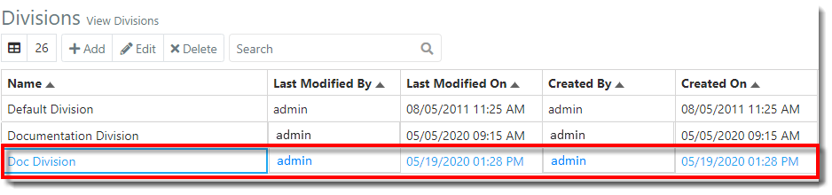
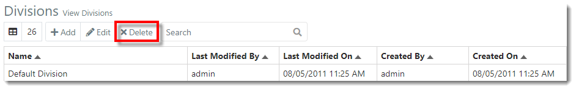
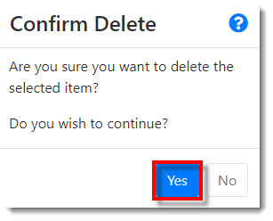
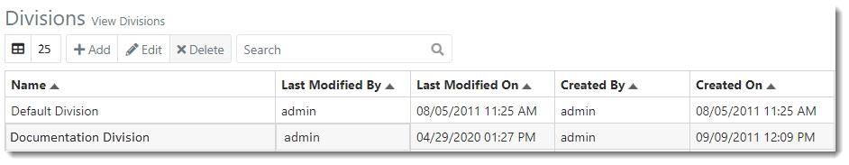



You are here: [Divisions](C:/_git/ProModelAutodeskEdition/PorfolioSimulator.Help/wwwroot/Help/Docs/Divisions1/Divisions.md) > Delete Division

----

## _**Delete Division**_ 

**1.** Select the **Division** to be deleted from the Divisions table. The selected Division is indicated with a blue highlight. **Note: Users cannot delete the Division currently in use. The user will be prompted to change the Division via the drop-down at the top-right corner of the screen.*

**2.** Next, select the **Delete button** located in the Divisions table toolbar.

**3.** A 'Confirm Delete' modal window populates. Select **Yes** to continue and delete the Division.

**4.** The deleted Division no longer appears in the Divisions table.

---

**Related Content**:
* [Divisions (overview)](C:/_git/ProModelAutodeskEdition/PorfolioSimulator.Help/wwwroot/Help/Docs/Divisions1/Divisions.md)
* [Add Division](C:/_git/ProModelAutodeskEdition/PorfolioSimulator.Help/wwwroot/Help/Docs/Divisions1/AddDivision/AddDivision.md)
* [Edit Division](C:/_git/ProModelAutodeskEdition/PorfolioSimulator.Help/wwwroot/Help/Docs/Divisions1/EditDivision/EditDivision.md)
* [Search Divisions](C:/_git/ProModelAutodeskEdition/PorfolioSimulator.Help/wwwroot/Help/Docs/Divisions1/SearchDivisions/SearchDivisions.md)

---

 &copy; 2020 ProModel Corporation  705 E Timpanogos Parkway  Orem, UT 84097  Support: 888-776-6633  www.promodel.com {style ="align: left"}

