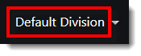
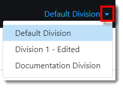
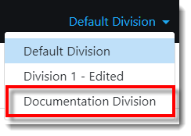
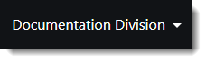
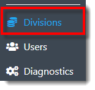
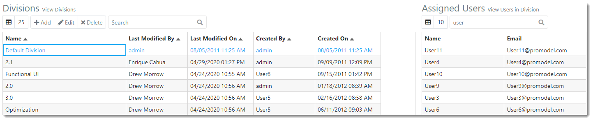



You are here: Divisions

----
# **Divisions** 

Within an organization there may be different groups of users who would like to use the same instance of ProModel AutoCAD Edition (PMAD), 
but with unique and separate data. PMAD now supports ‘Divisions’, which represent individual sets of project data 
within the same instance of PMAD. Users can be granted access to multiple Divisions as needed, and switch between 
Divisions while using PMAD.  

Users with access to multiple Divisions may navigate to another Division via the Division drop-down located at 
the top right of the PMAD toolbar.

### _**Change Division**_

**1.** After logging into PMAD, the current **Division** displays in the top-right corner of the PMAD toolbar. 

**2.** Select the **Division drop-down**. The Division options display in the drop-down and the current Division is indicated with a blue highlight. The user will only be able to access projects within the currently selected Division. 

**3.** Select the desired **Division** from the drop-down.

**4.** Data displayed throughout ProModel AutoCAD Edition now reflects the currently selected Division. 
The currently selected Division is displayed in the top right of the PMAD toolbar, as depicted below.

### _**Navigation**_

**1.** After loggin into PMAD, select the **Divisions link** displayed in the navigation pane on the left-hand side of the screen.

**2.** The user is directed to the Divisions view, as depicted in the image below.

### _**Terminology**_

**Name**: Each Division requires a unique name. It may be helpful to utilize a name that indicates the user group assigned to the Division.   

**Last Modified By**: The user that last made changes to the Division.

**Last Modified On**: Date the Division was last changed.

**Created By**: The user that created the Division.

**Created On**: Date the Division was created.

**Assigned Users**: Each Division is comprised of Assigned Users. These are the only users with access to the projects, portfolios, etc. found within the Division.

---

**Related Content**:
* [Add Division](C:/_git/ProModelAutodeskEdition/PorfolioSimulator.Help/wwwroot/Help/Docs/Divisions1/AddDivision/AddDivision.md)
* [Edit Division](C:/_git/ProModelAutodeskEdition/PorfolioSimulator.Help/wwwroot/Help/Docs/Divisions1/EditDivision/EditDivision.md)
* [Delete Division](C:/_git/ProModelAutodeskEdition/PorfolioSimulator.Help/wwwroot/Help/Docs/Divisions1/DeleteDivision/DeleteDivision.md)
* [Search Divisions](C:/_git/ProModelAutodeskEdition/PorfolioSimulator.Help/wwwroot/Help/Docs/Divisions1/SearchDivisions/SearchDivisions.md)

---
 &copy; 2020 ProModel Corporation  705 E Timpanogos Parkway  Orem, UT 84097  Support: 888-776-6633  www.promodel.com {style ="align: left"}

