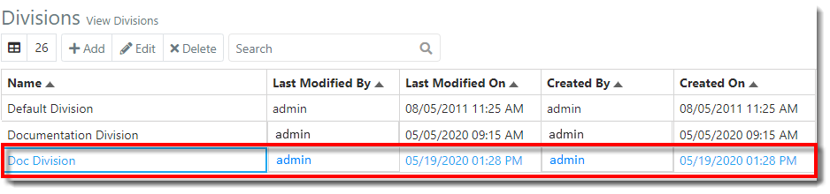
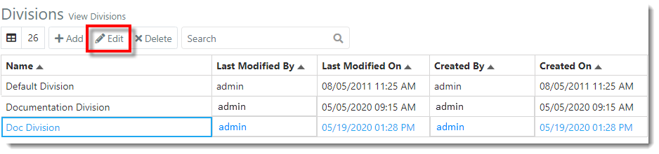
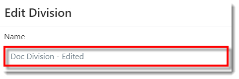
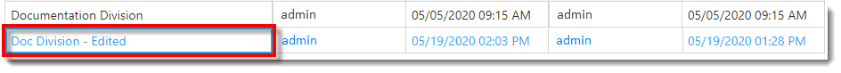



You are here: [Divisions](C:/_git/ProModelAutodeskEdition/PorfolioSimulator.Help/wwwroot/Help/Docs/Divisions1/Divisions.md) > Edit Division

----
## _**Edit Division**_ 

**1.** Select the **Division** to be edited from the Divisions table. The selected Division is indicated with via blue text.

**2.** Next, select the **Edit button** located in the Divisions table toolbar *(alternatively, double-click the Division row to open the Edit Division modal)*.

**3.** The Edit Division modal populates as depicted in the image below. Make the desired changes. 
In the example below, the user intends to edit the **Division Name**.  

**4.** Once complete, select **Save**. 

**5.** The Division name is updated, as shown in the image below.

---

**Related Content**:
* [Divisions (overview)](C:/_git/ProModelAutodeskEdition/PorfolioSimulator.Help/wwwroot/Help/Docs/Divisions1/Divisions.md)
* [Add Division](C:/_git/ProModelAutodeskEdition/PorfolioSimulator.Help/wwwroot/Help/Docs/Divisions1/AddDivision/AddDivision.md)
* [Delete Division](C:/_git/ProModelAutodeskEdition/PorfolioSimulator.Help/wwwroot/Help/Docs/Divisions1/DeleteDivision/DeleteDivision.md)
* [Search Divisions](C:/_git/ProModelAutodeskEdition/PorfolioSimulator.Help/wwwroot/Help/Docs/Divisions1/SearchDivisions/SearchDivisions.md)

---

 &copy; 2020 ProModel Corporation  705 E Timpanogos Parkway  Orem, UT 84097  Support: 888-776-6633  www.promodel.com {style ="align: left"}

