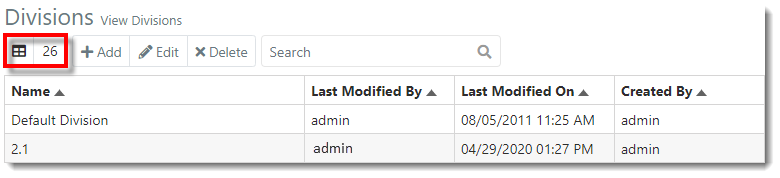
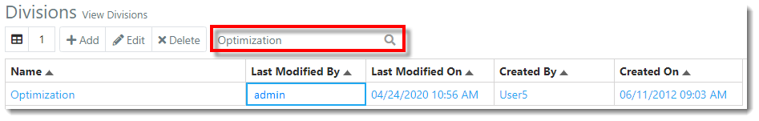
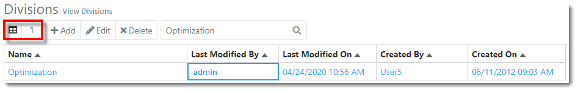
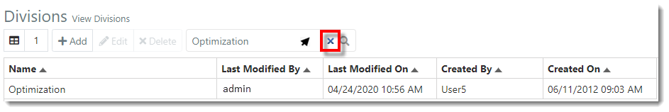
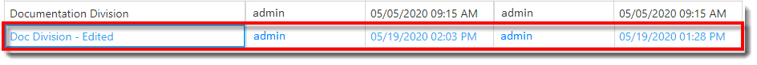
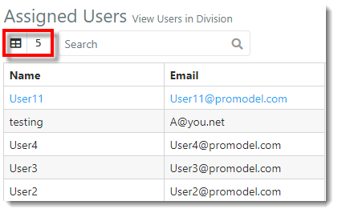
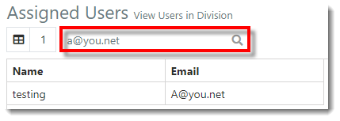
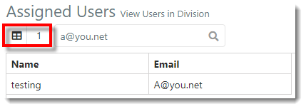
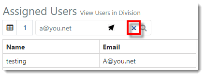



You are here: [Divisions](C:/_git/ProModelAutodeskEdition/PorfolioSimulator.Help/wwwroot/Help/Docs/Divisions1/Divisions.md) > Search Divisions

---

## _**Search Divisions**_ 

**1.** The Divisions **item count** is displayed in the top left of the Divisions toolbar. This number represents the number of Divisions available (4).

**2.** Users may search the Divisions table by Division Name. 
Simply key in the Division name in the **search bar** located in the toolbar. Search results populate as criteria is entered.

**3.** Notice that the **Item Count** updates to reflect the number of Divisions displayed in the search results (1).

**4.** To clear the search, hover the cursor over the **search bar**, then select the **X** displayed within.

## _**Search Users**_

**1.** Select a **Division** from the Division table.

**2.** The 'Assigned Users' list updates to display users with access to the Division. The **Item Count** reflects the number of Assigned Users in the Division (5).

**3.** Key in the user's name or email in the Assigned Users **search bar**. Search results display as criteria is entered. 

**4.** Note that the **Item Count** updates to reflect the number of Assigned Users displayed in the search results (1).

**5.** To clear the search, hover the cursor over the **search bar**, then select the **X** displayed within.

---

**Related Content**:
* [Divisions (overview)](C:/_git/ProModelAutodeskEdition/PorfolioSimulator.Help/wwwroot/Help/Docs/Divisions1/Divisions.md)
* [Add Division](C:/_git/ProModelAutodeskEdition/PorfolioSimulator.Help/wwwroot/Help/Docs/Divisions1/AddDivision/AddDivision.md)
* [Edit Division](C:/_git/ProModelAutodeskEdition/PorfolioSimulator.Help/wwwroot/Help/Docs/Divisions1/EditDivision/EditDivision.md)
* [Delete Division](C:/_git/ProModelAutodeskEdition/PorfolioSimulator.Help/wwwroot/Help/Docs/Divisions1/DeleteDivision/DeleteDivision.md)

---

 &copy; 2020 ProModel Corporation  705 E Timpanogos Parkway  Orem, UT 84097  Support: 888-776-6633  www.promodel.com {style ="align: left"}

