

You are here: [Fixed Costs](C:/_git/ProModelAutodeskEdition/PorfolioSimulator.Help/wwwroot/Help/Docs/FixedCosts/FixedCosts.md) > Define and Enable Fixed Costs

----
## _**Define and Enable Fixed Costs**_ 

**Please note that Fixed Costs must be defined and enabled within the PMAD application prior to Project import.*

**1.** In the example below, the user intends to define and enable Fixed Cost 4. Key in the name of the Fixed Cost in the corresponding **Name field**. **The currently selected row is indicated via blue text.*

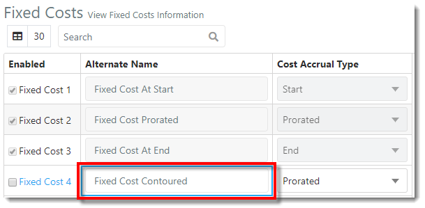

**2.** Select the **Cost Accrual Type** for the newly added Fixed Cost. In this example, the user would like to add a 'Contoured' Cost Accrual Type. **The currently selected Accrual Type is indicated with a blue highlight.*

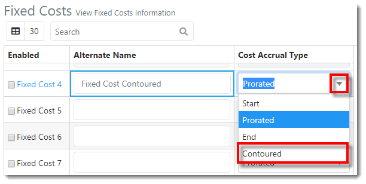

**3.** A green pop-up notification displays, indicating the Fixed Cost Accrual Type has been set.

**4.** Enable the Fixed Cost throughout the PMAD application by selecting the **'Enabled' checkbox** to the left of the corresponding Fixed Cost. If not enabled, the new Fixed Cost will not display in the Repository.

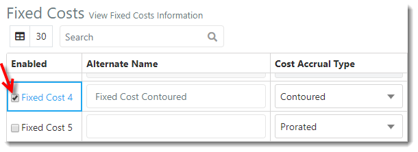

**5.** A green pop-up notification displays, indicated the Fixed Cost has been enabled.

**6.** The user now needs to add the Fixed Cost to the Excel file to be imported, aligned with the associated Project or Task. Fixed Costs are entered in the Task Information sheet of the Excel template.
Key in the **Fixed Costs column header** (mirroring the Fixed Cost name entered in PMAD) and enter the **Fixed Cost values** in the rows beneath. 

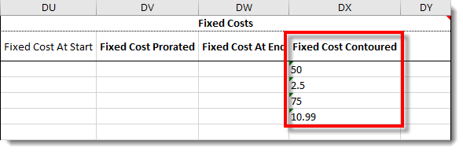

**7.** Save the Excel template once all desired fields are complete. Select **File** > **Save As** > and select the **save destination**. 

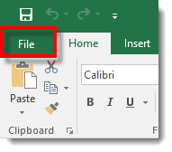 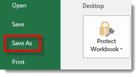 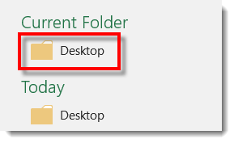

**8.** The 'Save As' modal populates. Key in the desired **file name** and select the **save button** in the lower right-hand corner of the modal.

**9.** In PMAD, select the **Repository link** in the navigation pane on the left-hand side of the screen. 

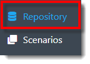

**10.** The user is directed to the Repository view. Select the **Import** button.  

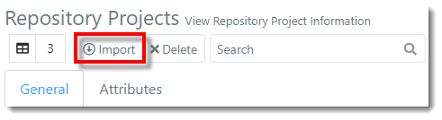

**11.** The Excel Import modal populates. Drag the desired Excel file to the Excel Import modal (and skip step 12), or select the text **"click to Browse"**.

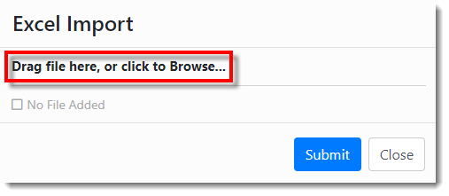

**12.** The File Explorer modal populates. Select the **Excel Import Template**, then select **Open**.

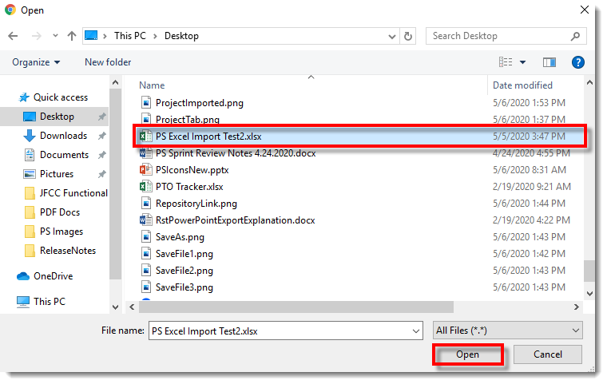

**13.** The file is selected for upload in the Excel Import modal. Select **Submit** to import the file.

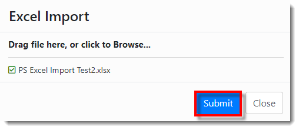

**14.** An 'Import Job Created' notification populates, as depicted below.

**15.** Select the **Diagnostics link** displayed in the navigation pane on the left-hand side of the screen.  

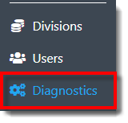

**16**. The user is directed to the Diagnostics view. In the Jobs table, locate the recently created **Import Job** (Import "file name"). 

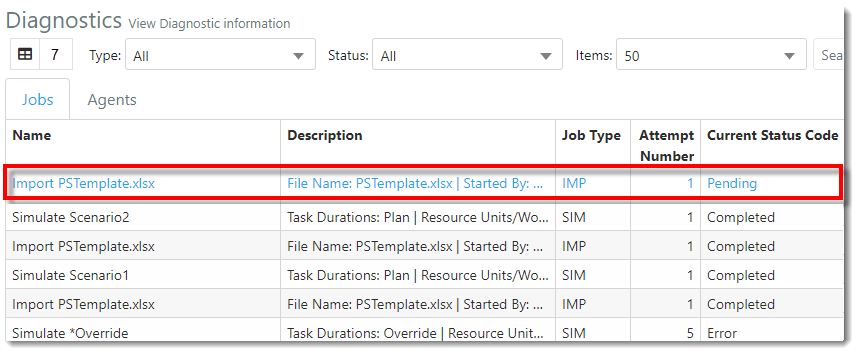

**17.** Once the **Current Status Code** displays as **Completed**, the file has been successfully imported into PMAD.

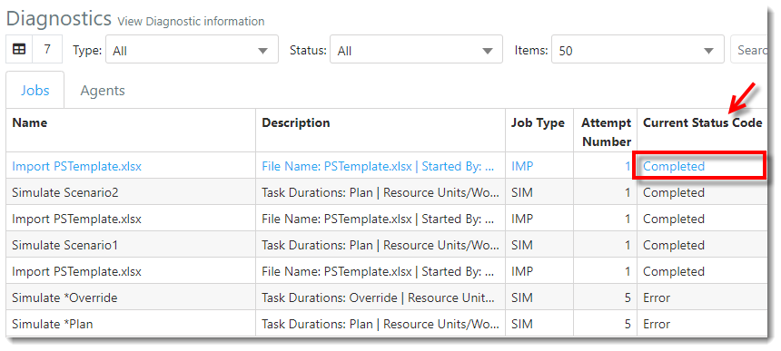

**18.** Select the **Respository link** displayed in the navigation pane on the left-hand side of the screen.

**19.** The imported Project and Tasks appear in the Repository view. The Fixed Cost columns appear on the far right of the Repository Projects and Repository Project Tasks tables, displaying the values as entered in the Excel template. 

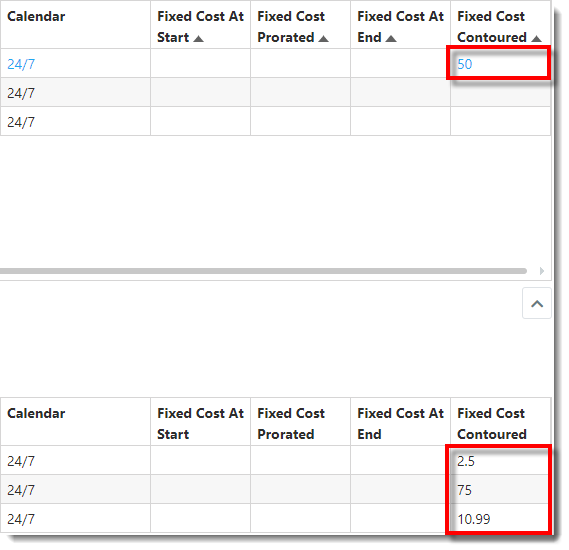 

---

**Related Content**:
- [Fixed Costs (overview)](C:/_git/ProModelAutodeskEdition/PorfolioSimulator.Help/wwwroot/Help/Docs/FixedCosts/FixedCosts.md)
- [Disable Fixed Cost](C:/_git/ProModelAutodeskEdition/PorfolioSimulator.Help/wwwroot/Help/Docs/FixedCosts/DisableFixedCost/DisableFixedCost.md)
- [Search Fixed Costs](C:/_git/ProModelAutodeskEdition/PorfolioSimulator.Help/wwwroot/Help/Docs/FixedCosts/SearchFixedCosts/SearchFixedCosts.md)

---
 &copy; 2020 ProModel Corporation  705 E Timpanogos Parkway  Orem, UT 84097  Support: 888-776-6633  www.promodel.com {style ="align: left"}

