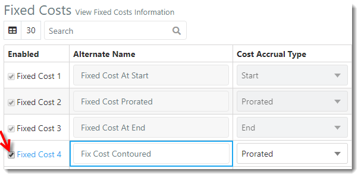
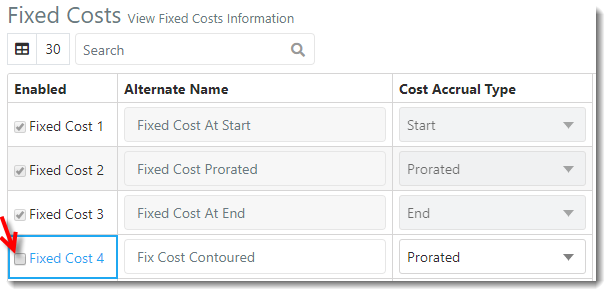
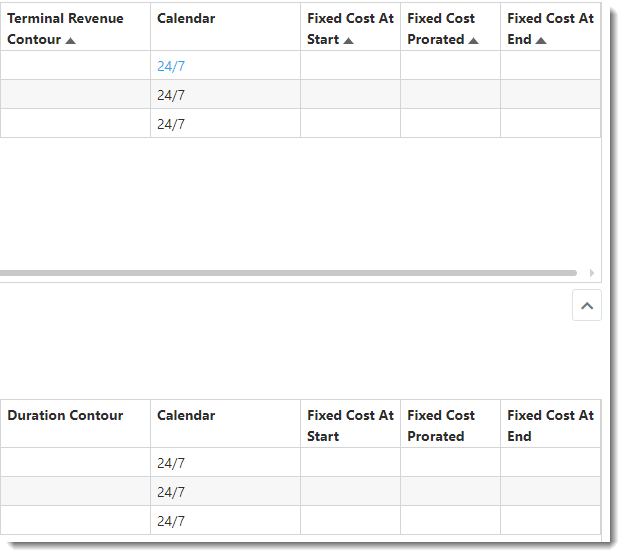



You are here: [Fixed Costs](C:/_git/ProModelAutodeskEdition/PorfolioSimulator.Help/wwwroot/Help/Docs/FixedCosts/FixedCosts.md) > Disable Fixed Cost

----
## _**Disable Fixed Cost**_

**1.** From the Fixed Costs view, locate the Fixed Cost to be disabled. De-select the corresponding **Enabled checkbox** to disable the Fixed Cost in the application.

 

**2.** A green pop-up notification displays, indicating the Fixed Cost has been disabled.

**3.** Next, select the **Repository link** from the navigation pane on the left-hand side of the screen.

**4.** The disabled Fixed Cost column, "Fixed Cost Contoured" no longer appears in the Repository Projects or Reposiotry Project Tasks table.

---

**Related Content**:
- [Fixed Costs (overview)](C:/_git/ProModelAutodeskEdition/PorfolioSimulator.Help/wwwroot/Help/Docs/FixedCosts/FixedCosts.md)
- [Define and Enable Fixed Cost](C:/_git/ProModelAutodeskEdition/PorfolioSimulator.Help/wwwroot/Help/Docs/FixedCosts/DefineFixedCost/DefineFixedCost.md)
- [Search Fixed Costs](C:/_git/ProModelAutodeskEdition/PorfolioSimulator.Help/wwwroot/Help/Docs/FixedCosts/SearchFixedCosts/SearchFixedCosts.md)

---

 &copy; 2020 ProModel Corporation  705 E Timpanogos Parkway  Orem, UT 84097  Support: 888-776-6633  www.promodel.com {style ="align: left"}

