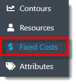
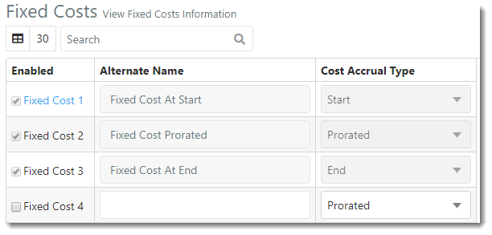



You are here: Fixed Costs

----
# **Fixed Costs** 

The Fixed Cost view allows the user to define different types of PMAD Fixed Costs.  Fixed Cost At Start, Fixed Cost Prorated and Fixed Cost At End are already defined, but the user may define up to 27 additional fixed cost types.

### _**Navigation**_

**1.** Select the **Fixed Costs link** in the navigation pane on the left-hand side of the screen.

**2.** The user is directed to the Fixed Costs view, as displayed in the image below.

### _**Terminology**_

- **Enabled**: When this checkbox is selected, the Fixed Cost is enabled throughout the PMAD application.

- **Name**: Name that identifies the Fixed Cost.
- **Cost Accrual Type**: Type of accrual for the cost. Choices include Start, Prorated, End and Contoured.
---

**Related Content**:
- [Define and Enable Fixed Cost](C:/_git/ProModelAutodeskEdition/PorfolioSimulator.Help/wwwroot/Help/Docs/FixedCosts/DefineFixedCost/DefineFixedCost.md)
- [Disable Fixed Cost](C:/_git/ProModelAutodeskEdition/PorfolioSimulator.Help/wwwroot/Help/Docs/FixedCosts/DisableFixedCost/DisableFixedCost.md)
- [Search Fixed Costs](C:/_git/ProModelAutodeskEdition/PorfolioSimulator.Help/wwwroot/Help/Docs/FixedCosts/SearchFixedCosts/SearchFixedCosts.md)

---
 &copy; 2020 ProModel Corporation  705 E Timpanogos Parkway  Orem, UT 84097  Support: 888-776-6633  www.promodel.com {style ="align: left"}

