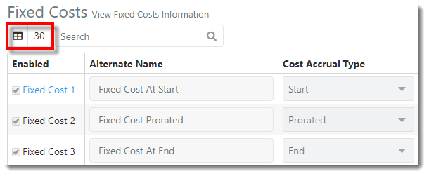
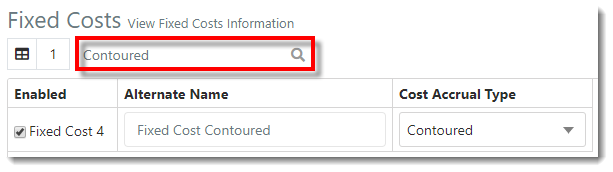
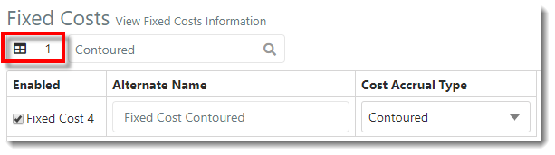
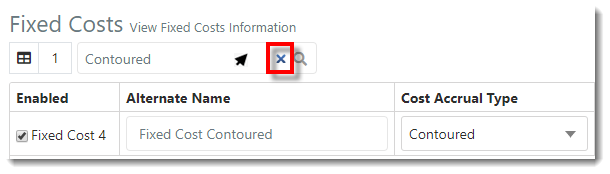



You are here: [Fixed Costs](C:/_git/ProModelAutodeskEdition/PorfolioSimulator.Help/wwwroot/Help/Docs/FixedCosts/FixedCosts.md) > Search Fixed Costs

----
## _**Search Fixed Costs**_ 

**1.** The **Item Count** is displayed in the top-left corner of the Fixed Costs view. The Item Count represents the number of Fixed Costs available in the table, whether or not the Fixed Cost is defined or enabled (30).

**2.** Key in the Fixed Cost name within the **Search bar** located in the toolbar. Search results auto populate as criteria is entered.

**3.** Note that the **Item Count** updates to reflect the number of Fixed Costs displayed in the search results (1).

**4.** To clear the search, hover the cursor over the **search bar** and select the **X**. 

---

**Related Content**:
- [Fixed Costs (overview)](C:/_git/ProModelAutodeskEdition/PorfolioSimulator.Help/wwwroot/Help/Docs/FixedCosts/FixedCosts.md)
- [Define and Enable Fixed Cost](C:/_git/ProModelAutodeskEdition/PorfolioSimulator.Help/wwwroot/Help/Docs/FixedCosts/DefineFixedCost/DefineFixedCost.md)
- [Disable Fixed Cost](C:/_git/ProModelAutodeskEdition/PorfolioSimulator.Help/wwwroot/Help/Docs/FixedCosts/DisableFixedCost/DisableFixedCost.md)

---

 &copy; 2020 ProModel Corporation  705 E Timpanogos Parkway  Orem, UT 84097  Support: 888-776-6633  www.promodel.com {style ="align: left"}

