

You are here: [Getting Started with PMAD](C:/_git/ProModelAutodeskEdition/PorfolioSimulator.Help/wwwroot/Help/Docs/GettingStarted/GettingStarted.md) > Create Scenario

---

## _**Create Scenario**_

**1.** Select the **Scenarios link** displayed in the navigation pane on the left-hand side of the screen.  

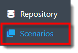

**2.** The user is directed to the Scenarios page, as depicted in the image below. Select the **Add button** from the Scenarios toolbar.

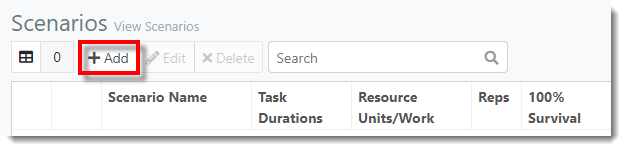

**3.** The New Scenario modal populates. In the General tab, key in the **Scenario Name** and select the desired **Task Durations** (Plan / Override) and **Resource Units/Work** (Plan / Override) options.

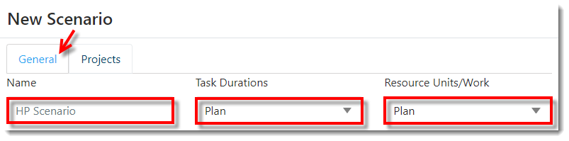

**4.** Next, key in the **Number of Reps**, select the **Resource Allocation Mode** (All Unconstrained / All Constrained / All Constrained Leveling / Per Resource) and the desired **100% Survivial** option (Yes / No). **Select **Yes** from the **100% Survival drop-down** to have all tasks always survive for this scenario. If  **No** is selected, the values entered in the survival column for each task will be used.*

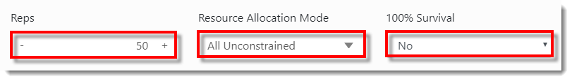

**5.** Select the **Resource Surplus Mode** (None / Recoup / Accelerate) and key in the corresponding **Leveling %**. 

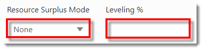

**6.** Select the **Task Behavior** (Event-Based / Work-Based) and key in the **APR** (Annual Percentage Rate).

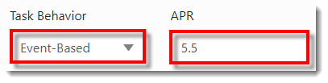

**7.** Select the **Status Date**. Key in the **Run Length** and select the **Run Length time frame** (Day / Week / Month / Quarter / Year).

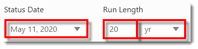

**8.** Select the **Reporting Interval** (Monthly / Quarterly / Yearly). Key in the **Time Series Length** and select the corresponding **time frame** (Day / Week / Month / Quarter / Year).

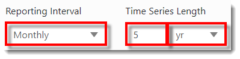

**9.** Enter any **Notes** for regarding the New Scenario (optional).

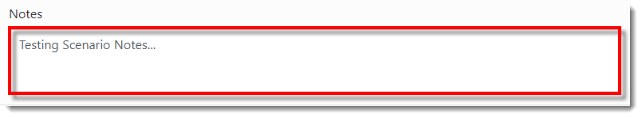

**10.** Next, select the **Projects tab** at the top of the modal window.

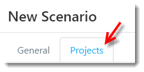

**11.** The user is directed to the Projects tab. Select the deisred **Available Project(s)** to be included in the Scenario. The selected Project is indicated via blue text.

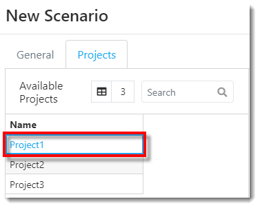

**12.** Select the **right-facing arrow button** to add the selected Projects to the Scenario Projects list.

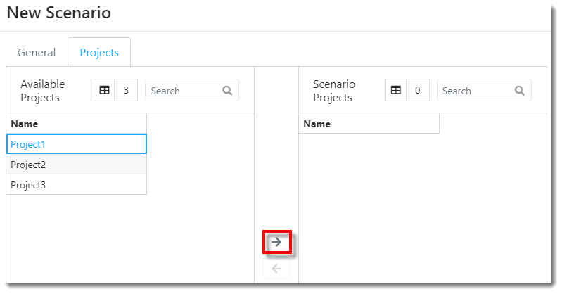

**13.** The selected Projects are moved from the Available Project list to the Scenario Project list, as depicted in the image below.

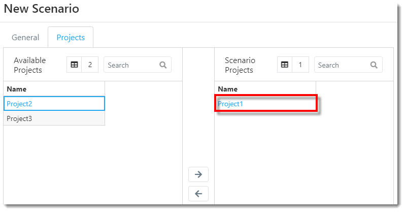

**14.** Once all desired information is entered and/or selected, click **Save** in the lower right-hand corner of the modal window.

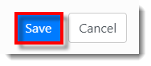

**15.** The new Scenario appears in the Scenarios table, as depicted in the image below.

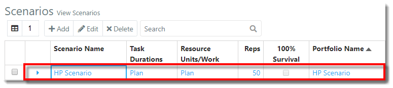

---

**Next**: [Simulate Scenario](C:/_git/ProModelAutodeskEdition/PorfolioSimulator.Help/wwwroot/Help/Docs/GettingStarted/RunScenario/RunScenario.md)

---
 &copy; 2020 ProModel Corporation  705 E Timpanogos Parkway  Orem, UT 84097  Support: 888-776-6633  www.promodel.com {style ="align: left"}

