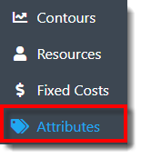
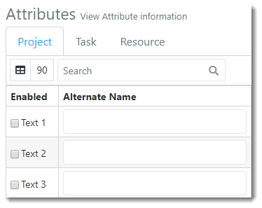
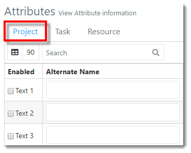
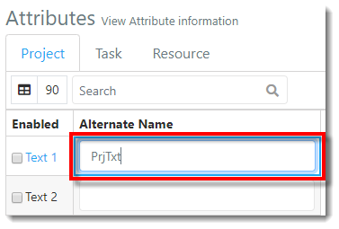
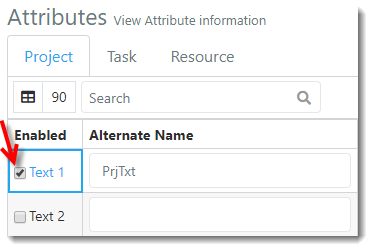
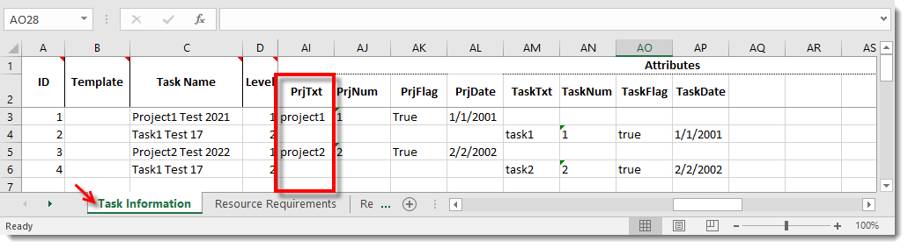
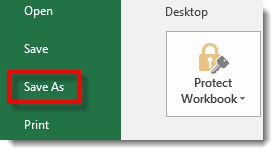
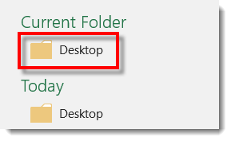
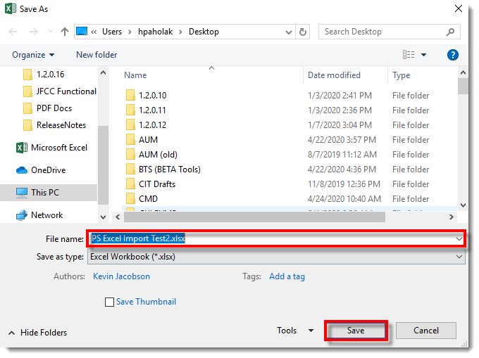



You are here: [Getting Started with PMAD](C:/_git/ProModelAutodeskEdition/PorfolioSimulator.Help/wwwroot//Help/Docs/GettingStarted/GettingStarted.md) > Define and Enable Attributes

---
## _**Define and Enable Attributes**_ 

**1.** Select the **Attributes link** in the navigation pane on the left-hand side of the screen.

**2.** The user is directed to the Attributes view, as displayed in the image below. 

**3.** From the Attributes page, select the desired **Object Type tab** for the new Attribute. In the example below, the user intends to define a Project Attribute. 

**4.** Scroll down to view the additional Attribute Types. The Attribute Types are listed in the following order from the top to bottom of the screen: Text, Number, Flag, and Date. 
Locate the desired Attribute Type and key in the **Attribute Alias** (note that this must match column header in the Excel import template) in the next available (blank) Alias field. In the example below, the user is defining the Project Text Attribute Alias so the corresponding values entered in the Excel template display in PMAD once the file is imported.

**5.** A green pop-up notification displays, indicating the Attribute Project Text (#) Alias name has been updated.

**6.** Enable the Attribute throughout the PMAD application by selecting the **'Enabled' checkbox** to the left of the corresponding Alias field. If not enabled, the Attribute will not display in the Repository.

**7.** A green pop-up notification displays, indicating the Attribute Project Text (#) has been enabled. 

**8.** The user now needs to add the Attribute to the Excel file to be imported, aligned with the associated Project or Task. Attributes are entered in the Task Information sheet of the Excel template.
Key in the **"PrjTxt" Attributes** (column header must match Alias entered in PMAD). Note that the additional Attributes shown in the Excel template in this example have not been enabled in PMAD.

**9.** Save the Excel template once all desired fields are complete. Select **File** > **Save As** > and select the **save destination**. 

  

**10.** The 'Save As' modal populates. Key in the desired **file name** and select the **save button** in the lower right-hand corner of the modal.

---

**Next**: [Import Projects](C:/_git/ProModelAutodeskEdition/PorfolioSimulator.Help/wwwroot/Help/Docs/GettingStarted/ImportProjects/ImportProjects.md)

---

 &copy; 2020 ProModel Corporation  705 E Timpanogos Parkway  Orem, UT 84097  Support: 888-776-6633  www.promodel.com {style ="align: left"}

