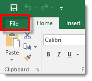

You are here: [Getting Started with PMAD](C:/_git/ProModelAutodeskEdition/PorfolioSimulator.Help/wwwroot/Help/Docs/GettingStarted/GettingStarted.md) > Define Fixed Costs

----
## _**Define and Enable Fixed Costs**_ 

**Please note that Fixed Costs must be defined and enabled within the PMAD application prior to Project import.*

**1.** Select the **Fixed Costs link** in the navigation pane on the left-hand side of the screen.

**2.** The user is directed to the Fixed Costs view, as displayed in the image below. As you can see, the first three Fixed Costs are defined and enabled by default.

**3.** In the example below, the user intends to define and enable Fixed Cost 4. Key in the name of the Fixed Cost in the corresponding **Name field**. **The currently selected row is indicated with a blue highlight.*

**4.** Select the **Cost Accrual Type** for the newly added Fixed Cost. In this example, the user would like to add a 'Contoured' Cost Accrual Type. **The currently selected Accrual Type is indicated with a blue highlight.*

**5.** A green pop-up notification displays, indicating the Fixed Cost Accrual Type has been set.

**6.** Enable the Fixed Cost throughout the PMAD application by selecting the **'Enabled' checkbox** to the left of the corresponding Fixed Cost. If not enabled, the new Fixed Cost will not display in the Repository.

**7.** A green pop-up notification displays, indicated the Fixed Cost has been enabled.

**8.** The user now needs to add the Fixed Cost to the Excel file to be imported, aligned with the associated Project or Task. Fixed Costs are entered in the Task Information sheet of the Excel template.
Key in the **Fixed Costs column header** (mirroring the Fixed Cost name entered in PMAD) and enter the **Fixed Cost values** in the rows beneath. 

**9.** Save the Excel template once all desired fields are complete. Select **File** > **Save As** > and select the **save destination**. The file will be imported to PMAD in a subsequent 'Getting Started' chapter.

  

**10.** The 'Save As' modal populates. Key in the desired **file name** and select the **save button** in the lower right-hand corner of the modal.

---

**Next**:
[Define and Enable Attributes](C:/_git/ProModelAutodeskEdition/PorfolioSimulator.Help/wwwroot/Help/Docs/GettingStarted/DefineAttributes/DefineAttributes.md) 

---

 &copy; 2020 ProModel Corporation  705 E Timpanogos Parkway  Orem, UT 84097  Support: 888-776-6633  www.promodel.com {style ="align: left"}

