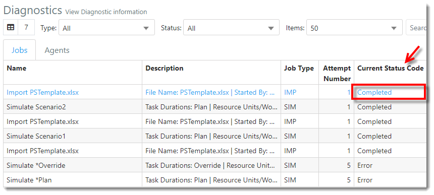

You are here: [Getting Started with ProModel AutoCAD Edition](C:/_git/ProModelAutodeskEdition/PorfolioSimulator.Help/wwwroot/Help/Docs/GettingStarted/GettingStarted.md) > Import Project  

--- 

## _**Import Project**_ 

**1.** Select the **Respository link** displayed in the navigation pane on the left-hand side of the screen.    

**2.** The user is directed to the Repository page. Select the **Import button** located at the top of the Repository Projects table. 
  

**3.** The Excel Import modal populates. Drag the desired Excel file to the Excel Import modal (and skip step 4), or select the text **"click to Browse"**..

**4.** The File Explorer modal populates. Select the desired **Excel spreadsheet**, then select **Open**.

 

**5.** The file is selected for upload in the Excel Import modal. Select **Submit** to import the file.

**6.** An 'Import Job Created' notification populates, as depicted below.

**7.** Select the **Diagnostics link** displayed in the navigation pane on the left-hand side of the screen.  

**8**. The user is directed to the Diagnostics view. In the Jobs table, locate the recently created **Import Job** (Import "file name"). 

**9.** Once the **Current Status Code** displays as **Completed**, the file has been successfully imported into ProModel AutoCAD Edition.

**10.** Select the **Respository link** displayed in the navigation pane on the left-hand side of the screen.

**11.** The Project(s) and associated Task(s) appear in the Repository Projects and Repository Project Tasks tables, as depicted in the image below.

---

**Next**: [Create Scenario](C:/_git/ProModelAutodeskEdition/PorfolioSimulator.Help/wwwroot/Help/Docs/GettingStarted/AddScenario/AddScenario.md)

---

 &copy; 2020 ProModel Corporation  705 E Timpanogos Parkway  Orem, UT 84097  Support: 888-776-6633  www.promodel.com 

