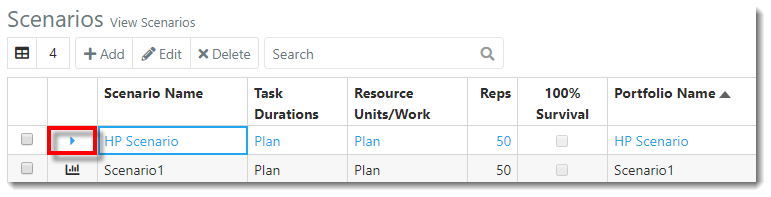
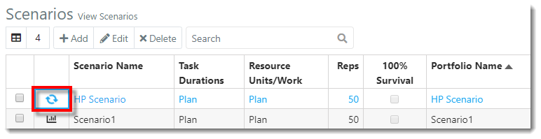
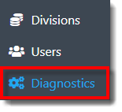
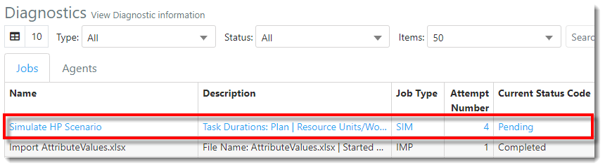
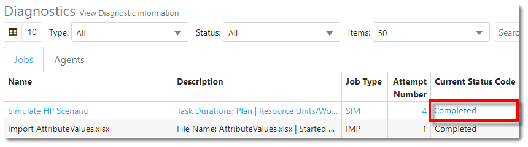



You are here: [Getting Started with ProModel AutoCAD Edition](C:/_git/ProModelAutodeskEdition/PorfolioSimulator.Help/wwwroot/Help/Docs/GettingStarted/GettingStarted.md) > Simulate Scenario

---

## _**Simulate Scenario**_ 

**1.** From the Scenarios page, locate the Scenario to be simulated. Select the corresponding **simulate button** located to the left of the Scenario Name.

**2.** The simulate button now displays as 'processing' as shown in the example below. The icon will remain spinning until the simulation is complete.

**3.** Select the **Diagnostics link** displayed in the navigation pane on the left-hand side of the screen.

**4.** The user is directed to the Diagnostics view. Locate the **simulation job** in the Jobs table. Note that the **Current Status Code** displays as "pending".

**5.** Once the **Current Status Code** displays as "Completed", the Scenario has completed simulation.

**6.** Select the **Scenarios link** displayed in the navigation pane on the left-hand side of the screen.

**7.** The user is directed to the Scenarios view. The Scenario's simulate button now displays as a report icon, as depicted in the image below. This indicates the reports are ready for viewing.

---

**Next**: [View Reports](C:/_git/ProModelAutodeskEdition/PorfolioSimulator.Help/wwwroot/Help/Docs/GettingStarted/ViewReports/ViewReports.md)

---

 &copy; 2020 ProModel Corporation  705 E Timpanogos Parkway  Orem, UT 84097  Support: 888-776-6633  www.promodel.com {style ="align: left"}

