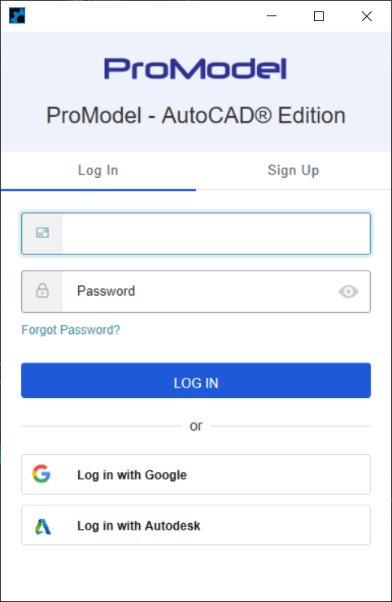



You are here: [Introduction](/pmacad/help/topic?page=Help/Docs/PMADHelpHome.md) > [Getting Started](/pmacad/help/topic?page=Help/Docs/GettingStarted/GettingStarted.md) > Sign In 

  

## _**Sign In**_
***

 

1.  After installing,  start the AutoCAD® application.
2.	Within the ProModel Ribbon, click <b>Log In</b> and a log in prompt should appear. Choose <b>Sign Up</b> to create your new ProModel account. You can also choose to authenticate with an Autodesk User Account for convenience. If you have previously signed up for an account, select <b>Log In</b>.       

 

 
 

3.	Create a password for your new ProModel account.
4.	Click <b>Sign Up</b> and then a message about verifying your email should appear.
5.	Go to your email program to get the Verify Email sent to you.    
6.	Click on the <b>Verify My Email</b> button in the email and it should open a web page with a verification message.
7.	Now return to the ProModel application and click the Login message. 
8.	This will open the login screen again. Enter your email address, newly created password and then click the <b>Log In</b> button.
9.	You have now created a ProModel account. Next you will connect this account with the new ProModel licensing system. First, you will receive a prompt on your screen. 
10.	Click the <b>Request Code</b> button and you should receive a message about an Authentication Code. 
11.	Click <b>OK</b> and then go to your email and get the Authentication Code that was sent to you.
12.	Copy the Authentication Code and then enter it into the prompt. 
13.	Click <b>OK</b> and you should now be successfully signed into the application!
 

---

**Next**: [Use Simulation Browser to create Locations, Entities, Conveyors, Flows, Resources and Path Networks](/pmacad/help/topic?page=Help/Docs/Modeling/SimulationBrowser/Simulation_Browser.md)     

