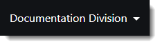



You are here: [Getting Started with ProModel AutoCAD Edition](C:/_git/ProModelAutodeskEdition/PorfolioSimulator.Help/wwwroot//Help/Docs/GettingStarted/GettingStarted.md) > Select Division

----
## _**Select Division**_

Within an organization there may be different groups of users who would like to use the same instance of ProModel AutoCAD Edition (PMACAD), 
but with unique and separate data. ProModel AutoCAD Edition now supports ‘Divisions’, which represent individual sets of project data 
within the same instance of ProModel AutoCAD Edition. Users can be granted access to multiple Divisions as needed, and switch between 
Divisions while using ProModel AutoCAD Edition.  

Users with access to multiple Divisions may navigate to another Division via the Division drop-down located at 
the top right of the ProModel AutoCAD Edition toolbar. Prior to importing a new Project, navigate to the Division in which the Project will be housed. The Project will only
be available within the Division it is imported. 

**1.** After logging into ProModel AutoCAD Edition, select the **Division drop-down** located at the top right corner of the screen. The currently selected Division name displays here.
The user will only be able to access projects within the currently selected Division. Select the desired **Division** from the drop-down.

**2.** Data displayed throughout ProModel AutoCAD Edition now reflects the currently selected Division. 
The currently selected Division is displayed in the top right of the ProModel AutoCAD Edition toolbar, as depicted below.

---

**Next**: [Define and Enable Fixed Costs](C:/_git/ProModelAutodeskEdition/PorfolioSimulator.Help/wwwroot/Help/Docs/GettingStarted/DefineFixedCosts/DefineFixedCosts.md)

---
 &copy; 2020 ProModel Corporation  705 E Timpanogos Parkway  Orem, UT 84097  Support: 888-776-6633  www.promodel.com {style ="align: left"}

