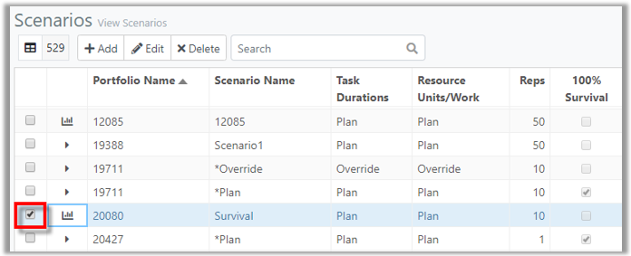

You are here: [Getting Started with ProModel AutoCAD Edition](C:/_git/ProModelAutodeskEdition/PorfolioSimulator.Help/wwwroot/Help/Docs/GettingStarted/GettingStarted.md) > View Reports

----
## _**View Reports**_

**1.** From the Scenarios page, select the checkbox to the left of the Scenario Name to view the corresponding Reports. ***Note* - the Scenario simulation must be complete prior to viewing Reports.*

**2.** Reports display beneath the Scenarios table, as depicted in the image below. There are several different Reports available. By default, the Throughput tab displays, which contains four **Throughput Reports**. The Throughput reports show passed, failed, started and terminated tasks averaged for all replications. This information can be shown as a Totals, Time Series, Histogram, or Work in Progress chart. The Throughput chart includes historical data, which is information contained in the portfolio that has occurred prior to the simulation start date.   
* **Totals**: The Throughput Totals report shows the average number of started and failed, or started tasks in a given time period for all replications.
* **Time Series**: The Throughput Time Series chart shows the average number of passed, failed, and started tasks for all replications over time in either years or fiscal quarters. This chart can also display a running total of passed, failed, and started tasks.
* **Histogram**: The Throughput Histogram shows the frequency of the number of task's (specified in the options) that will pass, fail, or start (specified in the Scenario Filter.
* **WIP (Work in Progress)**: The Throughput WIP Report shows the work in progress.

**3.** Select the **Time Series link** in the Throughput tab to view the Throughput Time Series Report.

**4.**

---

 &copy; 2020 ProModel Corporation  705 E Timpanogos Parkway  Orem, UT 84097  Support: 888-776-6633  www.promodel.com {style ="align: left"}

