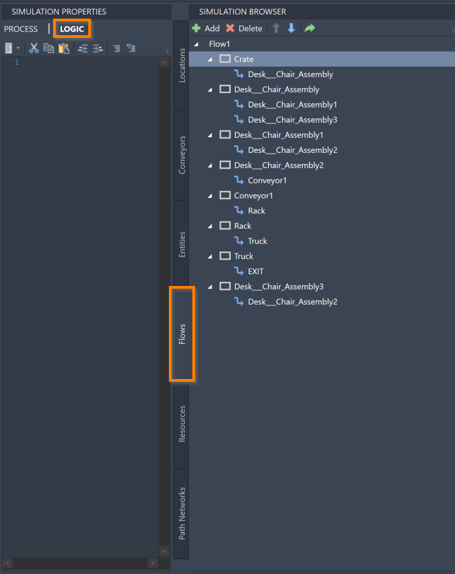
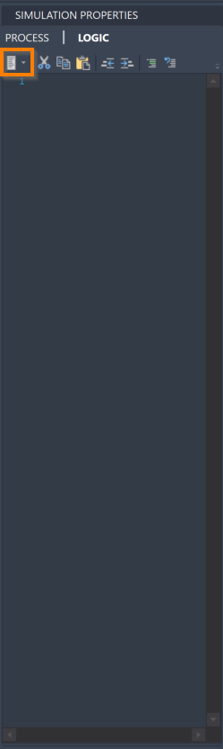



You are here: [Introduction](/pmacad/help/topic?page=Help/Docs/PMADHelpHome.md) > [Modeling](/pmacad/help/topic?page=Help/Docs/Modeling/Modeling.md)/[Getting Started](/pmacad/help/topic?page=Help/Docs/GettingStarted/GettingStarted.md) > Logic

# **Logic**
***

 

In ProModel AutoCAD® Edition, Logic statements are used to take additional action in models by creating “code”. 
Many Logic statements and system functions are available to you to help you create the Logic necessary for your model, which will be described in this section. 
In addition, you may also define your own expressions that can be utilized in your model’s Logic. 

To access the Logic information for your model, make sure the Simulation Properties menu is open and navigate to the **Flow** tab in the Simulation Browser. 
Select a Location or Route and click the word Logic at the top of the Simulation Properties menu to open the Logic editor for that Location or Route. 

 

 
 

Each Location and Route within a Flow has its own Logic defined within it. 
Which Location or Route you use to define certain Logic will have an impact on when that Logic is executed. 
For example, if you assign a value to an Attribute in the Logic of the first Location of a Flow, Entities following that Flow will be marked with that value as soon as they enter the system. 
However, if you instead define the Logic in a Location later in the flow, Entities will not be marked with that value until they reach that Location.
Please keep this in mind as you use Logic in your model.

As you start typing in the Logic menu, you will start to receive suggestions of usable statements due to the **Intellisense** feature. 
Use your **arrow keys** or your **mouse** to select the desired statement and press **Enter** or **Space** your keyboard to complete the word in the Logic editor. 
You may also open the **Statements Pane** to see common statements that can be used in Logic.  

 

 
 

The following section will describe some common statements and functions that you may utilize while creating Logic for your model. 
However, this guide is not a complete list of usable statements in ProModel AutoCAD® Edition.

**1.** [Incrementing and Decrementing](/pmacad/help/topic?page=Help/Docs/Modeling/Logic/IncrementingAndDecrementing/Incrementing_and_Decrementing.md)   
&nbsp;&nbsp;&nbsp;&nbsp;&nbsp;&nbsp;a. [Inc](/pmacad/help/topic?page=Help/Docs/Modeling/Logic/IncrementingAndDecrementing/Incrementing_and_Decrementing.md#inc)   
&nbsp;&nbsp;&nbsp;&nbsp;&nbsp;&nbsp;b. [Dec](/pmacad/help/topic?page=Help/Docs/Modeling/Logic/IncrementingAndDecrementing/Incrementing_and_Decrementing.md#dec)    
&nbsp;&nbsp;&nbsp;&nbsp;&nbsp;&nbsp;c. [IncEntCost](/pmacad/help/topic?page=Help/Docs/Modeling/Logic/IncrementingAndDecrementing/Incrementing_and_Decrementing.md#incentcost)   
&nbsp;&nbsp;&nbsp;&nbsp;&nbsp;&nbsp;d. [IncLocCost](/pmacad/help/topic?page=Help/Docs/Modeling/Logic/IncrementingAndDecrementing/Incrementing_and_Decrementing.md#incloccost)   
&nbsp;&nbsp;&nbsp;&nbsp;&nbsp;&nbsp;e. [IncResCost](/pmacad/help/topic?page=Help/Docs/Modeling/Logic/IncrementingAndDecrementing/Incrementing_and_Decrementing.md#increscost)   
**2.** [Time](/pmacad/help/topic?page=Help/Docs/Modeling/Logic/Time/Time.md)  
&nbsp;&nbsp;&nbsp;&nbsp;&nbsp;&nbsp;a. [Clock](/pmacad/help/topic?page=Help/Docs/Modeling/Logic/Time/Time.md#clock)  
&nbsp;&nbsp;&nbsp;&nbsp;&nbsp;&nbsp;b. [Log](/pmacad/help/topic?page=Help/Docs/Modeling/Logic/Time/Time.md#log)  
**3.** [Simulation Interruption](/pmacad/help/topic?page=Help/Docs/Modeling/Logic/SimulationInterruption/Simulation_Interruption.md)  
&nbsp;&nbsp;&nbsp;&nbsp;&nbsp;&nbsp;a. [Pause](/pmacad/help/topic?page=Help/Docs/Modeling/Logic/SimulationInterruption/Simulation_Interruption.md#pause)  
&nbsp;&nbsp;&nbsp;&nbsp;&nbsp;&nbsp;b. [Prompt](/pmacad/help/topic?page=Help/Docs/Modeling/Logic/SimulationInterruption/Simulation_Interruption.md#prompt)  
&nbsp;&nbsp;&nbsp;&nbsp;&nbsp;&nbsp;c. [Display](/pmacad/help/topic?page=Help/Docs/Modeling/Logic/SimulationInterruption/Simulation_Interruption.md#display)  
&nbsp;&nbsp;&nbsp;&nbsp;&nbsp;&nbsp;d. [Stop](/pmacad/help/topic?page=Help/Docs/Modeling/Logic/SimulationInterruption/Simulation_Interruption.md#stop)  
**4.** [Grouping](/pmacad/help/topic?page=Help/Docs/Modeling/Logic/Grouping/Grouping.md)   
&nbsp;&nbsp;&nbsp;&nbsp;&nbsp;&nbsp;a. [Accum](/pmacad/help/topic?page=Help/Docs/Modeling/Logic/Grouping/Grouping.md#accum)   
&nbsp;&nbsp;&nbsp;&nbsp;&nbsp;&nbsp;b. [Join](/pmacad/help/topic?page=Help/Docs/Modeling/Logic/Grouping/Grouping.md#join)   
&nbsp;&nbsp;&nbsp;&nbsp;&nbsp;&nbsp;c. [Get](/pmacad/help/topic?page=Help/Docs/Modeling/Logic/Grouping/Grouping.md#get)   
&nbsp;&nbsp;&nbsp;&nbsp;&nbsp;&nbsp;d. [Free](/pmacad/help/topic?page=Help/Docs/Modeling/Logic/Grouping/Grouping.md#free)   
&nbsp;&nbsp;&nbsp;&nbsp;&nbsp;&nbsp;e. [Jointly Get](/pmacad/help/topic?page=Help/Docs/Modeling/Logic/Grouping/Grouping.md#jointly-get)   
&nbsp;&nbsp;&nbsp;&nbsp;&nbsp;&nbsp;f. [Split](/pmacad/help/topic?page=Help/Docs/Modeling/Logic/Grouping/Grouping.md#split)   
&nbsp;&nbsp;&nbsp;&nbsp;&nbsp;&nbsp;g. [Load and Unload](/pmacad/help/topic?page=Help/Docs/Modeling/Logic/Grouping/Grouping.md#load-and-unload)   
&nbsp;&nbsp;&nbsp;&nbsp;&nbsp;&nbsp;i. [Group and Ungroup](/pmacad/help/topic?page=Help/Docs/Modeling/Logic/Grouping/Grouping.md#group-and-ungroup)   
**5.** [Code](/pmacad/help/topic?page=Help/Docs/Modeling/Logic/Code/Code.md)   
&nbsp;&nbsp;&nbsp;&nbsp;&nbsp;&nbsp;a. [#region](/pmacad/help/topic?page=Help/Docs/Modeling/Logic/Code/Code.md#region)   
**6.** [Conditional Statements](/pmacad/help/topic?page=Help/Docs/Modeling/Logic/ConditionalStatements/Conditional_Statements.md)    
&nbsp;&nbsp;&nbsp;&nbsp;&nbsp;&nbsp;a. [If ... Then Statements](/pmacad/help/topic?page=Help/Docs/Modeling/Logic/ConditionalStatements/Conditional_Statements.md#if--then-statements)    
&nbsp;&nbsp;&nbsp;&nbsp;&nbsp;&nbsp;b. [Else](/pmacad/help/topic?page=Help/Docs/Modeling/Logic/ConditionalStatements/Conditional_Statements.md#else)    
&nbsp;&nbsp;&nbsp;&nbsp;&nbsp;&nbsp;c. [While](/pmacad/help/topic?page=Help/Docs/Modeling/Logic/ConditionalStatements/Conditional_Statements.md#while)    
&nbsp;&nbsp;&nbsp;&nbsp;&nbsp;&nbsp;d. [Until](/pmacad/help/topic?page=Help/Docs/Modeling/Logic/ConditionalStatements/Conditional_Statements.md#until)    
&nbsp;&nbsp;&nbsp;&nbsp;&nbsp;&nbsp;e. [Break](/pmacad/help/topic?page=Help/Docs/Modeling/Logic/ConditionalStatements/Conditional_Statements.md#break)    
**7.** [Creation](/pmacad/help/topic?page=Help/Docs/Modeling/Logic/Creation/Creation.md)    
&nbsp;&nbsp;&nbsp;&nbsp;&nbsp;&nbsp;a. [Create](/pmacad/help/topic?page=Help/Docs/Modeling/Logic/Creation/Creation.md#create)    
&nbsp;&nbsp;&nbsp;&nbsp;&nbsp;&nbsp;b. [Int](/pmacad/help/topic?page=Help/Docs/Modeling/Logic/Creation/Creation.md#int)    
&nbsp;&nbsp;&nbsp;&nbsp;&nbsp;&nbsp;c. [Real](/pmacad/help/topic?page=Help/Docs/Modeling/Logic/Creation/Creation.md#real)    
&nbsp;&nbsp;&nbsp;&nbsp;&nbsp;&nbsp;d. [Order](/pmacad/help/topic?page=Help/Docs/Modeling/Logic/Creation/Creation.md#order)    
**8.** [System](/pmacad/help/topic?page=Help/Docs/Modeling/Logic/System/System.md)    
&nbsp;&nbsp;&nbsp;&nbsp;&nbsp;&nbsp;a. [Animate](/pmacad/help/topic?page=Help/Docs/Modeling/Logic/System/System.md#animate)    
&nbsp;&nbsp;&nbsp;&nbsp;&nbsp;&nbsp;b. [Debug](/pmacad/help/topic?page=Help/Docs/Modeling/Logic/System/System.md#debug)    
&nbsp;&nbsp;&nbsp;&nbsp;&nbsp;&nbsp;c. [Trace](/pmacad/help/topic?page=Help/Docs/Modeling/Logic/System/System.md#trace)    
&nbsp;&nbsp;&nbsp;&nbsp;&nbsp;&nbsp;d. [ResetStats](/pmacad/help/topic?page=Help/Docs/Modeling/Logic/System/System.md#resetstats)    
**9.** [Waiting](/pmacad/help/topic?page=Help/Docs/Modeling/Logic/Waiting/Waiting.md)   
&nbsp;&nbsp;&nbsp;&nbsp;&nbsp;&nbsp;a. [Wait](/pmacad/help/topic?page=Help/Docs/Modeling/Logic/Waiting/Waiting.md#wait)   
&nbsp;&nbsp;&nbsp;&nbsp;&nbsp;&nbsp;b. [Wait Until](/pmacad/help/topic?page=Help/Docs/Modeling/Logic/Waiting/Waiting.md#wait-until)   
&nbsp;&nbsp;&nbsp;&nbsp;&nbsp;&nbsp;c. [Match](/pmacad/help/topic?page=Help/Docs/Modeling/Logic/Waiting/Waiting.md#match)   
&nbsp;&nbsp;&nbsp;&nbsp;&nbsp;&nbsp;d. [Use](/pmacad/help/topic?page=Help/Docs/Modeling/Logic/Waiting/Waiting.md#use)   
**10.** [Moving](/pmacad/help/topic?page=Help/Docs/Modeling/Logic/Moving/Moving.md)   
&nbsp;&nbsp;&nbsp;&nbsp;&nbsp;&nbsp;a. [Move](/pmacad/help/topic?page=Help/Docs/Modeling/Logic/Moving/Moving.md#move)   
&nbsp;&nbsp;&nbsp;&nbsp;&nbsp;&nbsp;b. [Send](/pmacad/help/topic?page=Help/Docs/Modeling/Logic/Moving/Moving.md#send)   

---

**Next**: [Use Simulation Tools to have complete control over your simulation](/pmacad/help/topic?page=Help/Docs/Simulation/Simulation_Tools.md) 

