

You are here: [Introduction](/pmacad/help/topic?page=Help/Docs/PMADHelpHome.md) > [Modeling](/pmacad/help/topic?page=Help/Docs/Modeling/Modeling.md)/[Getting Started](/pmacad/help/topic?page=Help/Docs/GettingStarted/GettingStarted.md) > Model Elements

# **Model Elements**
***

 

The ProModel AutoCAD® Edition’s Model Elements button is accessible through the ProModel ribbon tab within AutoCAD®.

 

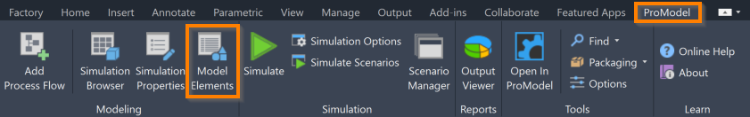

 
 

The Model Elements button opens ProModel’s Model Elements as an additional menu on your screen, allowing you to access advanced modeling elements.  

 

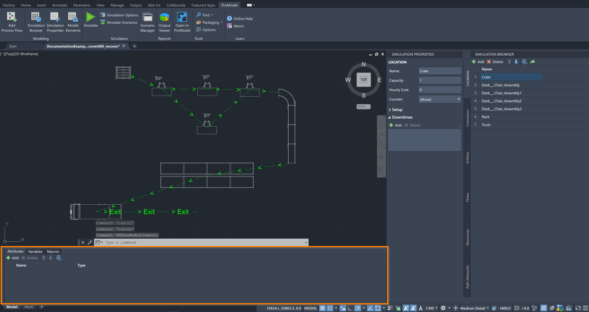

 
 

If you hover over the Model Elements icon, you can see a description of the tool, as well as the command **PMShowModelElements**. 
Typing this command into the command box is another way to open the Model Elements menu. 

Once you have opened the Model Elements menu, you will be able to access the **Attributes**, **Variables** and **Macros** tabs. 
This section will describe how each of these items function within your model, as well as how to use them. 

 

##### _Attributes_
 

In a ProModel simulation, Attributes act as a tag you place on an Entity as it enters the system to mark it with some data or use it to track simulation statistics. 
Note that, unlike Variables, attributes do not report simulation statistics themselves, and so must be used in tandem with Variables if you would like to use them in this way. 

An Attribute is a numerical value of either **Real** or **Integer** type. 
Attributes are not global. Instead, each Entity possesses an individual Attribute that can be used or changed during the course of the simulation. 
While Entities can change their own Attributes, they cannot change the Attributes of any other Entities. 
Attributes cannot be displayed on the layout, unlike Variables. 
However, they can be used to keep track of what happens to an Entity during a simulation, as well as determine what should happen to an Entity at certain points of a simulation. 

To access information about the Attributes in your model, open the Model Elements menu and navigate to the **Attributes** tab.

 

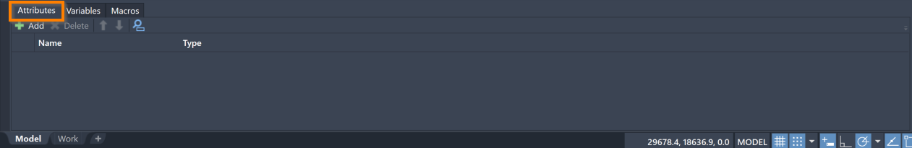

 
 

To add an Attribute to your model, select the **Add** button in the upper left corner of the Model Elements menu. 
Clicking **Add** will create an Attribute with the name **Attr1** and the type **Integer**.

To change the name of an Attribute, double-click on the box in the **Name** column to edit its contents to reflect your desired Attribute name.   

To change the type of an Attribute, select a type from the drop-down menu that appears when you double-click a box in the **Type** column. 

To delete an Attribute from your model, select an Attribute and press the **Delete** button. 

To reorder your Attributes within the Model Elements menu, select an Attribute and use the blue “**up**” and “**down**” arrows to move the Attribute. 

To search for a specific Attribute within your model, click on the **blue magnifying glass** to toggle the search panel. 
With the search panel open, you may then use it to search for an Attribute using its name. 

To assign a numerical value to your Attribute, make sure the Simulation Properties menu is open and navigate to the **Flow** tab in your Simulation Browser. 
Select the first Location in your Flow to ensure that the Attribute is assigned to your Entities right as they enter the system. 
In the Simulation Properties menu, select the word **Logic** at the top of the menu to view the Logic information for that Location. 

 

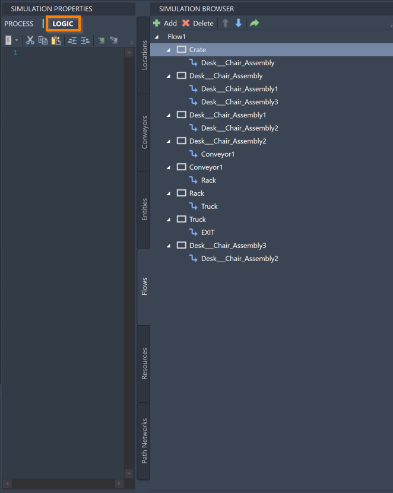

 
 

Use the equals sign (**=**) to assign a numerical value to an Attribute using its name. 
You may also use mathematical formulas and other Attributes to determine the value of an Attribute.

 

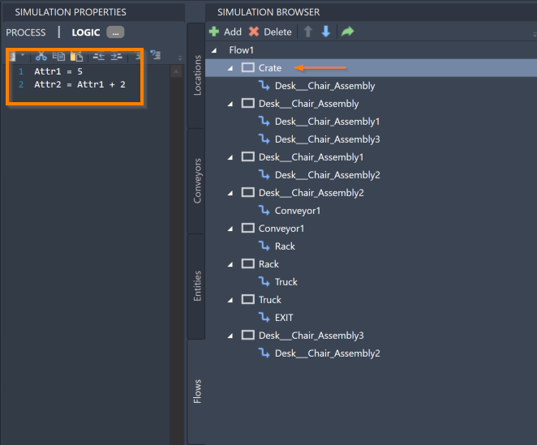

 
 

To change an Entity’s Attribute at a certain Location within the system, navigate to that Location in the Simulation Browser and open the **Logic** information in the Simulation Properties. 
You may now use the equals sign (**=**) to reassign a value to your Attribute using its name, which will cause the Attribute to change for an Entity when it enters this Location. 
You may also use mathematical formulas and other Attributes to determine the new value of an Attribute.  

 

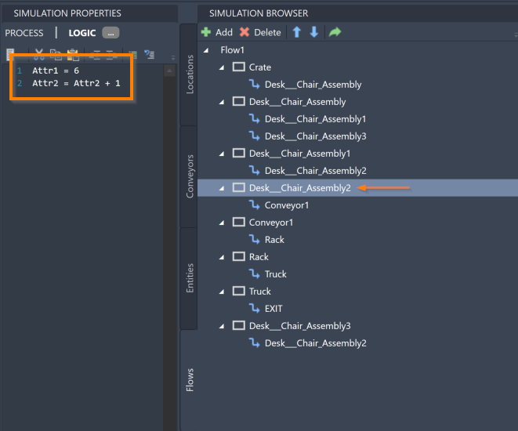

 
 

You may also use other Logic functions to assign values to your Attributes. 
For more information, see the [Logic](/pmacad/help/topic?page=Help/Docs/Modeling/Logic/Logic.md) section of the documentation. 

 

##### _Variables_
 

In a ProModel simulation, Variables are global numerical values of type **Real** or **Integer** that are used to track statistics throughout the system. 
Variables can store information that can be used during the simulation or the output results, and they can also be displayed on the layout during the simulation. 
Variables are often used for counting throughput, making decisions, tracking Work In Progress, calculating custom statistics, or displaying other data during simulation. 

To access information about the Variables in your model, open the Model Elements menu and navigate to the **Variables** tab.

 

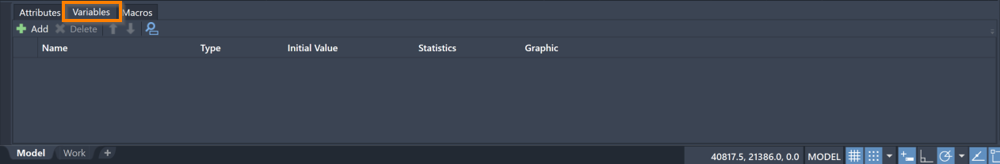

 
 

To add a Variable to your model, select the **Add** button in the upper left corner of the Model Elements menu. 
Clicking **Add** will create a Variable with the name **Var1**, the type **Integer**, an initial value of **0**, with the **Time Weighted** Statistics option selected, and with the **Graphic** box unchecked.  

To change the name of a Variable, double-click on the box in the **Name** column to edit its contents to reflect your desired Variable name. 

To change the type of a Variable, select a type from the drop-down menu that appears when you double-click a box in the **Type** column. 

To assign an initial value to your Variable, edit the contents of a box in the **Initial Value** column. 
If your Variable type is **Integer**, ProModel will only accept integers in this field. 
Both positive and negative numbers are acceptable.

To change the type of statistical information that is collected for a Variable, double-click a box in the **Statistic** column to see a drop-down menu of the statistical information types. 
**Time Weighted** Statistics collect information on the percentage of time the Variable was at a specific value (for its average value). 
**Observation** Statistics collect information on the number of times the Variable changed to a specific value (for its average value). 
You may also select **None** to collect no statistical information for this Variable.

To add a graphic to the layout that displays the value of a particular Variable, check the **Graphic** box. 

To delete a Variable from your model, select a Variable and press the **Delete** button. 

To reorder your Variables within the Model Elements menu, select a Variable and use the blue “**up**” and “**down**” arrows to move the Variable.

To search for a specific Variable within your model, click on the **blue magnifying glass** to toggle the search panel. 
With the search panel open, you may then use it to search for a Variable using its name. 

To change the value of a Variable at a certain Location within the system, make sure the Simulation Properties menu is open and navigate to the **Flow** tab in your Simulation Browser. 
Navigate to that Location in the Simulation Browser and then, in the Simulation Properties menu, select the word **Logic** at the top of the menu to view the Logic information for that Location.  

 

 
 

You may now use the equals sign (**=**) to reassign a value to your Variable using its name, which will cause the Variable to change every time an Entity enters this Location. 
You may also use mathematical formulas and other Variables to determine the new value of a Variable. 

 

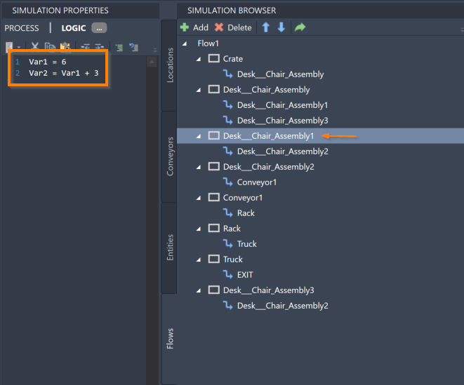

 
 

You may also use other Logic functions to assign values to your Variables. 
For more information, see the [Logic](/pmacad/help/topic?page=Help/Docs/Modeling/Logic/Logic.md) section of the documentation.

To view the statistical information that was collected for your Variables, you must first run your simulation. 
To run the simulation, select the **Simulate** icon in the ProModel ribbon. 
For more information about what options are available to you when you run your simulation, see the [Simulation](/pmacad/help/topic?page=Help/Docs/Simulation/Simulation_Tools.md) section of the documentation.

 

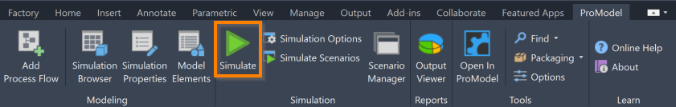

 
 

After the simulation has completed, a pop-up window will appear that displays the following message: 

 

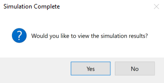

 
 

Select **Yes** to open Output Viewer and view the results of the simulation.  

 

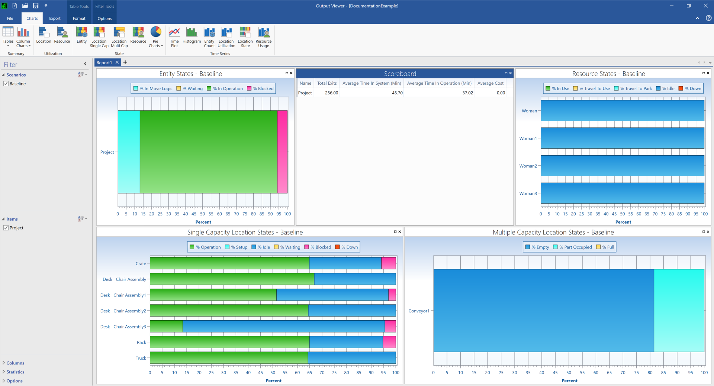

 
 

There are a few different ways to view the Variable information in Output Viewer. 
To see a table that displays information about your Variables, select the **Tables** icon to see a drop-down menu of options. 
Select the **Summary** icon under the **Variable** section to see a table which includes the following information about each of your Variables: Name, Total Changes, Average Time Per Change, Minimum Value, Maximum Value, Current Value, and Average Value. 

 

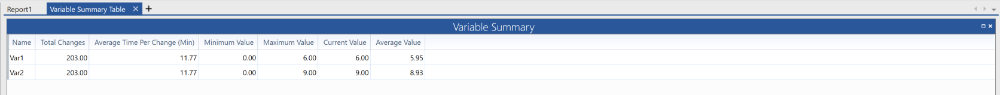

 
 

To see a column chart where you can view and compare information about your Variables, select the **Column Charts** icon to see a drop-down menu of options. 
Select the **Summary** icon under the **Variable** section to see a column chart displaying the current value of each of your Variables. 
To change the information being displayed, select the **Statistic** box to see a drop-down menu of possible options. 
The options for displayable information in a column chart include Total Changes, Average Time Per Change, Minimum Value, Maximum Value, Current Value and Average Value. 

 

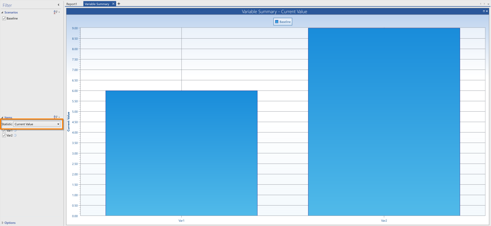

 
 

You may also add information about your Variables to a time plot or histogram displaying your other simulation results. 
While viewing a time plot or histogram, navigate to the **Items** list on the left hand side. 
Under the **Variables** folder, you will see a list of your created Variables. 
Click the box next to its name to display its information on the time plot or histogram. 

 

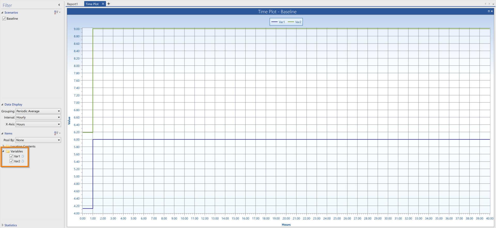

 
 

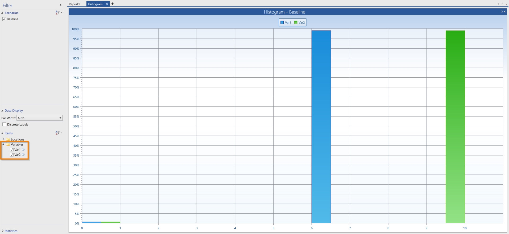

 
 

For more information about how to view and interpret your simulation results, see the [Simulation Results](/pmacad/help/topic?page=Help/Docs/SimulationResults/Simulation_Results.md) section of the documentation.

 

##### _Macros_
 

In a ProModel simulation, Macros are elements which can represent a number or a distribution expression that might be used repetitively throughout your model. 
Unlike Attributes and Variables, Macros do not change once the simulation has begun. 
Use Macros to quickly change values for the purposes of testing different options in your simulation. 

To access information about the Macros in your model, open the Model Elements menu and navigate to the **Macros** tab.

 

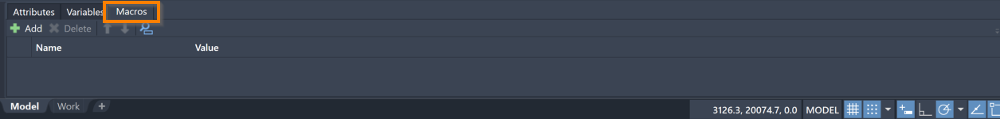

 
 

To add a Macro to your model, select the **Add** button in the upper left corner of the Model Elements menu. 
Clicking **Add** will create a Macro with the name **Macro1** and a value of **1**.

To change the name of a Macro, double-click on the box in the **Name** column to edit its contents to reflect your desired Macro name.  

To change the value of a Macro, edit the contents of the box in the **Value** column to reflect your desired value. 
Both positive and negative Real numbers are acceptable. 

To delete a Macro from your model, select a Macro and press the **Delete** button.

To reorder your Macros within the Model Elements menu, select a Macro and use the blue "**up**” and “**down**” arrows to move the Macro. 

To search for a specific Macro within your model, click on the **blue magnifying glass** to toggle the search panel. 
With the search panel open, you may then use it to search for a Macro using its name. 

Once a Macro is created, you may then use it to define Logic in your model. 
For more information on Logic use, see the [Logic](/pmacad/help/topic?page=Help/Docs/Modeling/Logic/Logic.md) section of the documentation.

 
---

**Next**: [Learn how to use Routing Rules](/pmacad/help/topic?page=Help/Docs/Modeling/RoutingRules/Routing_Rules.md)   

