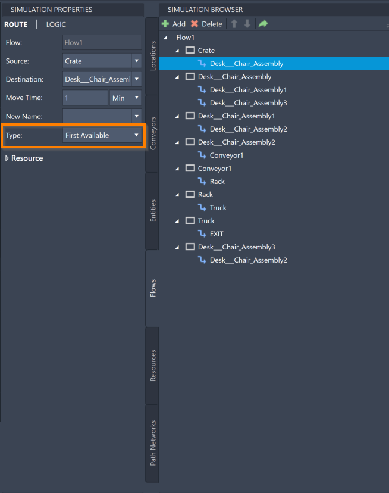
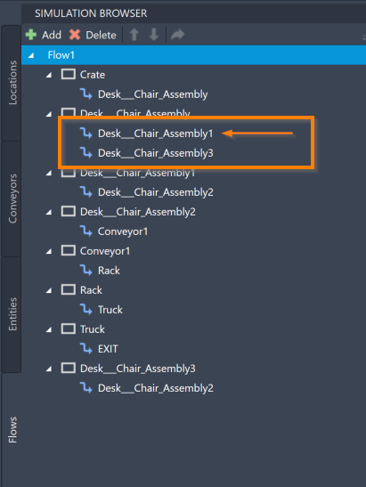
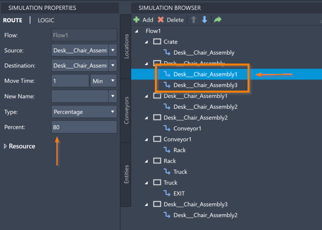
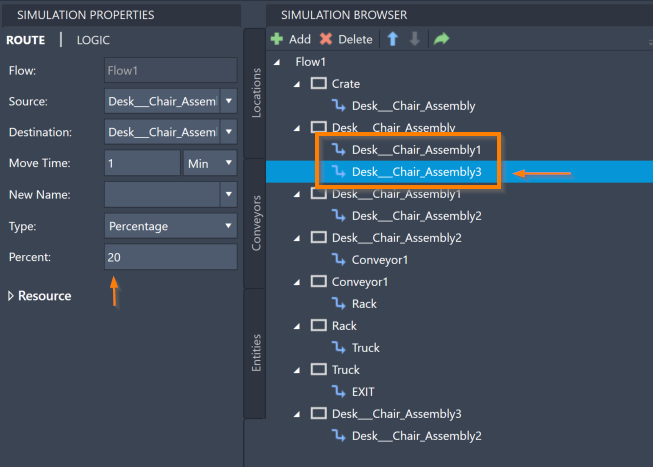
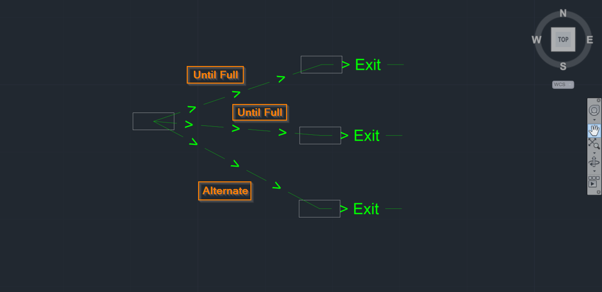
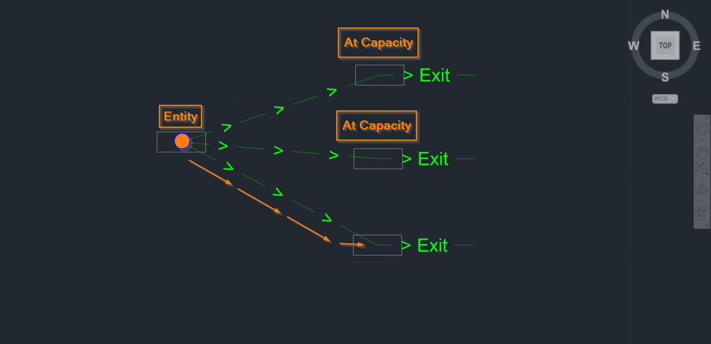



You are here: [Introduction](/pmacad/help/topic?page=Help/Docs/PMADHelpHome.md) > [Modeling](/pmacad/help/topic?page=Help/Docs/Modeling/Modeling.md)/[Getting Started](/pmacad/help/topic?page=Help/Docs/GettingStarted/GettingStarted.md) > Routing Rules

# **Routing Rules**
***

 

Routing Rules are a part of Flows that dictate where Entities will go first when traveling on a Flow Path with branching paths. 
This section will provide you a list of the available Routing Rules along with a description of each rule. 
For more information about how Flows function in ProModel simulations and about how to create and edit Flows in your model, see the [Flows](/pmacad/help/topic?page=Help/Docs/Modeling/SimulationBrowser/SB_Flows/SB_Flows.md) section of the Simulation Browser guide and the [Flows](/pmacad/help/topic?page=Help/Docs/Modeling/SimulationProperties/SP_Flows/SP_Flows.md) section of the Simulation Properties guide. 

To edit the Routing Rules for a Flow, make sure your Simulation Properties menu is open and select the **Flows** tab from the Simulation Browser. 
Choose any of the Routes within a Flow (denoted by a blue arrow to the left of its name) to see the Simulation Properties information for that Route. 
Choose the **Type** box to see a drop-down menu of the possible Routing Rules.

 

 
 

The following Routing Rules are available for use in ProModel AutoCAD® Edition:  

 

##### _First Available_
 

If segments of a Flow are set to the **First Available** Routing Rule, the Entity following the Flow will move to whichever Location becomes available first when waiting for a Location to move to. 
If multiple Locations on the Flow are available, the Entity will default to using the Route that is listed higher on the Simulation Browser menu within that particular group of Routes. 

 

 
 

##### _Percentage_
 

If segments of a Flow are set to the **Percentage** Routing Rule, a percentage of Entities following the Flow will go to each Location listed from the Entity’s current Location. 
What percentage of Entities will go to each Location is based on the value in the **Percentage** box, which will appear if you choose the **Percentage** Routing Rule for a Route. 
Type a number into the **Percentage** box to indicate that that percent of the total Entities coming from the source Location should follow that Route. 
Please ensure that all of the Routes in a particular group that are using the **Percentage** Routing Rule have values in the **Percentage** box that add up to 100 percent. 

 

 
 

 
 

##### _If Join_
 

The **If Join** Routing Rule is used when a portion of your model is assembling parts. 
If a segment of a Flow is set to the **If Join** Routing Rule, then it will remain in its previous Location until the Entity at the destination Location calls for it using a **Join** statement. 
The Route using the **If Join** Routing Rule should be the route that starts where the joining Entities are waiting and which leads to where the base Entity that executed the **Join** statement is waiting. 
For more information on the **Join** Logic statement, see the [Join](/pmacad/help/topic?page=Help/Docs/Modeling/Logic/Grouping/Grouping.md#join) section of the Logic guide. 

 

##### _If Send_
 

The **If Send** Routing Rule should be used together with the **Send** Logic statement. 
The Route that leads the Entities that have been called for in the **Send** statement to the Location that was specified in the **Send** statement should be set to the **If Send** Routing Rule. 
Setting a Route to **If Send** will ensure that Entities will wait at the Source Location of the Route until a **Send** statement is made for them. 
For more information on the **Send** Logic statement, see the [Send](/pmacad/help/topic?page=Help/Docs/Modeling/Logic/Moving/Moving.md#send) section of the Logic guide. 

 

##### _If Load_
 

The **If Load** Routing Rule should be used together with the **Load** Logic statement.
A Route using the **If Load** Routing Rule leads the loading Entities to the base Entity where the **Load** statement is defined. 
Setting a Route to **If Load** will ensure that Entities will wait at the Source Location of the Route until a **Load** statement is made for them. 
For more information on the **Load** Logic statement, see the [Load and Unload](/pmacad/help/topic?page=Help/Docs/Modeling/Logic/Grouping/Grouping.md#load-and-unload) section of the Logic guide. 

 

##### _Until Full_
 

If a segment of a Flow is set to the **Until Full** Routing Rule, Entities following the Flow will continue to travel to a Location until the Location has reached its capacity. 
If multiple Routes in a particular group are set to the **Until Full** Routing Rule, Entities will continue to use the Route that is ordered highest on the Simulation Browser in that group until the destination Location of that Route is full, when they will then start using the second Route, and so on. 

 

##### _Most Available_
 

If segments of a Flow are set to the **Most Available** Routing Rule, Entities following the Flow will determine which of the Locations they can go to has the most available capacity and will travel to that Location. 

 

##### _Alternate_
 

If a segment of a Flow is set to the **Alternate** Routing Rule, the Route is marked as an alternate path for Entities following the Flow. 
Entities will then follow this Route if the destination Location has available capacity and the condition for another primary Routing Rule is not met. 
For example, if a Location has three different Routes leading to three separate new Locations, two Routes could be set to the **Until Full** Routing Rule, and the third could be set to the **Alternate** Routing Rule. 
If the destination Locations of the two first arrows are at full capacity, meaning that the condition of their Routing Rule cannot be met, the Entity following the Flow will be able to use the third Route as an Alternate path. 

 

 
 

 
 

---

**Next**: [Learn how to use Distribution Intervals](/pmacad/help/topic?page=Help/Docs/Modeling/Distribution_Intervals.md)  

