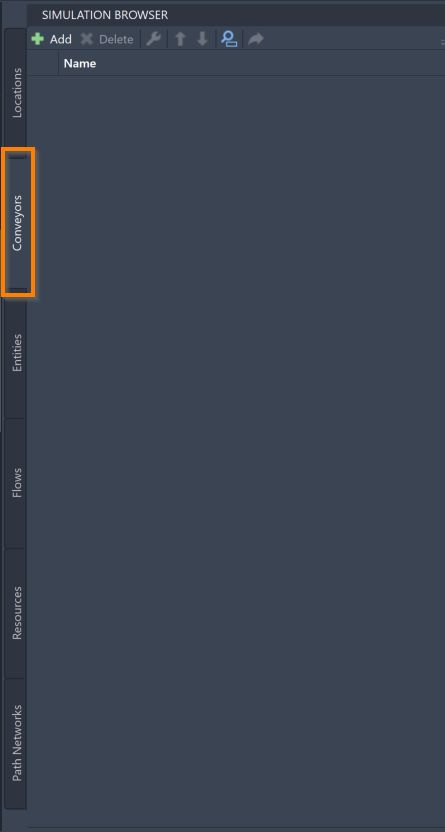
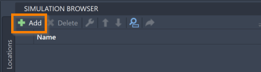
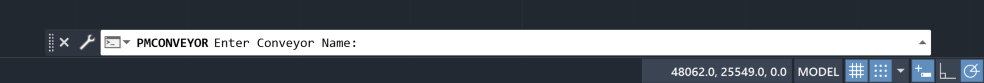
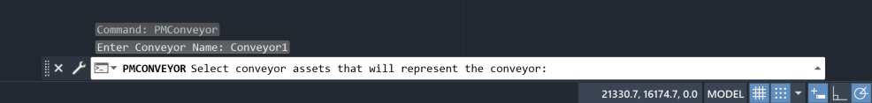
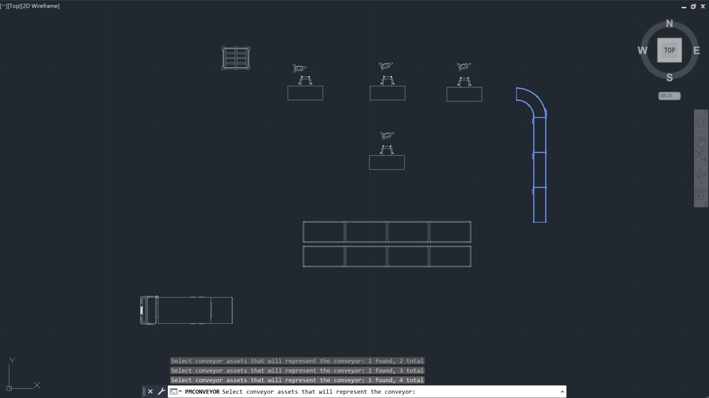
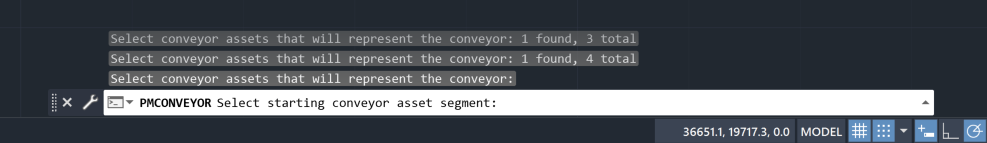
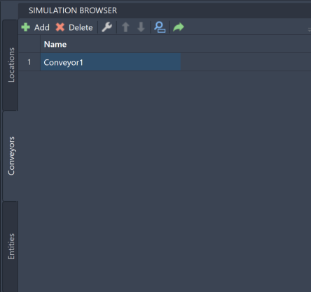
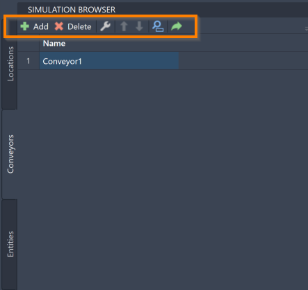



You are here: [Introduction](/pmacad/help/topic?page=Help/Docs/PMADHelpHome.md) > [Modeling](/pmacad/help/topic?page=Help/Docs/Modeling/Modeling.md)/[Getting Started](/pmacad/help/topic?page=Help/Docs/GettingStarted/GettingStarted.md) > [Simulation Browser](/pmacad/help/topic?page=Help/Docs/Modeling/SimulationBrowser/Simulation_Browser.md) > Conveyors

# **Simulation Browser: Conveyors**  
***

 

The Conveyors tab within the Simulation Browser menu allows you to add, delete, modify, and reorder the Conveyors in your model. 
Conveyors are a special type of Location within ProModel simulations. 
Conveyors represent Locations that move items from one place in your model to another, such as a conveyor belt in a factory. 

 

### _Adding Conveyors_
 

To add a Conveyor to your model, navigate to the Conveyor tab in the Simulation Browser menu and click the **Add** button in the upper left corner. 

 

 
 

 
 

Selecting the **Add** button will prompt the command box to display the following message: 

 

 
 

You may then enter the name of your Conveyor into the command box. 
Once you have entered your desired name, press **Enter** on your keyboard.
After pressing **Enter**, the command box will display the following message: 

 

 
 

You may now click the assets that you would like to add to represent the Conveyor. 
You can also click and drag your mouse to select multiple assets at once. 
When an asset is selected, it will turn blue.

 

 
 

Note that an asset that has already been chosen as a Location cannot also be added as a Conveyor. 

Once you have selected all of the desired assets, press **Enter** on your keyboard. 
The following message will then be displayed by the command box: 

 

 
 

Click the asset that you would like to represent the start of your Conveyor, or the location where Entities will arrive onto your Conveyor. 
The direction of the Conveyor will be determined by this selection: it will move away from the asset you choose as a starting point, and towards the end of the Conveyor. 
Once you have clicked the asset you have chosen as a starting segment, the Conveyor will be displayed on the Simulation Browser menu. 

 

 
 

If you instead need to exit out of the adding process during any of the previous steps, press **Escape** on your keyboard. 

 

### _Conveyor Tools_
 

Once added to the model, you will be able to use the Simulation Browser to delete, modify, reorder, search for, or navigate to your Conveyors within the model. 
These features are accessible through the buttons at the top of the Simulation Browser menu. 

 

 
 

To delete a Conveyor, click on your intended Conveyor in the Simulation Browser and press the **Delete** button. 
You may also right-click on the Conveyor and select **Delete**. 

To modify your Conveyor and re-select which assets represent the Conveyor, as well as which asset represents the start of your Conveyor, click on the **gray wrench**. 
You will now be taken through the selection portion of the adding process again, so that you may make any needed changes. 
You can also right-click on the intended Conveyor and click **Modify Conveyor**.

To reorder your Conveyors within the Simulation Browser, select a Conveyor and use the blue “**up**” and “**down**” arrows to move the Conveyor. 
 
To search for a specific Conveyor within your model, click on the **blue magnifying glass** to toggle the search panel. 
With the search panel open, you may then use it to search for a Conveyor using its name. 

To navigate to a specific Conveyor within your AutoCAD® drawing, select a Conveyor within the Simulation Browser and click the **green arrow**.

More ways to edit and interact with your Conveyors are available within the Simulation Properties menu, and will be described in the [Simulation Properties](/pmacad/help/topic?page=Help/Docs/Modeling/SimulationProperties/Simulation_Properties.md) section.

