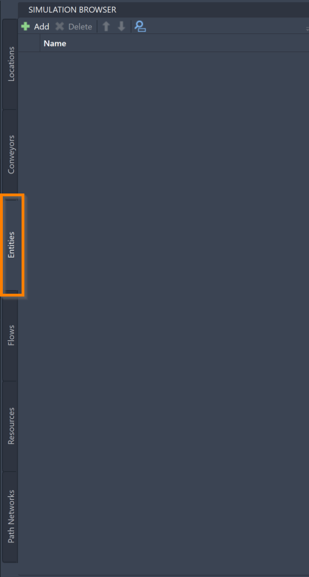
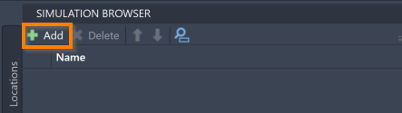
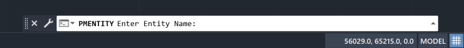
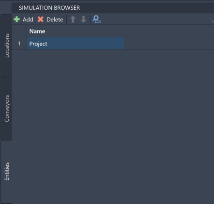
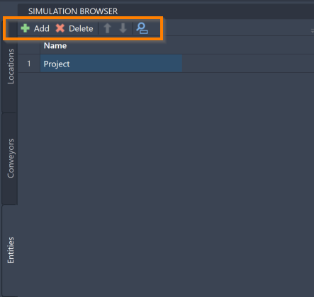



You are here: [Introduction](/pmacad/help/topic?page=Help/Docs/PMADHelpHome.md) > [Modeling](/pmacad/help/topic?page=Help/Docs/Modeling/Modeling.md)/[Getting Started](/pmacad/help/topic?page=Help/Docs/GettingStarted/GettingStarted.md) > [Simulation Browser](/pmacad/help/topic?page=Help/Docs/Modeling/SimulationBrowser/Simulation_Browser.md) > Entities

# **Simulation Browser: Entities**  
***

   

The Entities tab within the Simulation Browser allows you to add, delete, and reorder the Entities in your Model.
Within ProModel simulations, Entities are the essential elements of your model that drive nearly all of the events that occur during the simulation. 
Entities can be parts or raw materials that are used to create a product, orders or other types of paperwork, customers, or anything else that flows through the system.

 

### _Adding Entities_
 

To add Entities to your model, navigate to the Entities tab within the Simulation Browser menu and click the **Add** button in the upper left corner. 

 

 
 

 
 

Selecting the **Add** button will prompt the command box to display the following message: 

 

 
 

You may then enter the name of your Entity into the command box. 
Once you have entered your desired name, press **Enter** on your keyboard. 
The Entity will then be displayed on the Simulation Browser menu. 

 

 
 

If you instead need to exit out of the adding process, press **Escape** on your keyboard. 

 

### _Entity Tools_
 

Once added to the model, you will be able to use the Simulation Browser to delete, reorder, or search for your Entities. 
These features are accessible through the buttons at the top of the Simulation Browser menu. 

 

 
 

To delete an Entity, click on your intended Entity in the Simulation Browser and press the **Delete** button. 
You may also right-click on the Entity and select **Delete**. 

To reorder your Entities within the Simulation Browser, select an Entity and use the blue “**up**” and “**down**” arrows to move the Entity. 

To search for a specific Entity within your model, click on the **blue magnifying glass** to toggle the search panel. 
With the search panel open, you may then use it to search for an Entity using its name. 

More ways to edit and interact with your Entities are available within the Simulation Properties menu, and will be described in the [Simulation Properties](/pmacad/help/topic?page=Help/Docs/Modeling/SimulationProperties/Simulation_Properties.md) section.

