

You are here: [Introduction](/pmacad/help/topic?page=Help/Docs/PMADHelpHome.md) > [Modeling](/pmacad/help/topic?page=Help/Docs/Modeling/Modeling.md)/[Getting Started](/pmacad/help/topic?page=Help/Docs/GettingStarted/GettingStarted.md) > [Simulation Browser](/pmacad/help/topic?page=Help/Docs/Modeling/SimulationBrowser/Simulation_Browser.md) > Flows

# **Simulation Browser: Flows**  
***

 

The Flows tab within the Simulation Browser menu allows you to add, delete, and reorder the  Flows in your model.  

Within a ProModel simulation, Flows define how Entities move through the model. 
Flows are responsible for determining where Entities go in the model, how they get there, and what happens to them at each Location. 
Either all Entities in the model can follow the same Flow, or each Entity will need its own Flow. 

 

### _Adding Flows_
 

To add a Flow to your model, navigate to the Flows tab on the Simulation Browser menu and click the **Add** button in the upper left corner.

 

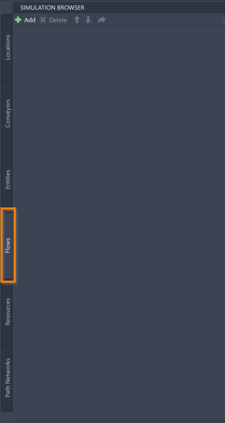

 
 

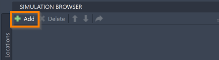

 
 

You may also select the **Add Process Flow** icon in the ProModel ribbon. 

 

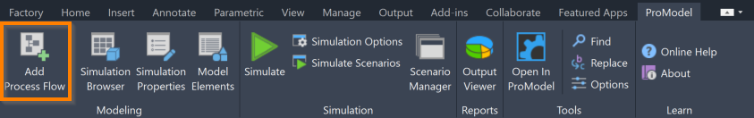

 
 

If you hover over the **Add Process Flow** icon, you can see a description of the tool, as well as the command **PMFlow**. 
Typing this command into the command box is another way to add Flows. 

Selecting either **Add** button or using the **PMFlow** command will prompt the command box to display the following message: 

 

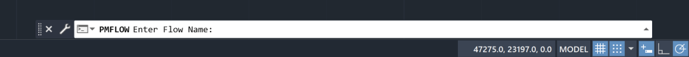

 
 

You may now enter the name of your Flow into the command box. 
Once you have entered your desired name, press **Enter** on your keyboard. 
Pressing **Enter** will prompt the command box to display the following message: 

 

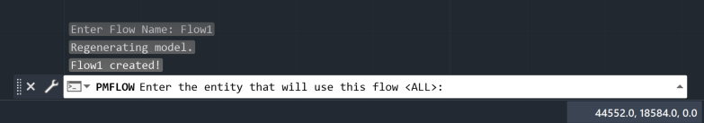

 
 

You may now enter the name of the Entity that you would like to follow this Flow. 
Once you have entered the name of your desired Entity into the command box, press **Enter** on your keyboard. 
If the Entity you would like to use has not yet been created, you may also enter the name of a new Entity and it will be created and added to the Entities tab when you press **Enter**. 
You may also type **ALL** into the command box to make all of your created Entities follow this Flow.

For more information on Entities and how to use the Entities tab of the Simulation Browser, see the [Entities](/pmacad/help/topic?page=Help/Docs/Modeling/SimulationBrowser/SB_Entities/SB_Entities.md) section of this guide.

Once you have selected an Entity to follow your Flow, you may now start defining how your Flow moves throughout your model. 

To build your Flow, single left-click on the Locations or Conveyors you would like your Flow to visit in your desired sequence order, meaning that the first Location you select should be the beginning of your Flow, and the last Location you select should be the end. 
As you select assets, they will be added, in order, to the Simulation Browser menu. 

 

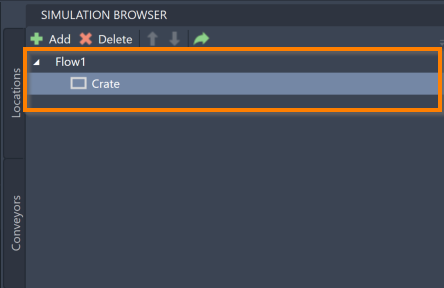

 
 

As you hover your mouse over Locations or Conveyors, notice how the asset is “highlighted”.
For the best results as you build your Flow, wait until you see this highlight on an asset before clicking it to make sure that it is selected correctly. 

As you click on assets to build your Flow, note that arrows will visually display the Routes you are creating between Locations, which will combine to create the full Flow. 

 

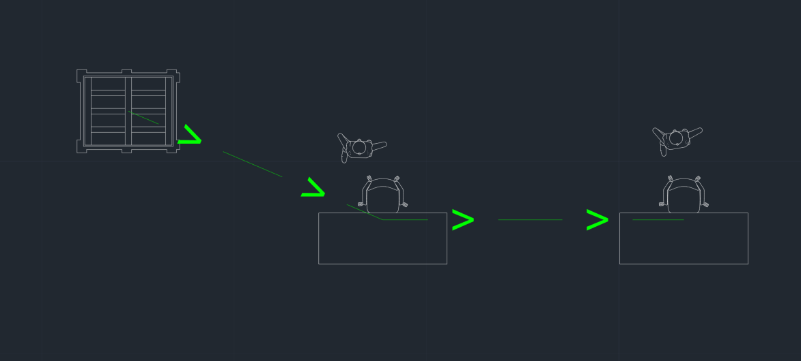

 
 

Once you have reached the final Location of your Flow, click on the **Exit** button in the command box to create an exit Route for your Entity. 
A line will then appear leading out of the final Location to represent your Entity leaving the model. 

 

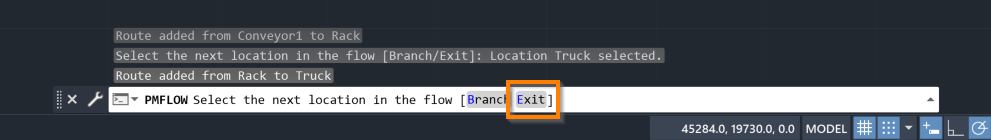

 
 

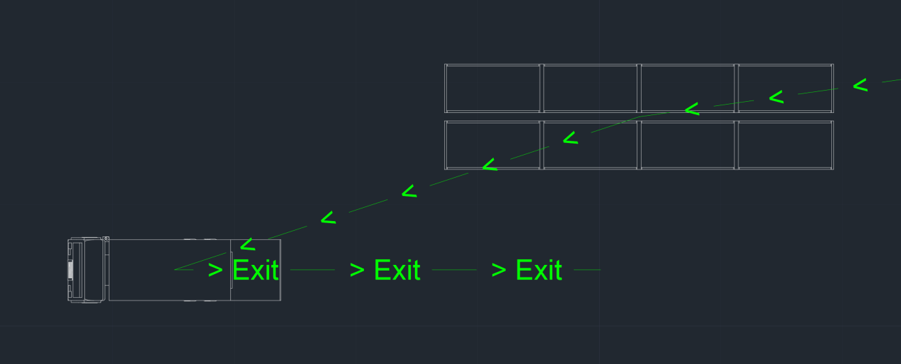

 
 

While building your Flow, you may also add branching paths that your Entity might take while traveling through the system. 
It is recommended that you first complete your main process Flow line before going back to add these branching paths. 
Once you are ready to add branches, press the **Branch** button in the command box. 

 

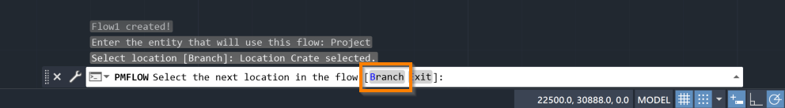

 
 

Once you have selected **Branch**, click on the Location in your main process Flow line where the branch will be stemming from. 
You may now select the other Locations that this branch will travel to that deviate from the main process Flow line. 
Your branch should either rejoin with the main process Flow line so that it can also reach the exit Route, or end in a new exit Route at a seperate Location. 

 

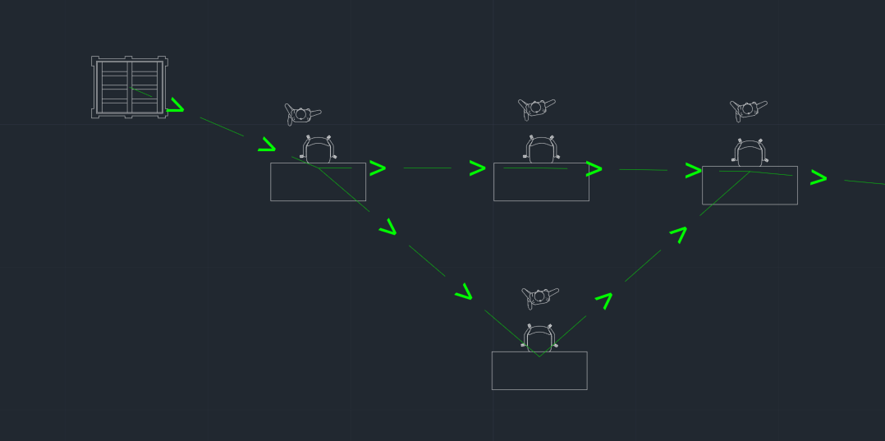

 
 

Once you have completed your Flow, press **Escape** on your keyboard to complete the adding process. 

 

### _Flow Tools_
 

Once added to the model, you will be able to use the Simulation Browser to delete, reorder, or navigate to your Flows within the model. 
These features are accessible through the buttons at the top of the Simulation Browser menu.

 

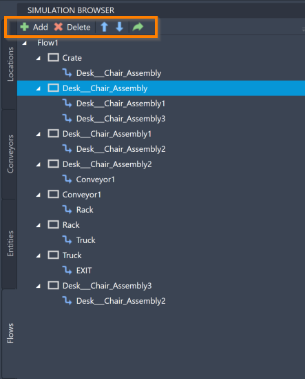

 
 

To delete a Flow, click on your intended Flow in the Simulation Browser and press the **Delete** button. 
You may also right-click on the Flow and select **Delete**. 

To duplicate a Flow in order to use it for a different Entity, right-click on the Flow and select **Duplicate**. 

To navigate to a specific Location, Conveyor or Route within your Flow on your AutoCAD® drawing, select your chosen item within the Simulation Browser and click the **green arrow**.

You can also use the Simulation Browser to modify the different pieces of your Flow. 
To delete any of the Routes between assets, right-click on the Route within the Simulation Browser menu (denoted by a blue arrow to the left of its name) and click **Delete**. 

 

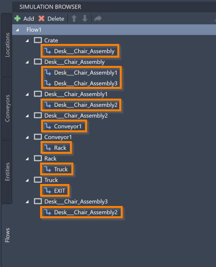

 
 

To delete any of the Locations (including Conveyors) within your Flow, right-click on the Location within the Simulation Browser menu (denoted by a white rectangle to the left of its name) and click **Delete**. 

 

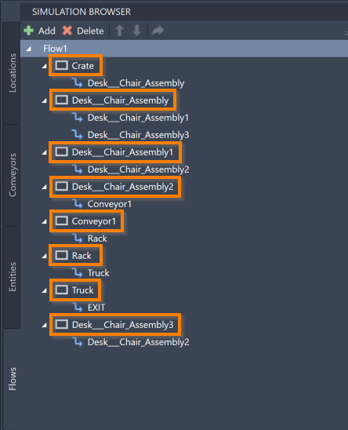

 
 

You may also use the Locations in the Simulation Browser to add new Routes to your Flow. 
Right-click on a Location and select the **Add Route** button. 
This action will cause the following message to be displayed by the command box:

 

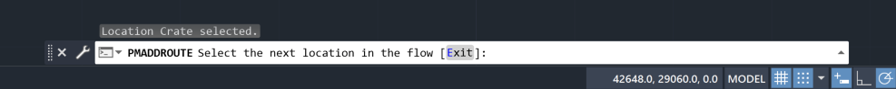

 
 

You may now select the next Location by clicking on the asset in the layout, which will create a new Route branching from the Location that you initially selected. 
You can also right-click on a Location and select **Add Exit Route** to denote that the Entity will leave the system from that Location. 

Another way to add additional Routes to your Flow is to right-click on your Flow and select **Add Process**. 
This option will allow you to use the layout and click directly on assets to add them to your Flow, much like the initial adding process. 

To reorder the Locations within a Flow, select a Location and use the blue “**up**” and “**down**” arrows to reorder its place within the Flow sequence. 

More ways to edit and interact with your Flows are available within the Simulation Properties menu, and will be described in the [Simulation Properties](/pmacad/help/topic?page=Help/Docs/Modeling/SimulationProperties/Simulation_Properties.md) section. 

