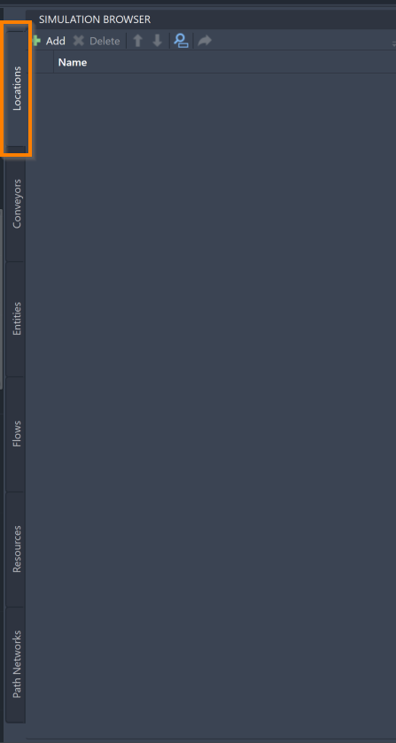
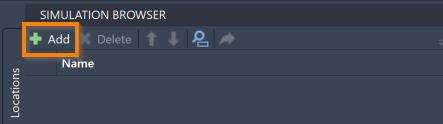
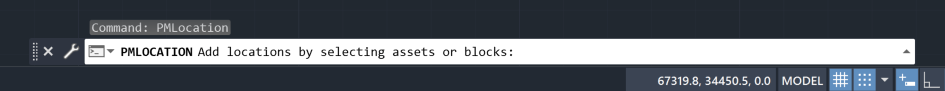
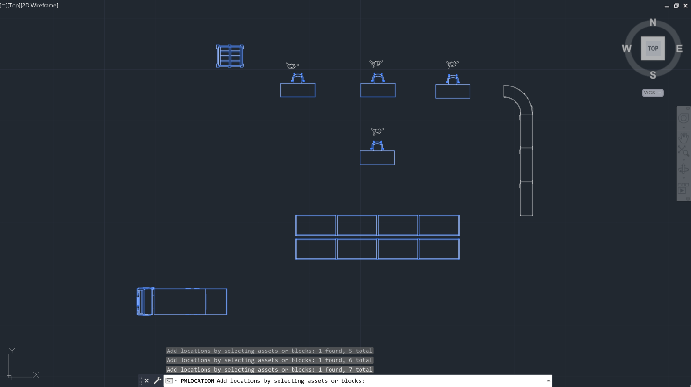
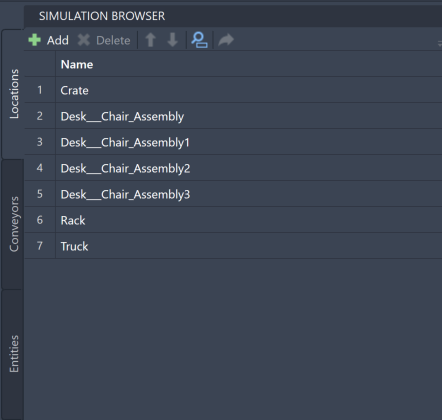
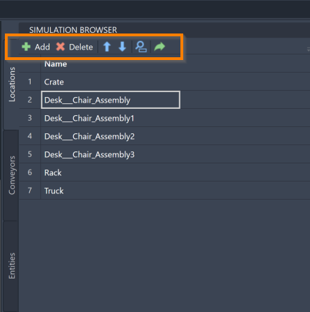



You are here: [Introduction](/pmacad/help/topic?page=Help/Docs/PMADHelpHome.md) > [Modeling](/pmacad/help/topic?page=Help/Docs/Modeling/Modeling.md)/[Getting Started](/pmacad/help/topic?page=Help/Docs/GettingStarted/GettingStarted.md) > [Simulation Browser](/pmacad/help/topic?page=Help/Docs/Modeling/SimulationBrowser/Simulation_Browser.md) > Locations

# **Simulation Browser: Locations**
***  

 

The Locations tab within the Simulation Browser allows you to add, delete, and reorder the Locations in your model. 
Within ProModel simulations, Locations are places in your model where activities happen. 
Locations can be machines where a product is being produced, shelving where inventory is stored, conveyor belts where materials are transported from one place to another, queues of people lining up in front of a store, and so forth. 
Locations are often represented by a graphic within the model, but they can also be transparent. 
An example of a transparent Location is a line of people waiting to make a purchase at a cash register, since that isn’t a Location you would need to use a graphic to represent. 
These transparent Locations will still be accessible while you edit your model, but they will appear transparent in the final simulation.

 

### _Adding Locations_
 

To add a Location to your model, navigate to the Locations tab within the Simulation Browser menu and press the **Add** button in the upper left corner. 

 

 
 

 
 

Selecting the **Add** button will prompt the command box to display the following message: 

 

 
 

You may now click the assets or blocks that you would like to make a Location. 
You can also click and drag your mouse, selecting many assets or blocks at once. 
Once an asset or block is selected, it will turn blue. 

 

 
 

Once you have finished selecting your new Locations, press **Enter** on your keyboard to add them to your model. 
They will then be displayed in your Simulation Browser. 

 

 
 

If you instead need to exit out of the adding process, press **Escape** on your keyboard. 

Many Locations, if they are represented by a graphic from the graphic library, will have an “entity spot” integrated into them when they are added. 
Entity spots are the points where Entities will appear graphically when interacting with a Location. 
Entity spots can also be placed manually on top of a graphic on the layout, or placed directly on the layout itself. 
More information about Entities can be found in the [Entities](/pmacad/help/topic?page=Help/Docs/Modeling/SimulationBrowser/SB_Entities/SB_Entities.md) section of the Simulation Browser guide.

 

### _Location Tools_
 

Once added to the model, you will be able to use the Simulation Browser to delete, reorder, search for, or navigate to your Locations in the model. 
These features are accessible through the buttons at the top of the Simulation Browser menu. 

 

 
 

To delete a Location, click on your intended Location in the Simulation Browser and press the **Delete** button. 
You may also right-click on the Location and select **Delete**. 

To reorder your Locations within the Simulation Browser, select a Location and use the blue “**up**” and “**down**” arrows to move the Location. 

To search for a specific Location within your model, click on the **blue magnifying glass** to toggle the search panel. 
With the search panel open, you may then use it to search for a Location using its name. 

To navigate to a specific Location within your AutoCAD® drawing, select a Location within the Simulation Browser and click the **green arrow**. 

More ways to edit and interact with your Locations are available within the Simulation Properties menu, and will be described in the [Simulation Properties](/pmacad/help/topic?page=Help/Docs/Modeling/SimulationProperties/Simulation_Properties.md) section. 

