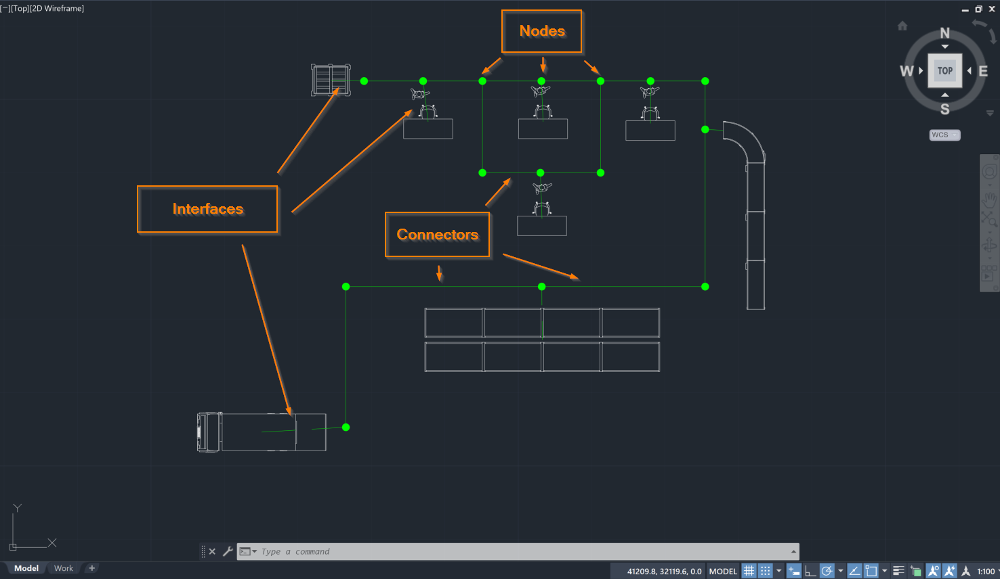
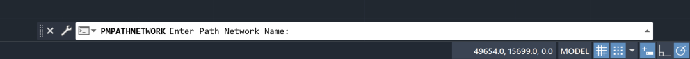

You are here: [Introduction](/pmacad/help/topic?page=Help/Docs/PMADHelpHome.md) > [Modeling](/pmacad/help/topic?page=Help/Docs/Modeling/Modeling.md)/[Getting Started](/pmacad/help/topic?page=Help/Docs/GettingStarted/GettingStarted.md) > [Simulation Browser](/pmacad/help/topic?page=Help/Docs/Modeling/SimulationBrowser/Simulation_Browser.md) > Path Networks

# **Simulation Browser: Path Networks**  
***

 

The Path Networks tab within the Simulation Browser menu allows you to add, delete, and reorder the Path Networks in your model.  

Path Networks allow Resources to move between Locations. 
When a Resource is assigned to a Path Network, the Resource follows the Path Network as it navigates through the system. 
Entities moving by themselves may also use Path Networks, but will usually use the Flow they are assigned to instead. 
 
Examples of Path Networks are interconnected hallways in an office building, roads or tracks that vehicles move on, or alleys between shelves in a warehouse. 

 Path Networks are composed of Connectors, Nodes and Interfaces.

 

 
 

**Connectors** are the path segments that combine to create the completed Path Network.  

**Nodes** mark the beginning and end of each connector. 
Nodes can be thought of as the joints that allow a Path Network to bend and wind in order to reach all the necessary Locations throughout your model.  

**Interfaces** are a special type of Node which define the relationship between a Node and a Location. 
Interfaces are used when an Entity or Resource moving on a Path Network needs to travel to and interact with a Location, such as a worker (Resource) using a machine (Location). 
 
Note that only one Node may interface with a particular Location from the same Path Network, but one Node may interface with multiple Locations.

 

### _Adding Path Networks_
 

To add Path Networks to your model, navigate to the Path Networks tab on the Simulation Browser menu and click the **Add** button in the upper left corner. 

 

 
 

 
 

Selecting the **Add** button will prompt the command box to display the following message: 

 

 
 

You may now enter the name of your Path Network into the command box. 
Once you have entered your desired name, press **Enter** on your keyboard. 
Pressing **Enter** will display the following message in your command box: 

 

 
 

You may now begin building your Path Network. 
You will automatically start using the Draw feature, which allows you to click on the layout to place Nodes. 
As you place additional Nodes, Connectors will appear between them. 
To return to the Draw feature at any time, select the **Draw** button in the command box.

To create additional Connectors, select the **Connector** button in the command box. 
You may now click on two or more Nodes that you would like to add Connectors to. 
Once you have chosen the desired Nodes, press **Enter** on your keyboard to create the Connectors. 

To create a branching path out of your main Path Network, select the **Branch** button in the command box. 
You may now select a Node from your main Path Network that your branching path will stem from. 
After selecting a starting Node, you will be able to add additional Nodes and Connectors the same way you did while using the Draw feature. 
If you would like to connect your Branch back to your main Path Network, click on a Node that is a part of your main Path Network and a Connector will be added between the end of the Branch and your main Path Network. 

To create an Interface, select the **Interface** button in the command box. 
You may now click on the Nodes and Locations that will be interfacing with one another. 
Note that Nodes that will be interfacing with Locations should be placed near the Locations, but not on top of them. 
This placement will keep the graphics from overlapping in an awkward way during the simulation. 
Once you have selected the desired Nodes and Locations, press **Enter** on your keyboard to create the Interface. 

If you have finished adding all of your desired Nodes, Connectors, Branches and Interfaces, press **Enter** on your keyboard. 
You may also press **Escape** on your keyboard to exit out of the adding process at any time. 

 

### _Path Network Tools_
 

Once added to the model, you will be able to use the Simulation Browser to delete, modify, reorder, search for, or navigate to your Path Networks within the model. 
These features are accessible through the buttons at the top of the Simulation Browser menu. 

 

 
 

To delete a Path Network, click on your intended Path Network in the Simulation Browser and press the **Delete** button. 
You may also right-click on the Path Network and select **Delete**. 

To modify your Path Network, click on the **gray wrench**, which will re-open the **Draw**, **Branch**, **Connector** and **Interface** menu. 
You can now use these options to modify your Path Network. 
You can also right-click on the intended Path Network and select **Modify Path Network**. 

To reorder your Path Networks within the Simulation Browser, select a Path Network and use the blue “**up**” and “**down**” arrows to move the Path Network.

To search for a specific Path Network within your model, click on the **blue magnifying glass** to toggle the search panel. 
With the search panel open, you may then use it to search for a Path Network using its name. 
 
To navigate to a specific Path Network within your AutoCAD® drawing, select a Path Network within the Simulation Browser and click the **green arrow**.

More ways to edit and interact with your Path Networks are available within the Simulation Properties menu, and will be described in the [Simulation Properties](/pmacad/help/topic?page=Help/Docs/Modeling/SimulationProperties/Simulation_Properties.md) section. 

