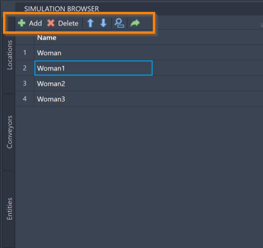

You are here: [Introduction](/pmacad/help/topic?page=Help/Docs/PMADHelpHome.md) > [Modeling](/pmacad/help/topic?page=Help/Docs/Modeling/Modeling.md)/[Getting Started](/pmacad/help/topic?page=Help/Docs/GettingStarted/GettingStarted.md) > [Simulation Browser](/pmacad/help/topic?page=Help/Docs/Modeling/SimulationBrowser/Simulation_Browser.md) > Resources

# **Simulation Browser: Resources**
***  

 

The Resources tab within the Simulation Browser menu allows you to add, delete, and reorder the Resources in your model.  

Resources are the people, machines or tools necessary to complete a task within a ProModel simulation. 
Generally, Resources impose constraints on your model, since Entities must share limited Resources in order to be processed through the system. 

There are two types of Resources: Static and Dynamic.   

**Static Resources** do not move throughout the model, and the graphic representing a Static Resource will not move during the simulation. 
 
**Dynamic Resources** do move throughout the model, and must be assigned to a Path Network so that the graphic representing the Dynamic Resource can move during the simulation. 
For more information about Path Networks, see the [Path Networks](/pmacad/help/topic?page=Help/Docs/Modeling/SimulationBrowser/SB_Path_Networks/SB_Path_Networks.md) section of the documentation.

 

### _Adding Resources_
 

To add a Resource to your model, navigate to the Resources tab on the Simulation Browser menu and click the **Add** button in the upper left corner.

 

 
 

 
 

Selecting the **Add** button will prompt the command box to display the following message: 

 

 
 

You may now click the assets or blocks that you would like to make a Resource. 
You can also click and drag your mouse, selecting many assets or blocks at once. 
Once an asset or block is selected, it will turn blue. 

 

 
 

Once you have finished selecting your new Resources, press **Enter** on your keyboard to add them to your model. 
They will then be displayed in your Simulation Browser.

 

 
 

If you instead need to exit out of the adding process, press **Escape** on your keyboard.

 

### _Resource Tools_ 
 

Once added to the model, you will be able to use the Simulation Browser to delete, reorder, search for, or navigate to your Resources within the model. 
These features are accessible through the buttons at the top of the Simulation Browser menu. 

 

 
 

To delete a Resource, click on your intended Resource in the Simulation Browser and press the **Delete** button. 
You may also right-click on the Resource and select **Delete**.

To reorder your Resources within the Simulation Browser, select a Resource and use the blue “**up**” and “**down**” arrows to move the Resource. 

To search for a specific Resource within your model, click on the **blue magnifying glass** to toggle the search panel. 
With the search panel open, you may then use it to search for a Resource using its name.

To navigate to a specific Resource within your AutoCAD® drawing, select a Resource within the Simulation Browser and click the **green arrow**.

More ways to edit and interact with your Resources are available within the Simulation Properties menu, and will be described in the [Simulation Properties](/pmacad/help/topic?page=Help/Docs/Modeling/SimulationProperties/Simulation_Properties.md) section.

