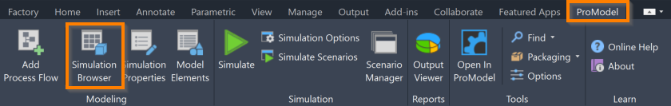
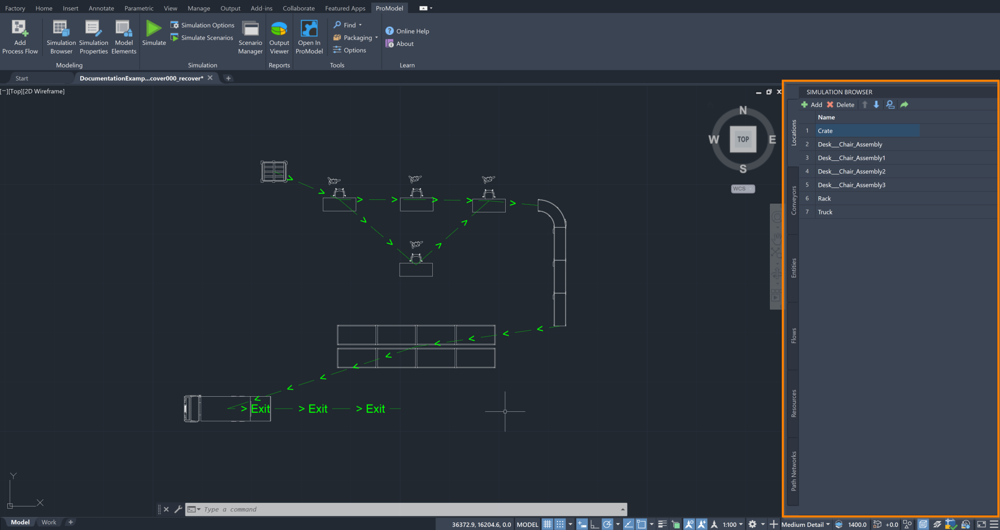



You are here: [Introduction](/pmacad/help/topic?page=Help/Docs/PMADHelpHome.md) > [Modeling](/pmacad/help/topic?page=Help/Docs/Modeling/Modeling.md)/[Getting Started](/pmacad/help/topic?page=Help/Docs/GettingStarted/GettingStarted.md) > Simulation Browser 

# **Simulation Browser**  
***

 

The ProModel AutoCAD® Edition’s Simulation Browser button is accessible through the ProModel ribbon tab within AutoCAD®.

 

 
 

The Simulation Browser button opens ProModel’s Simulation Browser as an additional menu on your screen, allowing you to browse or modify the elements of your DWG file. 

 

 
 

If you hover over the Simulation Browser icon, you can see a description of the tool, as well as the command **PMShowBrowser**. 
Typing this command into the command box is another way to open the Simulation Browser menu. 

Once you open the Simulation Browser, you will see the following tabs: Locations, Conveyors, Entities, Flows, Resources, and Path Networks. 
Each of these tabs allows you to add, delete, and reorder the items that they represent. 
Some tabs also provide additional capabilities, which will be described in their respective sections. 

To find information on each of the tabs included in the Simulation Browser, click on one of the sections below. 

**1.** [Locations](/pmacad/help/topic?page=Help/Docs/Modeling/SimulationBrowser/SB_Locations/SB_Locations.md)  
**2.** [Entities](/pmacad/help/topic?page=Help/Docs/Modeling/SimulationBrowser/SB_Entities/SB_Entities.md)  
**3.** [Conveyors](/pmacad/help/topic?page=Help/Docs/Modeling/SimulationBrowser/SB_Conveyors/SB_Conveyors.md)  
**4.** [Flows](/pmacad/help/topic?page=Help/Docs/Modeling/SimulationBrowser/SB_Flows/SB_Flows.md)  
**5.** [Resources](/pmacad/help/topic?page=Help/Docs/Modeling/SimulationBrowser/SB_Resources/SB_Resources.md)  
**6.** [Path Networks](/pmacad/help/topic?page=Help/Docs/Modeling/SimulationBrowser/SB_Path_Networks/SB_Path_Networks.md)

---

**Next**: [Use Simulation Properties to define information about the items in your model](/pmacad/help/topic?page=Help/Docs/Modeling/SimulationProperties/Simulation_Properties.md)  

