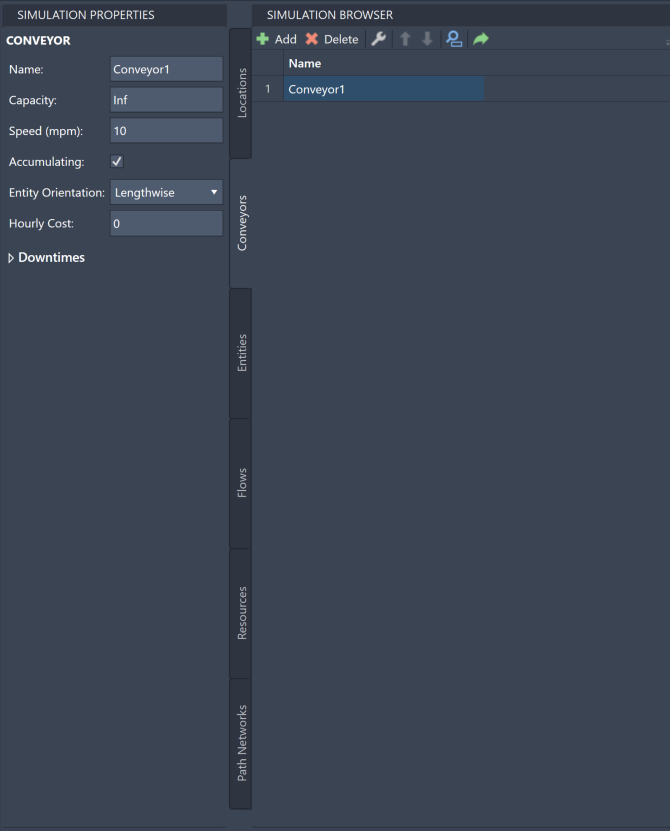
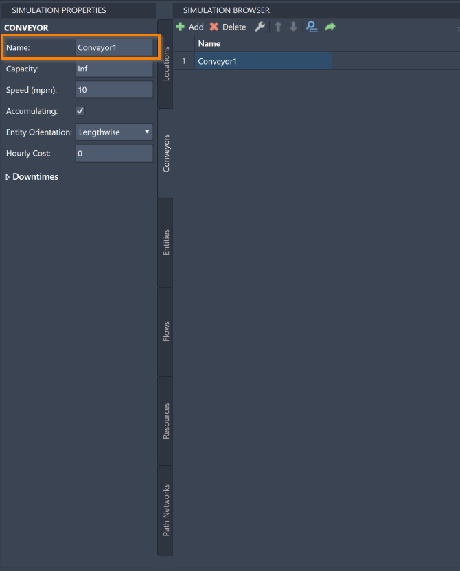
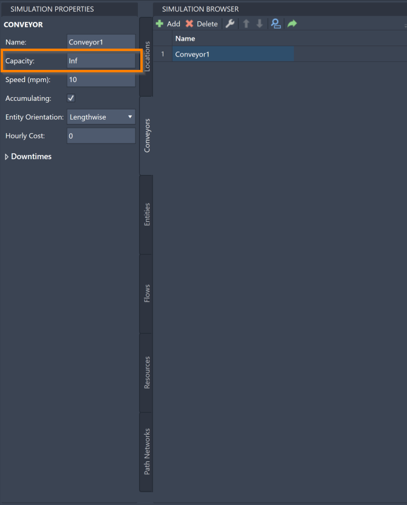
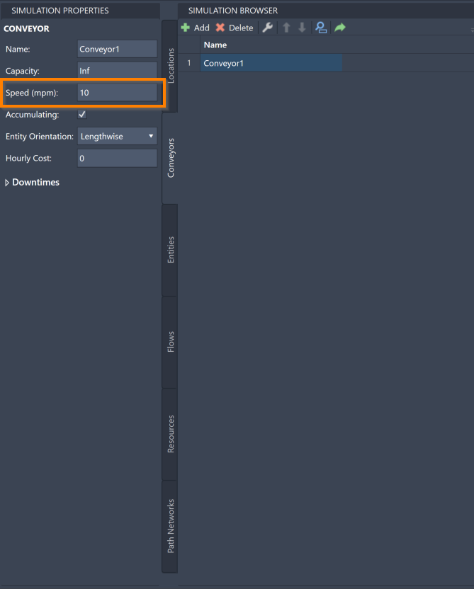
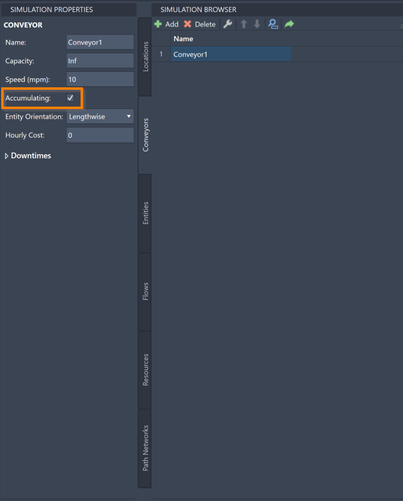
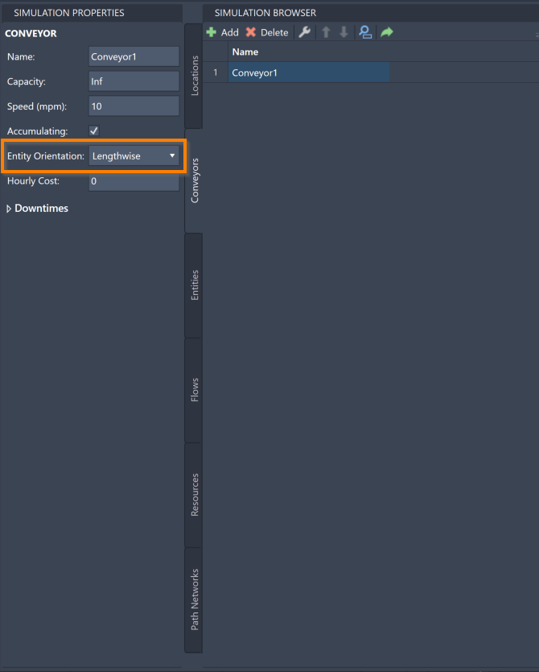
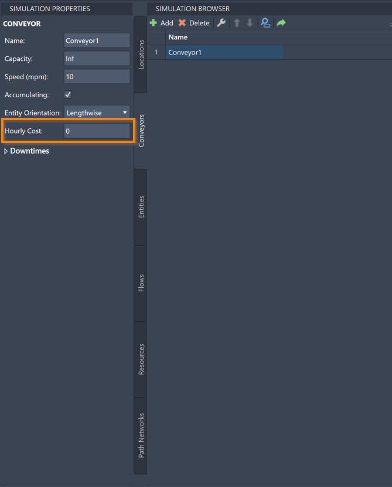
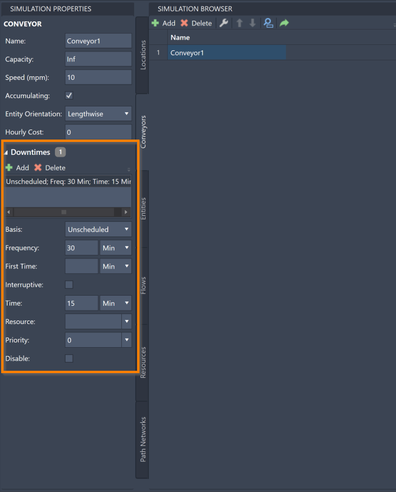



You are here: [Introduction](/pmacad/help/topic?page=Help/Docs/PMADHelpHome.md) > [Modeling](/pmacad/help/topic?page=Help/Docs/Modeling/Modeling.md)/[Getting Started](/pmacad/help/topic?page=Help/Docs/GettingStarted/GettingStarted.md) > [Simulation Properties](/pmacad/help/topic?page=Help/Docs/Modeling/SimulationProperties/Simulation_Properties.md) > Conveyors

# **Simulation Properties: Conveyors**  
***

 

The Simulation Properties menu allows you to edit the properties of the Conveyors you have defined in the Simulation Browser. 

For more information about how Conveyors function within a ProModel simulation, see the [Conveyors](/pmacad/help/topic?page=Help/Docs/Modeling/SimulationBrowser/SB_Conveyors/SB_Conveyors.md) section of the Simulation Browser guide.

To access the Simulation Properties of your Conveyors, make sure your Simulation Properties menu is open and then navigate to the Conveyors tab in your Simulation Browser. 
Select a specific Conveyor to see its information displayed in the Simulation Properties menu.

 

 
 

Within the Simulation Properties menu, you can change the name, capacity, speed, type, entity orientation and hourly cost of your Conveyors. 
You can also define Downtimes for your Conveyors. 

To change the name of a Conveyor, change the contents of the **Name** box in the Simulation Properties menu to reflect your desired Conveyor name. 

 

 
 

You can also change the capacity of a Conveyor using the Simulation Properties menu. 
The capacity of a Conveyor is the number of Entities that can travel on the Conveyor at any given time. 
A Conveyor’s capacity can be set to any integer between **1** and **999,999**. 
You may also use **Infinite** or **INF**, which ProModel equates to **999,999**. 
How Entities interact with a Conveyor’s capacity works similarly to how capacity was described in the [Locations](/pmacad/help/topic?page=Help/Docs/Modeling/SimulationProperties/SP_Locations/SP_Locations.md) section of this guide.

Any Location, including Conveyors, with a Capacity greater than **1** is considered a Multi-Capacity Location, and will be reflected as such in the simulation results. 
For more information about simulation results, see the [Simulation Results](/pmacad/help/topic?page=Help/Docs/SimulationResults/Simulation_Results.md) section of the documentation.

To change the capacity of a Conveyor, navigate to the **Capacity** box in the Simulation Properties menu and change the number to your desired capacity.  

 

 
 

Note that if the size of your Entities differ, the **Capacity** box may not be an accurate way to define capacity for your Conveyor, since ten of your smallest Entity may take up significantly less space on your Conveyor than ten of your largest Entity. 
In this case, set the **Capacity** box to **Infinite** and let the defined width or length of your Entities determine the capacity based on your Conveyor’s length. 

To change the speed at which your Conveyor moves, edit the value in the **Speed** box. 
Note that the speed is measured in miles per minute (mpm). 

 

 
 

The **Accumulating** box determines whether a Conveyor is Accumulating or Non-Accumulating. 
**Accumulating** Conveyors represent a gravity-based, roller type conveyor belt. 
Entities will move on an Accumulating Conveyor until they “bump” into the next Entity or reach the end of the Conveyor. 
**Non-Accumulating** Conveyors represent a conveyor where the entire conveyor track moves. 
All Entities move in unison on a Non-Accumulating Conveyor while maintaining a distinct distance between each other. 

If you would like your Conveyor to be the Accumulating type, check the **Accumulating** box. 
Otherwise, leave the box unchecked. 

 

 
 

You may also use the Simulation Properties menu to change the Entity orientation of your Conveyor, which determines what direction your Entities are oriented in as they travel along a Conveyor. 
Click on the **Entity Orientation** box to select a **Lengthwise** or **Widthwise** orientation. 
If an Entity moves on a Conveyor sideways (left to right or right to left), use the **Widthwise** orientation. 
If an Entity moves on a Conveyor up or down, use the **Lengthwise** orientation.

 

 
 

To change the hourly cost of a Conveyor, edit the contents of the **Hourly Cost** box in the Simulation Properties menu to reflect the correct hourly cost for that Conveyor. 
The hourly cost of a Conveyor represents how much that particular Conveyor will cost you to run in the simulation per hour. 
Using this feature will help you to determine how much a particular model will cost to run. 

 

 
 

### Downtimes
 

The Simulation Properties menu also offers tools to create and edit Downtimes for your Conveyors. 
Downtimes for Conveyors work similarly to how they were described in the [Locations](/pmacad/help/topic?page=Help/Docs/Modeling/SimulationProperties/SP_Locations/SP_Locations.md) section of this guide.

To access the Downtime information for a Conveyor, make sure the correct Conveyor is selected in your Simulation Browser menu and click the **Dowtime** drop-down menu displayed in Simulation Properties. 

 

 
 

To add a Downtime to your Conveyor, press the **Add** button in the upper left corner of the Downtime menu. 

Once a Downtime is added, you will be able to click on it in the menu and edit a number of its characteristics. 

The **Basis** box allows you to determine whether a Downtime is a Scheduled Downtime, an Unscheduled Downtime, or a Usage Downtime. 
Click the drop-down menu to see and select these options. 
The default option when you create a Downtime is **Unscheduled**.

The **Frequency** box allows you to enter a number to represent how frequently this Downtime will occur. 
Note that there is a drop-down menu that allows you to choose the unit of time that you would like to use. 
The default frequency when you create a Downtime is **30 minutes**.

The **First Time** box allows you to enter a number which will determine at what time the first instance of this Downtime will occur. 
The time you enter should be the amount of time after the start of the simulation that you would like the first instance of this Downtime to take place. 
Note that there is a drop-down menu that allows you to choose the unit of time that you would like to use. 
When you create a Dowtime, the default unit of time is **minutes**, and the First Time box is left blank.  
This setting will not impact **Usage** type Downtimes. 

Use the **Interruptive** box to ensure that other tasks will be interrupted to complete your Downtime. 

The **Time** box allows you to enter the amount of time that the Downtime should take. 
Note that there is a drop-down menu where you may select the unit of time that you would like to use. 
The default time when you create a Downtime is **15 minutes**.

The **Resource** box allows you to determine if a Resource needs to be involved in your Downtime break. 
Use this option if a Resource involved with the Conveyor should also take a break when the Conveyor begins its Downtime. 
Click on the box to see a drop-down menu of the Resources you have created and select your chosen Resource. 
You may also choose **Select None**, which will involve no Resources in the Downtime. 
**Select None** is the default setting when you create a Downtime.

Use the **Priority** box to select the priority (1-10 or interrupt) for obtaining the selected Resource and entering into the Downtime. 
Click on the box to see a drop-down menu of possible priorities. 
Downtimes with a higher priority will recieve their Resources and begin before other events with a lower priority. 
The **Interrupt** option is the highest priority.
The default priority when you create a Downtime is **0**.

The **Disable** box allows you to easily disable a Downtime without deleting it for the purposes of testing different options for your simulation. 
Click the box to mark the selected Downtime as disabled. 

To delete a Downtime from your Conveyor, select a Downtime from the menu and press the **Delete** button. 

 