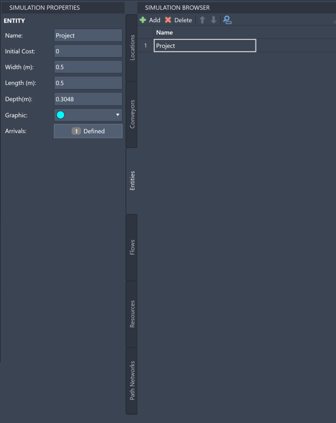
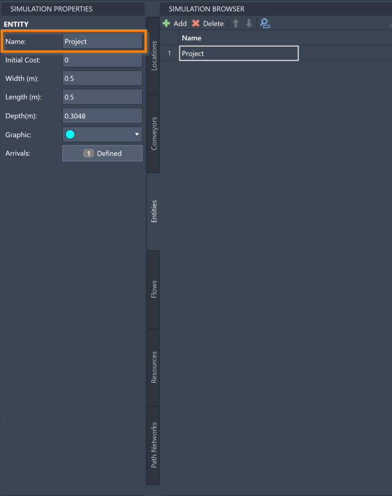
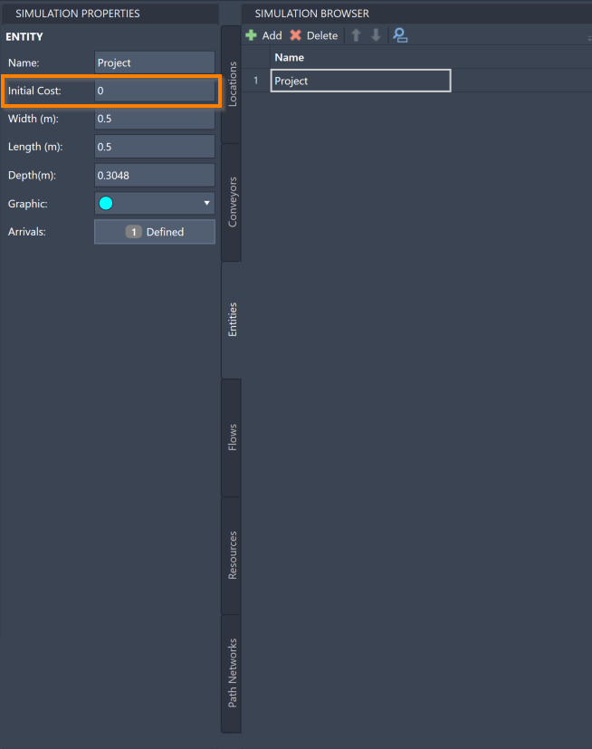
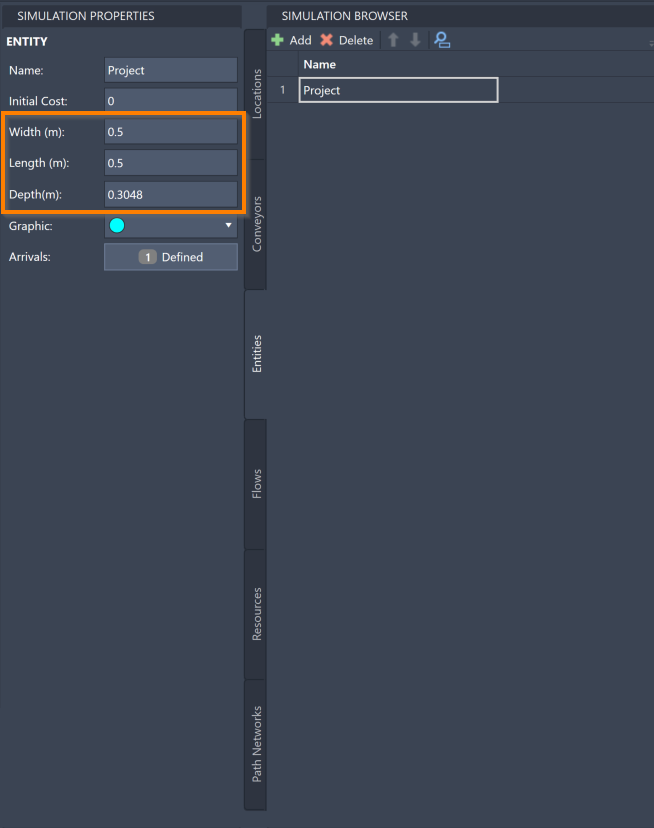
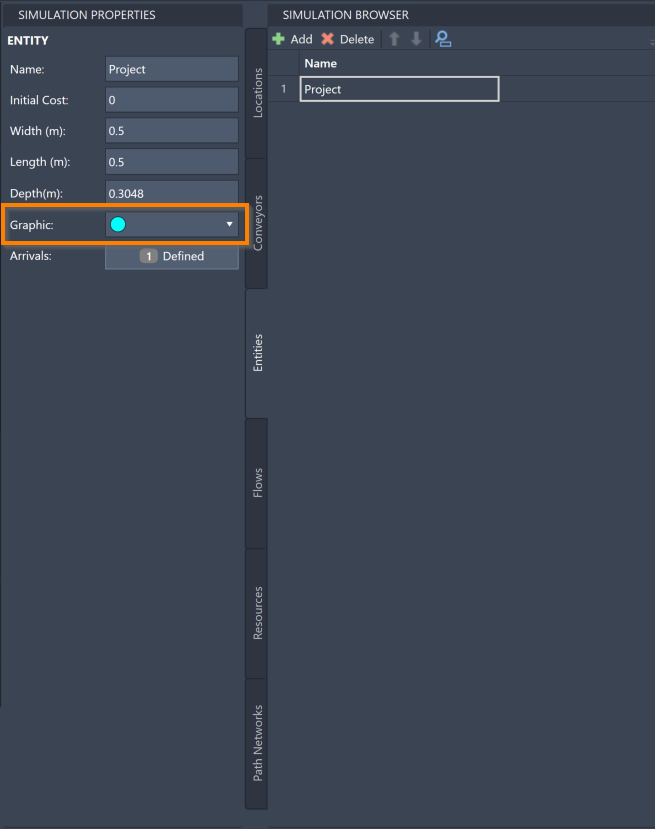
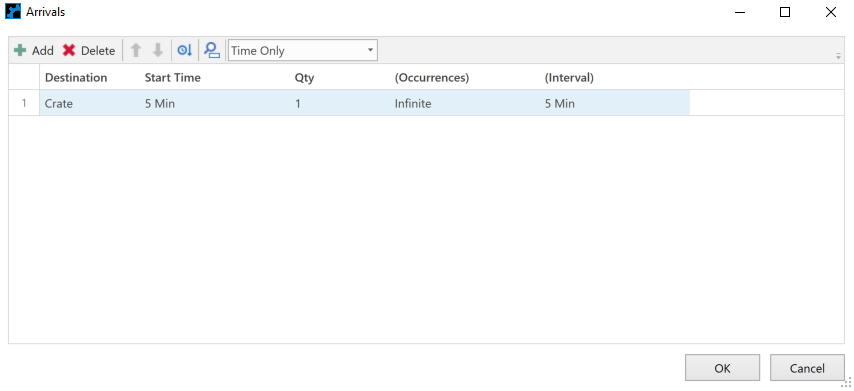
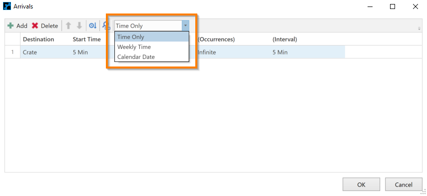



You are here: [Introduction](/pmacad/help/topic?page=Help/Docs/PMADHelpHome.md) > [Modeling](/pmacad/help/topic?page=Help/Docs/Modeling/Modeling.md)/[Getting Started](/pmacad/help/topic?page=Help/Docs/GettingStarted/GettingStarted.md) > [Simulation Properties](/pmacad/help/topic?page=Help/Docs/Modeling/SimulationProperties/Simulation_Properties.md) > Entities

# **Simulation Properties: Entities**  
***

 

The Simulation Properties menu allows you to edit the properties of the Entities you have defined in the Simulation Browser. 

For more information about how Entities function within a ProModel simulation, see the [Entities](/pmacad/help/topic?page=Help/Docs/Modeling/SimulationBrowser/SB_Entities/SB_Entities.md) section of the Simulation Browser guide. 
 
To access the Simulation Properties of your Entities, make sure your Simulation Properties menu is open and then navigate to the Entities tab in your Simulation Browser. 
Select a specific Entity to see its information displayed in the Simulation Properties menu.

 

 
 

Within the Simulation Properties menu, you can change the name, initial cost, width, length, depth, and graphic of your Entities. 
You can also define Arrivals for your Entities, which will be further explained [later in this section](/pmacad/help/topic?page=Help/Docs/Modeling/SimulationProperties/SP_Entities/SP_Entities.md#arrivals).

To change the name of an Entity, change the contents of the **Name** box in the Simulation Properties menu to reflect your desired Entity name. 

 

 
 

To change the initial cost of an Entity, edit the value in the **Initial Cost** box in the simulation Properties menu to display the correct initial cost. 
The initial cost of an Entity determines how much money the Entity will cost as it first enters the system.  
Using this feature will help you to determine how much a particular model will cost to run. 

 

 
 

To change the width of an Entity, change the value in the **Width** box. 
Note that the unit of measurement is in meters (m). 

To change the length of an Entity, change the value in the **Length** box. 
Note that the unit of measurement is in meters (m). 

To change the depth of an Entity, change the value in the **Depth** box. 
Note that the unit of measurement is in meters (m).
Note also that depth will only be a relevant setting if you choose to view a 3D animation of your model by opening in Inventor. 
For more information about how to open you model in Inventor, see the [ProModel 3D Animator For Inventor](/pmacad/help/topic?page=Help/Docs/ProModel3DAnimator/ProModel_3D_Animator.md)section of the documentation. 

 

 
 

The **Graphic** box allows you to change how your entity will appear in the final simulation. 
Click the **Graphic** box to see a drop-down menu with options for different shapes and colors. 

 

 
 

### _Arrivals_
 

The Simulation Properties menu also allows you to define Arrivals for your Entities. 
Arrivals are how you determine information about how and when Entities enter your system. 

To add an Arrival to your Entity, select the **Arrivals** box in the Simulation Properties menu to open a new window.

 

 
 

You may now select the **Add** button in the upper left corner to add a new Arrival to your Entity. 
 
To define your Arrival, you must determine a Location for your Entities to arrive at. 
Click on the **Destination** box to see a drop-down menu of the Locations in your model. 

You must also choose a time for the first instance of this particular Entity to enter into the system. 
How you define this time depends on whether the Arrival is set to **Time Only**, **Weekly Time**, or **Calendar Date**. 
Which option you choose should depend on the desired length of your simulation. 
Use the drop-down menu at the top of the window to select your preferred Arrival type. 

 

 
 

For **Time Only** Arrivals, use the **Start Time** box to define a starting time. 
The time you enter will be the amount of time that will pass in the simulation before the Entity arrives. 
Note that there is a drop-down menu where you may select the unit of time you would like to use. 
The default start time when you create a **Time Only** Arrival is **5 minutes**. 
If you leave the **Start Time** box empty, it will look to the **(Intervals)** box to determine the start time.  

For **Weekly Time** Arrivals, use the **Week** box to select which week this Entity should begin arriving. 
The default setting when you create a **Weekly Time** Arrival is **Week 1**. 
Use the **Day** box to select which day of the week the Entity should begin arriving from a drop-down menu of options. 
The default selection is **Monday**. 
Use the **Time** box to determine at what time on your chosen day the Entity should begin arriving. 
Click on the icon in the **Time** box to see a table of possible times, which range from **12:00 AM** to **11:30 PM** at half hour intervals. 
You may also type in a more precise time manually. 
The default time is **8:00 AM**.

For **Calendar Date** Arrivals, use the **Date** box to select a specific calendar date for your Entity to first arrive on. 
Click on the icon in the **Date** box to see a calendar which you can use to select your desired date. 
You may also type a date into the box manually. 
The default date when you create a **Calendar Date** Arrival is the same as the date when it is created. 
Use the **Time** box to determine at what time on your chosen day the Entity should begin arriving. 
Click on the icon in the **Time** box to see a table of possible times, which range from **12:00 AM** to **11:30 PM** at half hour intervals. 
You may also type in a more precise time manually. 
The default time is **8:00 AM**.

The following settings apply universally to all three types of Arrivals. 

The **Qty** or **Quantity** box determines how many iterations of this Entity should enter the system in this Arrival. 
ProModel will accept any integer between **1** and **999,999** in this field. 
The **Quantity** box may not be left blank. 

The **(Occurrences)** and **(Interval)** boxes are settings that should be used if you would like a particular Arrival to repeat at regular intervals throughout the simulation. 
Use the **(Occurrences)** box to define how many times you would like this Arrival to repeat during the simulation. 
ProModel will accept any integer between **1** and **999,999** in this field. 
You may also use **infinite** or **INF**, which ProModel will interpret as **999,999**. 
Use the **(Interval)** box to define how much time should pass between each repetition of this Arrival. 
Note that there is a drop-down menu where you may select the unit of time you would like to use. 

If you would instead like your Entity to arrive at irregular intervals throughout the simulation, you will need to create additional Arrivals for the same Entity. 
Continue using the **Add** button to create Arrivals at different times. 

To delete an Arrival, select an Arrival from the list and click the **Delete** button. 

To reorder your Arrivals within the Arrivals window, select an Arrival and use the blue “**up**” and “**down**” arrows to move the Arrival. 

Use the **Sort records by time** button (blue clock with an arrow) to sort your Arrivals based on their start time, starting with the time closest to the beginning of the simulation

To search for a particular Arrival, use the **blue magnifying glass** to toggle the search panel. 
Once open, you can use the search panel to find an Arrival using any of the information you have defined for it. 

When you have finished defining your Arrivals, press **OK** to close the Arrivals window. 
If you would like to close the window without saving your changes, press **Cancel**.

After closing the window, the number inside the **Arrivals** box will change to reflect how many Arrivals you have defined.  

