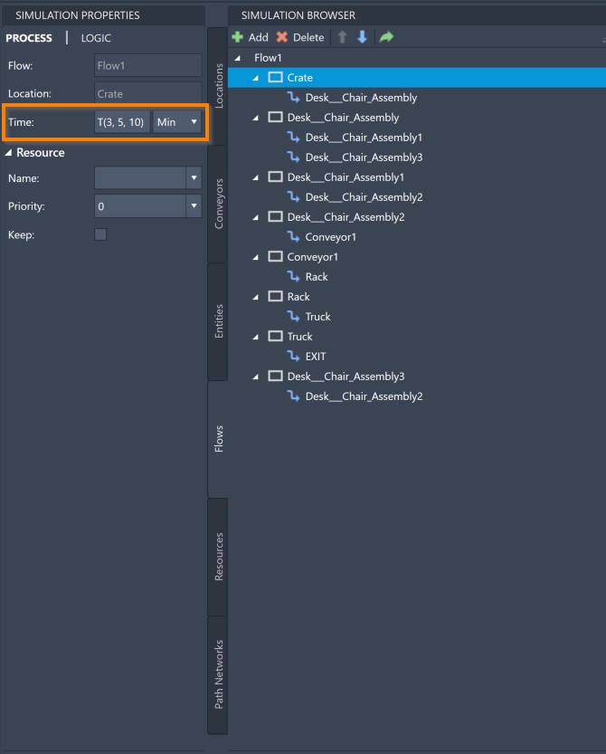

You are here: [Introduction](/pmacad/help/topic?page=Help/Docs/PMADHelpHome.md) > [Modeling](/pmacad/help/topic?page=Help/Docs/Modeling/Modeling.md)/[Getting Started](/pmacad/help/topic?page=Help/Docs/GettingStarted/GettingStarted.md) > [Simulation Properties](/pmacad/help/topic?page=Help/Docs/Modeling/SimulationProperties/Simulation_Properties.md) > Flows

# **Simulation Properties: Flows**  
***

 

The Simulation Properties menu allows you to edit the properties of the Flows you have defined in the Simulation Browser. 

For more information about how Flows function within a ProModel simulation, see the [Flows](/pmacad/help/topic?page=Help/Docs/Modeling/SimulationBrowser/SB_Flows/SB_Flows.md) section of the Simulation Browser guide. 

To access the Simulation Properties of your Flows, make sure your Simulation Properties menu is open and then navigate to the Flows tab in your Simulation Browser. 
Select a specific Flow, or a Location or Route within the Flow, to see its information displayed in the Simulation Properties menu.

 

 
 

Depending on whether you select a Flow, a Location, or a Route, different information will be available for you to edit within the Simulation Properties menu. 

For your Flows, the Simulation Properties menu allows you to change the Flow’s name and Entities. 

To change the name of a Flow, change the contents of the **Name** box in the Simulation Properties menu to reflect your desired Flow name.

 

 
 

To change which Entities follow a Flow, click on the **Entities** box to see a drop-down menu of the Entities you have defined in your model. 
Click on an Entity to select it as the Entity that will follow this Flow. 
You may also select **ALL**, which will allow all created Entities to follow this Flow. 
Note that Flows can only be set to one particular Entity or to all Entities using the **ALL** option.

 

 
 

For the Locations and Routes within a Flow, the Simulation Properties menu allows you to change the Location's time, the Route's source and destination, move time, and type, as well as the Resource information for both Locations and Routes. 
Note that this information does not appear for Conveyors, which cannot be edited through the Flow menu. 

To change how long an Entity will stay at a Location while following this Flow, edit the value in the **Time** box. 
Note that there is a drop-down menu where you may select the unit of time that you would like to use. 
The time for a Location within a Flow can be an integer, such as **15 minutes**, or it can be a distribution interval. 
For more information about distribution intervals, see the [Distribution Intervals](/pmacad/help/topic?page=Help/Docs/Modeling/Distribution_Intervals.md) section of the documentation. 
The default time setting is the interval **T(3,5,10)** since this is the default value in the **Process Time** field in the **Options** menu. 
For more information on how to use the Options menu to change default values, see the [Options](/pmacad/help/topic?page=Help/Docs/ToolsAndLearn/Tools_and_Learn.md#options) section of the documentation.

 

 
 

To change the source or destination of a Route, choose a new Location from the drop-down menu of the **Source** or **Destination** box. 
This action will change how your Flow moves throughout your model.

 

 
 

To change the move time for a Route, edit the value in the **Move Time** box. 
Note that there is a drop-down menu where you may select the unit of time that you would like to use. 
This setting will impact how long it takes for an Entity to move from the source of the Route to the destination. 
The default move time is **1 minute** since this is the default value in the **Move Time** field in the **Options** menu. 
For more information on how to use the Options menu to change default values, see the [Options](/pmacad/help/topic?page=Help/Docs/ToolsAndLearn/Tools_and_Learn.md#options) section of the documentation.

 

 
 

Optionally, you may choose to rename an Entity as it travels through a Route. 
Use the **New Name** box to type in the new name for your Entity. 
You may also click the arrow in the box to see a drop-down menu of your created Entities that you can select from. 

 

 
 

To change the type of a Route, select the **Type** box to see a list of type options. 
Each of these options is based on a Routing Rule. 
For a list of Routing Rule explanations, see the [Routing Rules](/pmacad/help/topic?page=Help/Docs/Modeling/Routing_Rules.md) section of the documentation.

 

 
 

For both Locations and Routes, the Simulation Properties menu allows you to edit Resource information. 
To add a Resource to help process an Entity at a Location in the Flow, or to help move an Entity on a Route, click the **Resource** button and select a Resource from the drop-down menu. 

 

 
 

To change the priority of a Resource within a Location or a Route, click the **Priority** button and select an option from the drop-down menu. 
The priority setting determines how likely it is that a Resource will stop another task to process an Entity at a Location or to move an Entity along a Route. 
If the Priority box is set to **0**, the task is seen as a low priority and the Resource will not stop its current task to attend to the Location or Route. 
**Interrupt** is the highest priority setting, and will ensure that a Resource will interrupt its current task in order to attend to the Location or Route immediately. 
The default priority is **0**.

When the **Keep** box is checked, the Entity keeps the Resource after making the move and continues to use it at the next activity. 

