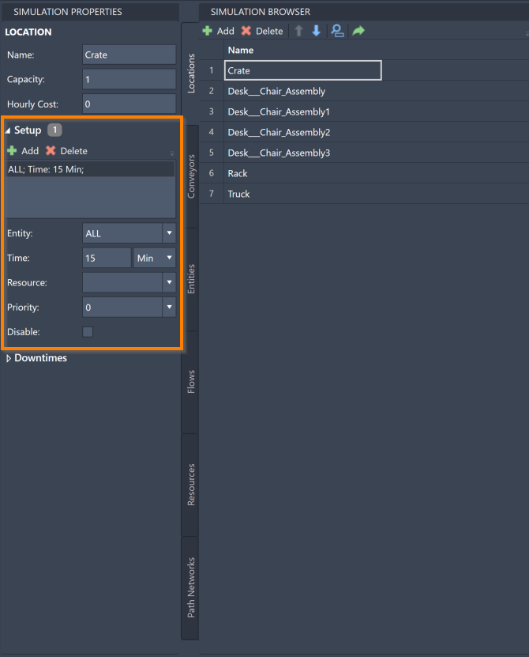

You are here: [Introduction](/pmacad/help/topic?page=Help/Docs/PMADHelpHome.md) > [Modeling](/pmacad/help/topic?page=Help/Docs/Modeling/Modeling.md)/[Getting Started](/pmacad/help/topic?page=Help/Docs/GettingStarted/GettingStarted.md) > [Simulation Properties](/pmacad/help/topic?page=Help/Docs/Modeling/SimulationProperties/Simulation_Properties.md) > Locations

# **Simulation Properties: Locations**  
***

 

The Simulation Properties menu allows you to edit the properties of the Locations you have defined in the Simulation Browser. 

For more information about how Locations function within a ProModel simulation, see the [Locations](/pmacad/help/topic?page=Help/Docs/Modeling/SimulationBrowser/SB_Locations/SB_Locations.md) section of the Simulation Browser guide.

To access the Simulation Properties of your Locations, make sure your Simulation Properties menu is open and then navigate to the Locations tab in your Simulation Browser. 
Select a specific Location to see its information displayed in the Simulation Properties menu.

 

 
 

Note that you can also right-click on an asset in the layout and select Simulation Properties.

Within the Simulation Properties menu, you can change the name, capacity, and hourly cost of your Locations. 
You can also add Setups and Downtimes for a particular Location. 

To change the name of a Location, change the contents of the **Name** box in the Simulation Properties menu to reflect your desired Location name. 

 

 
 

You can also change the capacity of a Location using the Simulation Properties menu. 
The capacity of a Location is the number of Entities that the Location can have there at any given time. 
A Location’s capacity can be set to any integer between **1** and **999,999**. 
You may also use **Infinite** or **INF**, which ProModel equates to **999,999**. 

When Entities attempt to move from one Location to another, they will check the destination Location’s free capacity. 
When a Location is capacitated, meaning that it has as many Entities as its capacity can permit, no other Entities will be able to go there. 
The Entities will instead wait at their current Location until capacity becomes available at their intended Location, or choose a different route if one is defined for them. 
While an Entity waits for a Location to become available for them, the Entity is considered “blocked”. 

Note that Resources are not considered “in” a Location when they are visiting it, and so do not take up a Location’s capacity. 

Any Location with a Capacity greater than **1** is considered a Multi-Capacity Location, and will be reflected as such in the simulation results. 
For more information about simulation results, see the [Simulation Results](/pmacad/help/topic?page=Help/Docs/SimulationResults/Simulation_Results.md) section of the documentation.

To change the capacity of a Location, navigate to the **Capacity** box in the Simulation Properties menu and change the number to your desired capacity. 

 

 
 

To change the hourly cost of a Location, edit the contents of the **Hourly Cost** box in the Simulation Properties menu to reflect the correct hourly cost for that Location. 
The hourly cost of a Location represents how much that particular Location will cost you to run in the simulation per hour. 
For example, a machine in a factory will use a certain amount of energy every hour, creating an hourly cost that the factory owner must pay to keep their factory running. 
Using this feature will help you to determine how much a particular model will cost to run. 

 

 
 

To add a counter to a Location which will display the number of Entities currently in that Location, use the **Counter** box.
Click on the box to see a drop-down menu of possible orientations for your counter. 
Select an orientation to add a counter to your Location.

 

 
 

The Simulation Properties menu also offers tools to create and edit Setups and Downtimes for your Locations, which are different types of breaks from operations that your Locations will take during the simulation. 

 

### Setups
 

Setups are breaks that occur at Locations when one Entity type has been in a Location and a different Entity type enters the Location. 
The Setup break is the time it takes the Location to “set up” whatever is necessary to process the new Entity type. 
For example, if the meat station at a sandwich shop is adding turkey to sandwiches for the first half of the day, but then gets new orders for roast beef sandwiches, the worker will need some set up time to switch the meat from turkey to roast beef at their station.

To access the Setup information for a Location, make sure the correct Location is selected in your Simulation Browser menu and click the **Setup** drop-down menu displayed in Simulation Properties.  

 

 
 

To add a Setup to your Location, press the **Add** button in the upper left corner of the Setup menu. 

Once a Setup is added, you will be able to click on it in the menu and edit a number of its characteristics. 

The **Entity** box determines which Entity type triggers the Setup. 
Click on the box to see a drop-down menu of the Entities you have created and select your chosen Entity. 
You also have the option to choose **ALL**, which will involve all of your created Entities in the Setup. 
**ALL** is the default setting when you create a Setup. 

The **Time** box allows you to enter the amount of time that the Setup should take. 
Note that there is a drop-down menu where you may select the unit of time that you would like to use. 
The default time when you create a Setup is **15 minutes**. 

The **Resource** box allows you to determine if a Resource needs to be involved in your Setup break. 
In our sandwich shop example from the beginning of the Setup section, the worker (Resource) at the meat station would need to be involved in the Setup in order to switch out the meat types. 
Click on the box to see a drop-down menu of the Resources you have created and select your chosen Resource. 
You may also choose **Select None**, which will involve no Resources in the Setup. 
**Select None** is the default setting when you create a Setup. 

The **Priority** box allows you to determine how likely the Location in the Setup is to finish its current task before taking the Setup break. 
Click on the box to see a drop-down menu of possible priorities. 
If the priority is set at **0**, the Setup is seen as a low priority and the Location will not interrupt its current task to begin the break. 
The **Interrupt** option is the highest priority, and will ensure that the Location will interrupt its current task to begin the break. 
The default priority when you create a Setup is **0**.

The **Disable** box allows you to easily disable a Setup without deleting it for the purposes of testing different options for your simulation. 
Click the box to mark the selected Setup as disabled. 

To delete a Setup from your Location, select a Setup from the menu and press the **Delete** button. 

 

### Downtimes
 

Downtimes are breaks that occur at Locations and are based on times within the simulation. 
There are three types of Dowtimes: Scheduled, Unscheduled, and Usage. 

**Scheduled Downtimes** do not include the time spent in them in a Location’s total “scheduled time” in the simulation statistics.

**Unschedule Downtimes** do include the time spent in them in a Location’s total “scheduled time” in the simulation statistics. 
The percentage of time the Location spent in Unscheduled Downtime is shown in the “% Down” field in the statistics. 
For more information about simulation results, please see the [Simulation Results](/pmacad/help/topic?page=Help/Docs/SimulationResults/Simulation_Results.md) section of the documentation. 

**Usage Downtimes** are based on the Location’s usage time rather than the overall time of the simulation. 
If a Location is not being used, then it will not come any closer to needing its Usage Downtime break. 

To access the Downtime information for a Location, make sure the correct Location is selected in your Simulation Browser menu and click the **Dowtime** drop-down menu displayed in Simulation Properties. 

 

 
 

To add a Downtime to your Location, press the **Add** button in the upper left corner of the Downtime menu. 

Once a Downtime is added, you will be able to click on it in the menu and edit a number of its characteristics. 

The **Basis** box allows you to determine whether a Downtime is a Scheduled Downtime, an Unscheduled Downtime, or a Usage Downtime. 
Click the drop-down menu to see and select these options. 
The default option when you create a Downtime is **Unscheduled**. 

The **Frequency** box allows you to enter a number to represent how frequently this Downtime will occur. 
Note that there is a drop-down menu that allows you to choose the unit of time that you would like to use. 
The default frequency when you create a Downtime is **30 minutes**. 

The **First Time** box allows you to enter a number which will determine at what time the first instance of this Downtime will occur. 
The time you enter should be the amount of time after the start of the simulation that you would like this Downtime to first take place. 
Note that there is a drop-down menu that allows you to choose the unit of time that you would like to use. 
When you create a Dowtime, the default unit of time is **minutes**, and the First Time box is left blank. 

Use the **Interruptive** box to ensure that other tasks will be interrupted to complete your Downtime. 

The **Time** box allows you to enter the amount of time that the Downtime should take. 
Note that there is a drop-down menu where you may select the unit of time that you would like to use. 
The default time when you create a Downtime is **15 minutes**. 
 
The **Resource** box allows you to determine if a Resource needs to be involved in your Downtime break. 
Use this option if a Resource involved with the Location should also take a break when the Location begins its Downtime. 
Click on the box to see a drop-down menu of the Resources you have created and select your chosen Resource. 
You may also choose **Select None**, which will involve no Resources in the Downtime. 
**Select None** is the default setting when you create a Downtime. 

Use the **Priority** box to select the priority (1-10 or interrupt) for obtaining the selected Resource and entering into the Downtime. 
Click on the box to see a drop-down menu of possible priorities. 
Downtimes with a higher priority will recieve their Resources and begin before other events with a lower priority. 
The **Interrupt** option is the highest priority.
The default priority when you create a Downtime is **0**.

The **Disable** box allows you to easily disable a Downtime without deleting it for the purposes of testing different options for your simulation. 
Click the box to mark the selected Downtime as disabled. 

To delete a Downtime from your Location, select a Downtime from the menu and press the **Delete** button. 

