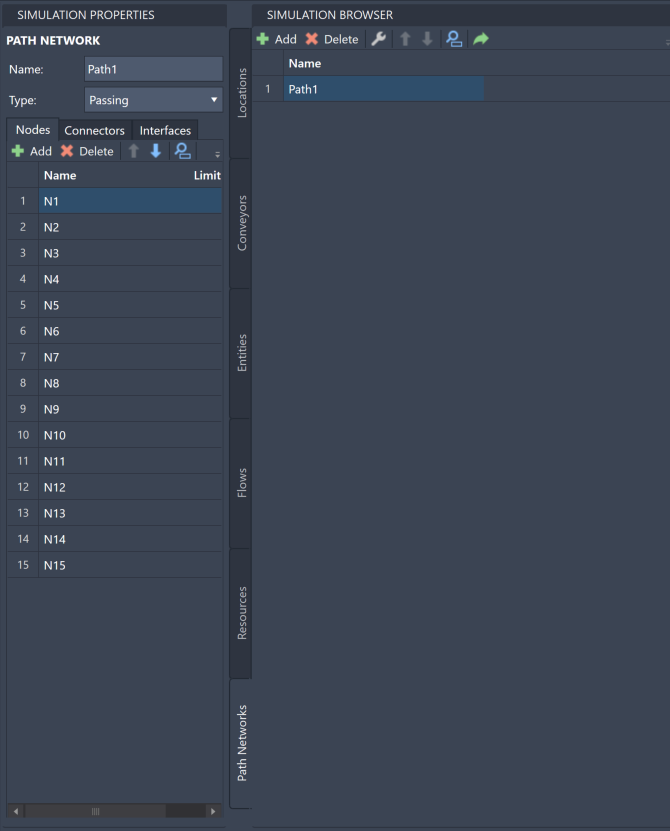
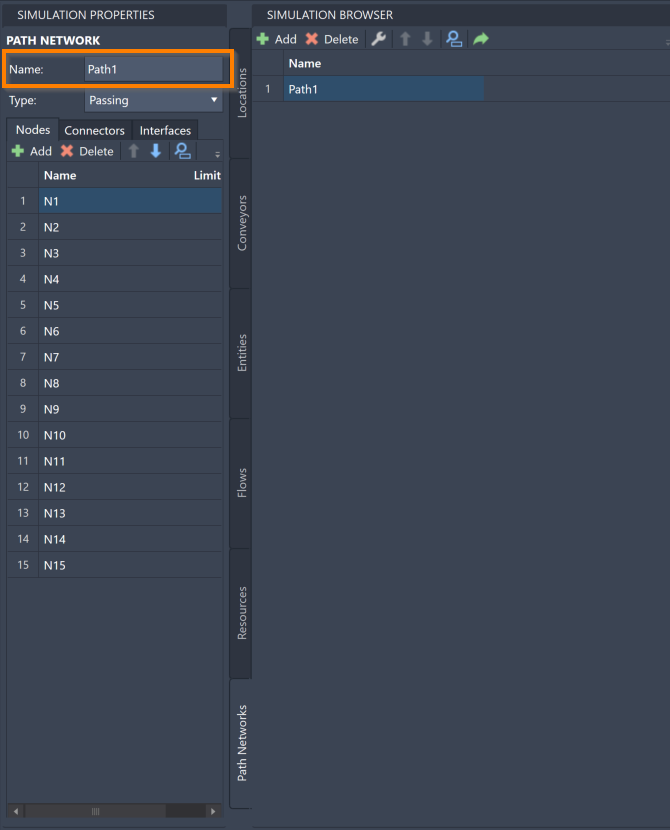
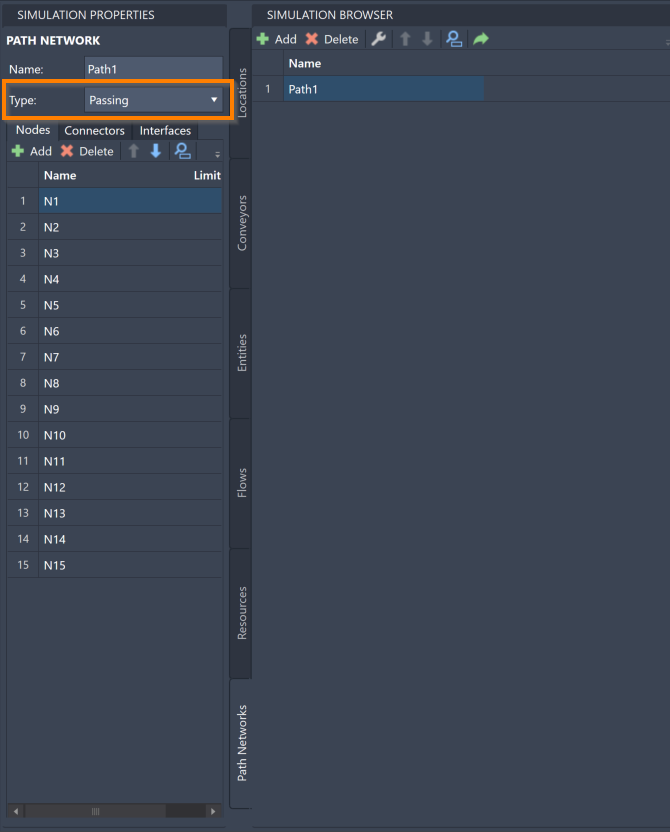
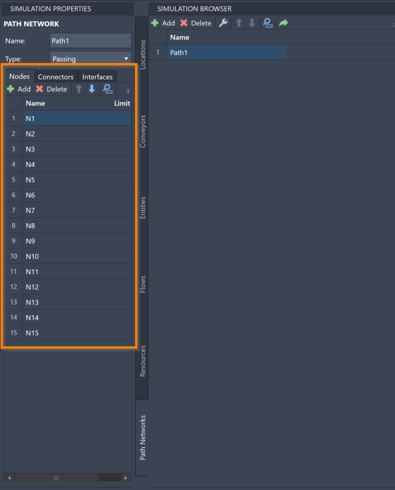
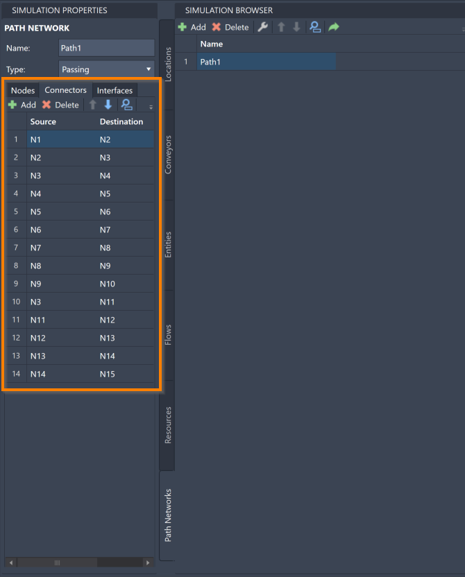
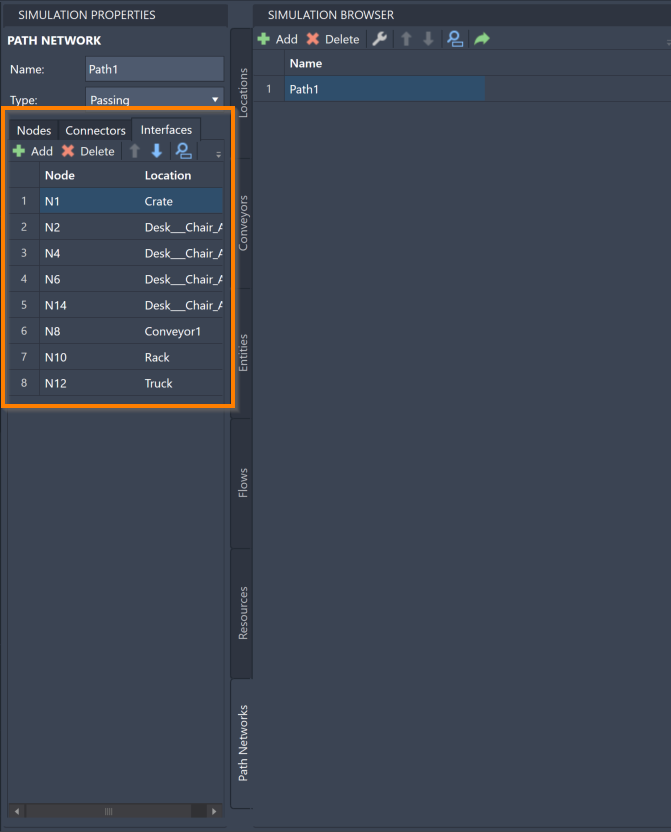



You are here: [Introduction](/pmacad/help/topic?page=Help/Docs/PMADHelpHome.md) > [Modeling](/pmacad/help/topic?page=Help/Docs/Modeling/Modeling.md)/[Getting Started](/pmacad/help/topic?page=Help/Docs/GettingStarted/GettingStarted.md) > [Simulation Properties](/pmacad/help/topic?page=Help/Docs/Modeling/SimulationProperties/Simulation_Properties.md) > Path Networks

# **Simulation Properties: Path Networks**  
***

 

The Simulation Properties menu allows you to edit the properties of the Path Networks you have defined in the Simulation Browser. 

For more information about how Path Networks function within a ProModel simulation, see the [Path Networks](/pmacad/help/topic?page=Help/Docs/Modeling/SimulationBrowser/SB_Path_Networks/SB_Path_Networks.md) section of the Simulation Browser guide.

To access the Simulation Properties of your Path Networks, make sure your Simulation Properties menu is open and then navigate to the Path Networks tab in your Simulation Browser. 
Select a specific Path Network to see its information displayed in the Simulation Properties menu. 

 

 
 

Within the Simulation Properties menu, you can change the name and type of your Path Networks. 
You can also make changes to your Nodes, Connectors and Interfaces. 

To change the name of a Path Network, change the contents of the **Name** box in the Simulation Properties menu to reflect your desired Path Network name.

 

 
 

The **Type** box allows you to change the type of your Path Network. 
There are two types of Path Networks: **Passing** and **Non-Passing**. 
A **Passing** network is used for open path movement where Entities and Resources are free to overtake one another. 
**Non-Passing** networks consist of single-file tracks or guide paths such as those used for AGVs where vehicles are not able to pass. 
Select the **Type** box to see a drop-down menu where you may choose one of these two options.  

 

 
 

The Simulation Properties menu also allows you to view and edit the individual Nodes, Connectors and Interfaces within a Path Network. 

 

### _Nodes_
 

To access the Nodes in a Path Network, select the **Nodes** tab in the Simulation Properties menu. 

 

 
 

To add new Nodes to your Path Network, select the **Add** button in the upper left corner. 
Clicking the **Add** button will open the **Draw**, **Branch**, **Connector** and **Interface** menu in the command box, which you may then use to edit your Path Network on the layout. 
The **Draw** feature will be automatically selected. 
For more in-depth information about how this menu functions, see the [Path Networks](/pmacad/help/topic?page=Help/Docs/Modeling/SimulationBrowser/SB_Path_Networks/SB_Path_Networks.md) section of the Simulation Browser guide.

To delete a Node, click on your intended Node in the Simulation Properties menu and press the **Delete** button. 

To reorder your Nodes within the Simulation Properties menu, select a Node and use the blue “**up**” and “**down**” arrows to move the Node. 

To search for a specific Node within your model, click on the **blue magnifying glass** to toggle the search panel. 
With the search panel open, you may then use it to search for a Node using its name. 

To navigate to a specific Node within your AutoCAD® drawing, select a Node within the Simulation Properties menu and click the **green arrow**.

To change the name of a Node, double-click on the Node in the **Name** column of the Node menu and change the contents to reflect your desired Node name.

 

### _Connectors_
 

To access the Connectors in a Path Network, select the **Connectors** tab in the Simulation Properties menu. 

 

 
 

To add new Connectors to your Path Network, select the **Add** button in the upper left corner. 
Clicking the **Add** button will open the **Draw**, **Branch**, **Connector** and **Interface** menu in the command box, which you may then use to edit your Path Network on the layout. 
The **Connector** feature will be automatically selected. 
For more in-depth information about how this menu functions, see the [Path Networks](/pmacad/help/topic?page=Help/Docs/Modeling/SimulationBrowser/SB_Path_Networks/SB_Path_Networks.md) section of the Simulation Browser guide.

To delete a Connector, click on your intended Connector in the Simulation Properties menu and press the **Delete** button. 

To reorder your Connectors within the Simulation Properties menu, select a Connector and use the blue “**up**” and “**down**” arrows to move the Connector. 

To search for a specific Connector within your model, click on the **blue magnifying glass** to toggle the search panel. 
With the search panel open, you may then use it to search for a Connector using any of the information defined for it. 

To navigate to a specific Connector within your AutoCAD® drawing, select a Connector within the Simulation Properties menu and click the **green arrow**.

To change the source or destination of a Connector, select a Node under the **Source** or **Destination** columns to see a drop-down menu of your created Nodes. 
Changing this setting will move the Connector to reflect its new source or destination Nodes. 

The **Direction** column allows you to change the direction settings of your Connectors. 
There are two types of directions: **One Way** and **Two Way**. 
**One Way** Connectors will only allow Resources and Entities to move along them in one direction, specifically from the source Node and towards the destination Node. 
**Two Way** Connectors will allow Resources and Entities to move along them in either direction. 
Choose a box under the **Direction** column to see a drop-down menu where you can select one of these two options.

 

### _Interfaces_
 

To access the Interfaces in a Path Network, select the **Interfaces** tab in the Simulation Properties menu.  

 

 
 

To add new Interfaces to your Path Network, select the **Add** button in the upper left corner. 
Clicking the **Add** button will open the **Draw**, **Branch**, **Connector** and **Interface** menu in the command box, which you may then use to edit your Path Network on the layout. 
The **Interface** feature will be automatically selected. 
For more in-depth information about how this menu functions, see the [Path Networks](/pmacad/help/topic?page=Help/Docs/Modeling/SimulationBrowser/SB_Path_Networks/SB_Path_Networks.md) section of the Simulation Browser guide. 

To delete an Interface, click on your intended Interface in the Simulation Properties menu and press the **Delete** button.

To reorder your Interfaces within the Simulation Properties menu, select an Interface and use the blue “**up**” and “**down**” arrows to move the Interface. 

To search for a specific Interface within your model, click on the **blue magnifying glass** to toggle the search panel. 
With the search panel open, you may then use it to search for an Interface using any of the information defined for it.

To navigate to a specific Interface within your AutoCAD® drawing, select an Interface within the Simulation Properties menu and click the **green arrow**. 

To change the Node that is participating in the Interface, select a Node under the **Node** column to see a drop-down menu of your created Nodes. 
Selecting a different Node will move the Interface line to reflect your choice. 

To change the Location that is participating in the Interface, select a Location under the **Location** column to see a drop-down menu of your created Locations. 
Selecting a different Location will move the Interface line to reflect your choice. 

