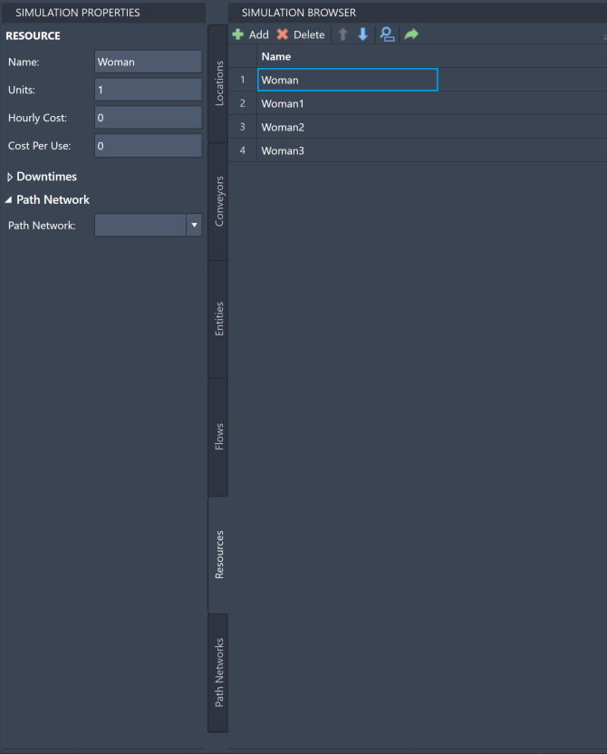
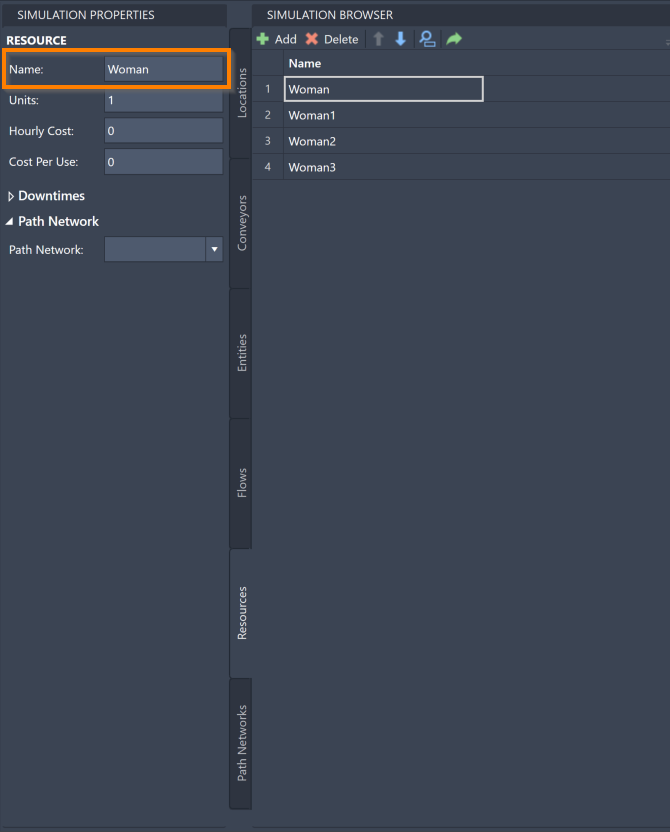
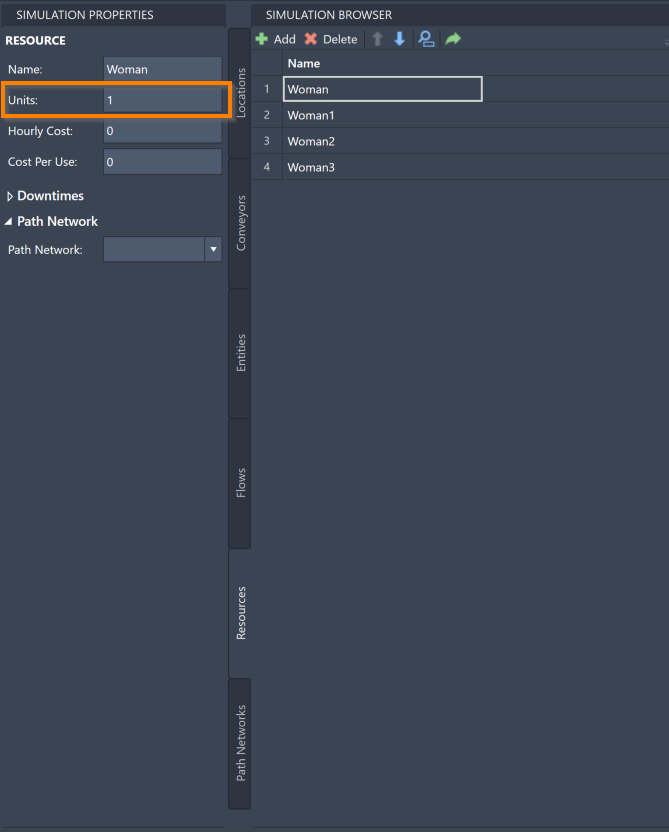
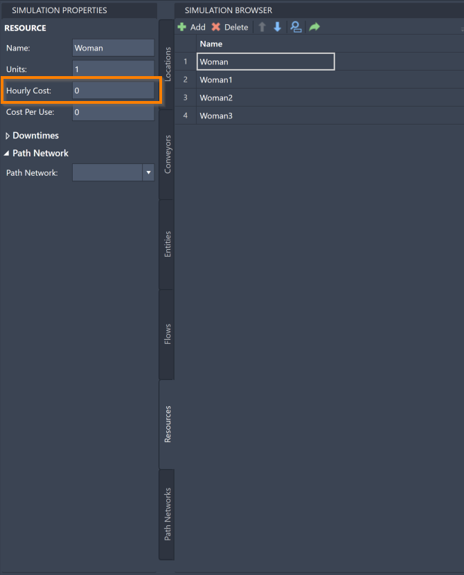
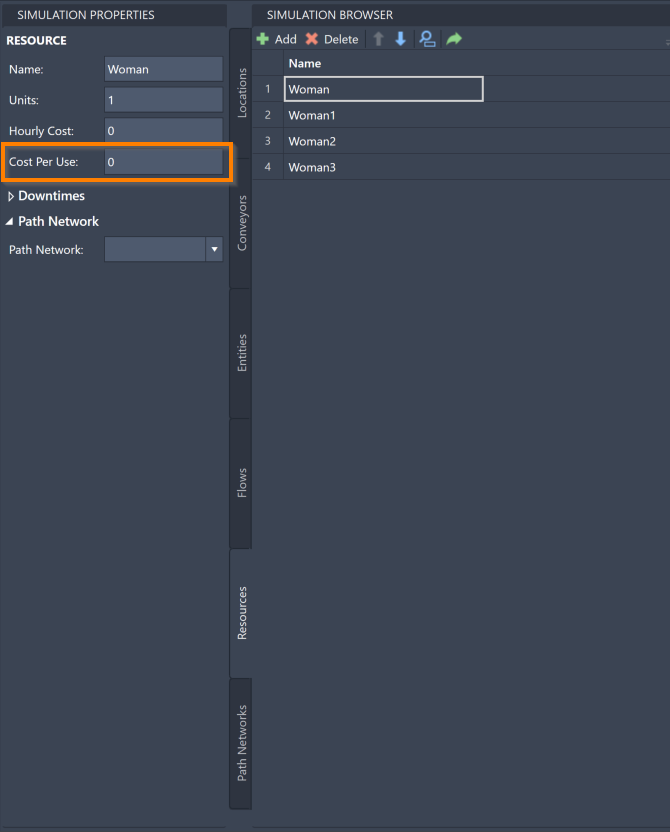
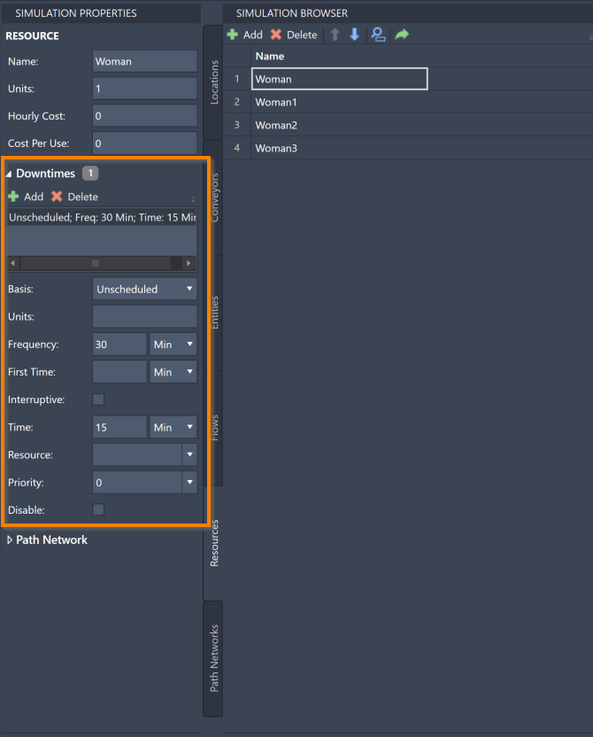
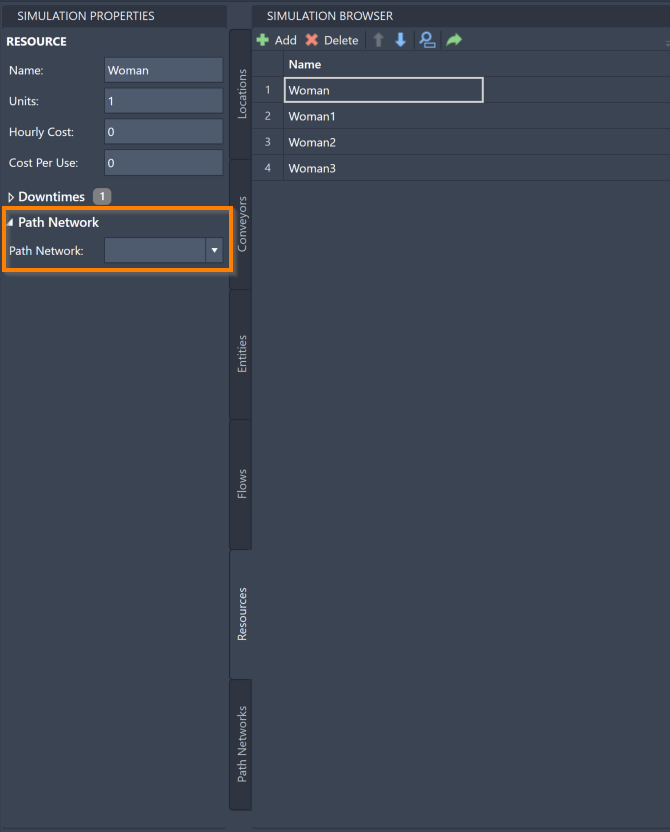



You are here: [Introduction](/pmacad/help/topic?page=Help/Docs/PMADHelpHome.md) > [Modeling](/pmacad/help/topic?page=Help/Docs/Modeling/Modeling.md)/[Getting Started](/pmacad/help/topic?page=Help/Docs/GettingStarted/GettingStarted.md) > [Simulation Properties](/pmacad/help/topic?page=Help/Docs/Modeling/SimulationProperties/Simulation_Properties.md) > Resources

# **Simulation Properties: Resources**  
***

 

The Simulation Properties menu allows you to edit the properties of the Resources you have defined in the Simulation Browser. 

For more information about how Resources function within a ProModel simulation, see the [Resources](/pmacad/help/topic?page=Help/Docs/Modeling/SimulationBrowser/SB_Resources/SB_Resources.md) section of the Simulation Browser guide.

To access the Simulation Properties of your Resources, make sure your Simulation Properties menu is open and then navigate to the Resources tab in your Simulation Browser. 
Select a specific Resource to see its information displayed in the Simulation Properties menu. 

 

 
 

Within the Simulation Properties menu, you can change the name, units, hourly cost, and cost per use of your Resources. 
You can also define Downtimes for your Resources, as well as assign them to Path Networks. 

To change the name of a Resource, change the contents of the **Name** box in the Simulation Properties menu to reflect your desired Resource name. 

 

 
 

To change how many units of a particular Resource are available, edit the value in the **Units** box. 
ProModel will accept any integer between **1** and **999** in this field. 

 

 
 

To change the hourly cost of a Resource, edit the contents of the **Hourly Cost** box in the Simulation Properties menu to reflect the correct hourly cost for that Resource. 
The hourly cost of a Resource represents how much that particular Resource will cost you to use in the simulation per hour. 
Using this feature will help you to determine how much a particular model will cost to run. 

 

 
 

If an hourly cost does not make sense for your Resource, such as a contract worker that gets paid when they complete a task, rather than an hourly payment, use the **Cost Per Use** box. 
The cost per use of a Resource represents how much that particular Resource will cost you each time it is used in the simulation. 
Edit the contents of the **Cost Per Use** box to set the correct cost per use for a Resource. 

 

 
 

### Downtimes
 

The Simulation Properties menu also offers tools to create and edit Downtimes for your Resources. 
Downtimes for Resources work similarly to how they were described in the [Locations](/pmacad/help/topic?page=Help/Docs/Modeling/SimulationProperties/SP_Locations/SP_Locations.md) section of this guide.

To access the Downtime information for a Resource, make sure the correct Resource is selected in your Simulation Browser menu and click the **Dowtime** drop-down menu displayed in Simulation Properties.  

 

 
 

To add a Downtime to your Resource, press the **Add** button in the upper left corner of the Downtime menu. 

Once a Downtime is added, you will be able to click on it in the menu and edit a number of its characteristics. 

The **Basis** box allows you to determine whether a Downtime is a Scheduled Downtime, an Unscheduled Downtime, or a Usage Downtime. 
Click the drop-down menu to see and select these options. 
The default option when you create a Downtime is **Unscheduled**.

The **Units** box allows you to select how many units of this particular Resource will be participating in the Downtime. 
Change the number in the box to reflect your desired number of units.  

The **Frequency** box allows you to enter a number to represent how frequently this Downtime will occur. 
Note that there is a drop-down menu that allows you to choose the unit of time that you would like to use. 
The default frequency when you create a Downtime is **30 minutes**.

The **First Time** box allows you to enter a number which will determine at what time the first instance of this Downtime will occur. 
The time you enter should be the amount of time after the start of the simulation that you would like this Downtime to first take place. 
Note that there is a drop-down menu that allows you to choose the unit of time that you would like to use. 
When you create a Dowtime, the default unit of time is **minutes**, and the First Time box is left blank.
This setting will not impact **Usage** type Downtimes. 

Use the **Interruptive** box to ensure that other tasks will be interrupted to complete your Downtime. 

The **Time** box allows you to enter the amount of time that the Downtime should take. 
Note that there is a drop-down menu where you may select the unit of time that you would like to use. 
The default time when you create a Downtime is **15 minutes**.

The **Resource** box allows you to determine if another Resource needs to be involved in your Downtime break. 
Use this option if two Resources should engage in a Downtime at the same time. 
Click on the box to see a drop-down menu of the other Resources you have created and select your chosen Resource. 
You may also choose **Select None**, which will involve no other Resources in the Downtime. 
**Select None** is the default setting when you create a Downtime. 

Use the **Priority** box to select the priority (1-10 or interrupt) for obtaining the selected Resource and entering into the Downtime. 
Click on the box to see a drop-down menu of possible priorities. 
Downtimes with a higher priority will recieve their Resources and begin before other events with a lower priority. 
The **Interrupt** option is the highest priority.
The default priority when you create a Downtime is **0**.

The **Disable** box allows you to easily disable a Downtime without deleting it for the purposes of testing different options for your simulation. 
Click the box to mark the selected Downtime as disabled.   

To delete a Downtime from your Resource, select a Downtime from the menu and press the **Delete** button.  

 

### Path Network
 

The Simulation Properties menu also allows you to add Resources to the Path Networks that you have created. 
Click the **Path Network** box to see a drop-down menu of the Path Networks you have created. 
Select a Path Network to add your Resource to it, which will allow the Resource to move along that Path Network during the simulation. 
Once a Path Network has been selected, additional settings will be available to you. 

 

