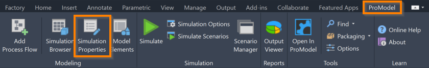
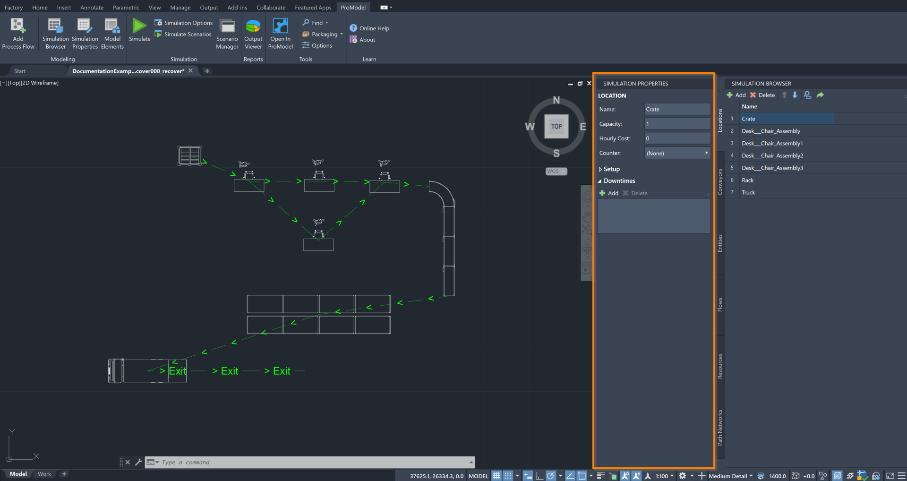



You are here: [Introduction](/pmacad/help/topic?page=Help/Docs/PMADHelpHome.md) > [Modeling](/pmacad/help/topic?page=Help/Docs/Modeling/Modeling.md)/[Getting Started](/pmacad/help/topic?page=Help/Docs/GettingStarted/GettingStarted.md) > Simulation Properties 

# **Simulation Properties**
***
 

The ProModel AutoCAD® Edition’s Simulation Properties button is accessible through the ProModel ribbon tab within AutoCAD®.

 

 
 

The Simulation Properties button opens ProModel’s Simulation Properties as an additional menu on your screen, allowing you to change the properties of items defined in the Simulation Browser. 

 

 
 

If you hover over the Simulation Properties icon, you can see a description of the tool, as well as the command **PMShowProperties**. 
Typing this command into the command box is another way to open the Simulation Properties menu. 

What displays in the Simulation Properties menu is directly correlated to what is open in the Simulation Browser menu. 
If you open the Simulation Properties menu without having opened and selected something within the Simulation Browser menu, the Simulation Properties menu will display the following message:

 

 
 

Because of this connection, the Simulation Properties menu builds off of and adds additional features to what you learned about Locations, Entities, Conveyors, Flows, Resources and Path Networks in the Simulation Browser section. 
New information on each of these tabs will be described in their respective sections in this guide. 
For more information about the Simulation Browser, see the [Simulation Browser](/pmacad/help/topic?page=Help/Docs/Modeling/SimulationBrowser/Simulation_Browser.md) section of the documentation. 

To find information about how each of the tabs included in the Simulation Browser can be expanded using the Simulation Properties menu, click on one of the sections below. 

**1.** [Locations](/pmacad/help/topic?page=Help/Docs/Modeling/SimulationProperties/SP_Locations/SP_Locations.md)  
**2.** [Entities](/pmacad/help/topic?page=Help/Docs/Modeling/SimulationProperties/SP_Entities/SP_Entities.md)  
**3.** [Conveyors](/pmacad/help/topic?page=Help/Docs/Modeling/SimulationProperties/SP_Conveyors/SP_Conveyors.md)  
**4.** [Flows](/pmacad/help/topic?page=Help/Docs/Modeling/SimulationProperties/SP_Flows/SP_Flows.md)  
**5.** [Resources](/pmacad/help/topic?page=Help/Docs/Modeling/SimulationProperties/SP_Resources/SP_Resources.md)  
**6.** [Path Networks](/pmacad/help/topic?page=Help/Docs/Modeling/SimulationProperties/SP_Path_Networks/SP_Path_Networks.md)

---

**Next**: [Use Model Elements to define Attributes, Variables and Macros](/pmacad/help/topic?page=Help/Docs/Modeling/ModelElements/Model_Elements.md)  

