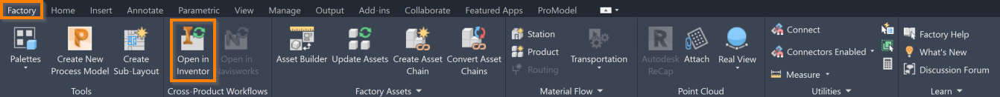
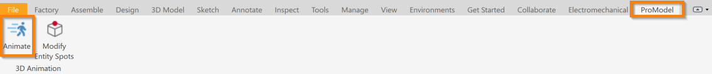
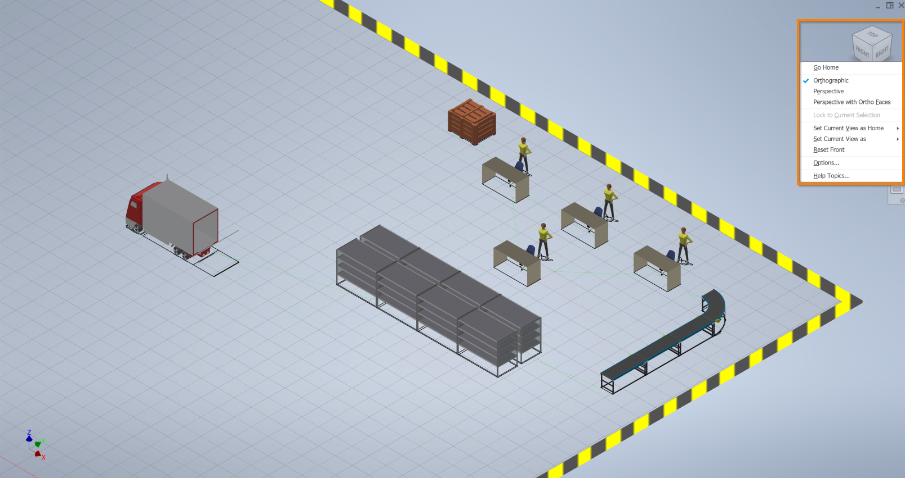
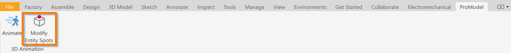



You are here: [Introduction](/pmacad/help/topic?page=Help/Docs/PMADHelpHome.md) > ProModel 3D Animator For Inventor

# **ProModel 3D Animator For Inventor**  
***

 

By purchasing an additional extension for ProModel AutoCAD® Edition, you will be able to view an animation of the model you have created in AutoCAD® using Factory assets in 3D using the Inventor software. 
In order to use this feature, you must have the correct ProModel AutoCAD® Edition licence that includes the 3D extension. 
To view your licence, select the **About** icon. 

You must also have both Factory Design Utilities and Inventor Professional (2020, 2021, or 2022) installed on your machine. 
To purchase and install these, as well as other Autodesk products, visit the [Autodesk website](https://www.autodesk.com/).  

To open your model in Inventor and see the 3D version of your model, select the **Open in Inventor** icon in the **Factory** tab. 
The **Open in Inventor** icon will only be available if you have Inventor installed on your machine. 

 

 
 

Before opening your model in Inventor, you must save the model and run your simulation at least once. 
If you have not done these things before selecting the **Open in Inventor** icon, you will be prompted to do so. 

Selecting the **Open in Inventor** icon will open the Inventor software and create a 3D rendering of your model using 3D versions of the graphics you have added to your layout in AutoCAD®.

 

#### Animate
 

Navigate to the **ProModel** tab and select the **Animate** icon to open a new window and see an animation of your model based on the Flows defined for it. 
The 3D animation in Inventor is only an animation and does not include any simulation properties.  

 

 
 

 
 

While viewing your animation, there are a number of tools available to you to control the view and pace of the animation. 

Click the different sides of the view box in the upper right hand corner to dictate from which direction you are viewing the animation. 
You may also click and drag your mouse on the layout to change your view. 
Left-click and hold to rotate your view, or right-click and hold to flatly move the animation. 
Click the arrow next to the box to see a number of view options. 

 

 
 

Select **Go Home** to return to the default view. 
You may also click the small house icon to return to this view.

To change the type of your view, select **Orthographic**, **Perspective**, or **Perspective with Ortho Faces**.

Select **Set current view as Home** to make your current view on the screen your Home view, which you will then return to when selecting **Go Home**. 
Select **Focus and set as Home** to recenter your view before making it the Home view.   

Select **Reset Home** to reset the Home view to the initial default Home view. 

Select **Set current view as Front** to reorient the view cube so that the current view on your screen displays when the view cube is set to the Front orientation. 

Select **Set current view as Top** to reorient the view cube so that the current view on your screen displays when the view cube is set to the Top orientation. 
  
Select **Reset orientation** to reset the view cube’s orientation back to its initial default orientation. 

To change your mouse so that it only flatly pans when clicking and dragging the layout, select the hand icon in the toolbar. 

To change your mouse so that clicking and dragging the layout zooms in and out of the animation, click the arrow icon. 

To return to the orbiting mouse function, click the icon with an arrow circling a line. 

To pause or play your animation, select the **Pause** or **Play** button. 

To stop the animation so that you have the option of restarting the animation from the beginning, select the **Stop** button.

To change the speed of your animation, use the gray slider in the toolbar. 
When the slider is all the way to the left, the animation will play in real time. 
When the slider is all the way to the right, the animation will play at 100% greater speed. 
See the clock to the right of the speed bar to view the time that has elapsed in the animation. 

To exit the animation, close the animation window. 

 

#### Modify Entity Spots
 

To edit the Entity spots in your animation, which are the points where Entities will be displayed when they are at a particular Location, select the **Modify Entity Spots** icon.

 

 
 

Selecting **Modify Entity Spots** will open a new window.
Select a graphic on the layout to see the orientation of its Entity spot in the X, Y and Z directions.

 

 
 

Change the value in any of the boxes to change the location of the Entity spot in that direction, where 0 is the beginning of the graphic in that direction and 1 is the end. 
You may also use the arrow buttons to the right of the boxes to nudge the value in either direction. 
You may choose a value less than 0 or greater than 1, but the Entity spot will then appear to no longer be on the graphic.   

The **Top Center** button centers the Entity spot in the X and Y directions by setting them to .5 and places the Entity at the top of the graphic by setting the Z direction to 1. 

The **Center** button places the Entity spot in the center of the graphic by setting all three directions to .5. 

To change the Entity Spot orientations for multiple Locations at once, hold the **Ctrl** button down on your keyboard to select multiple Locations.

To close the **Modify Entity Spots** menu, select the **Done** button. 
You may also select the **x** button.  

 