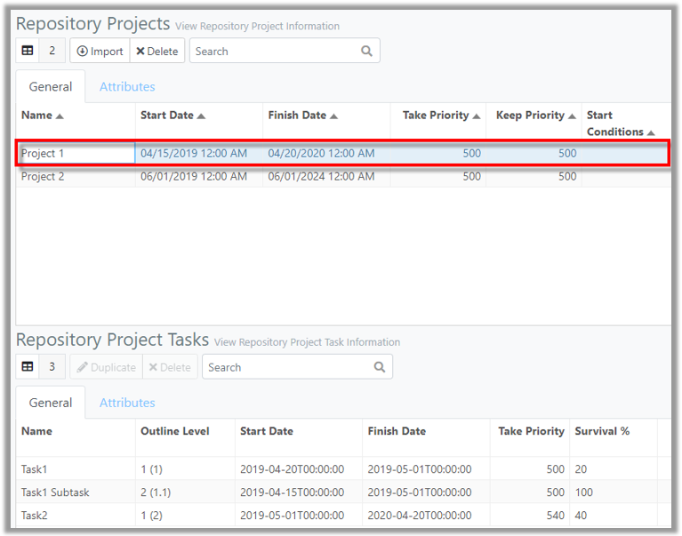
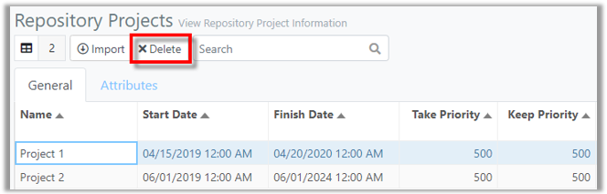
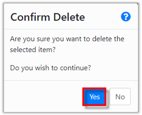
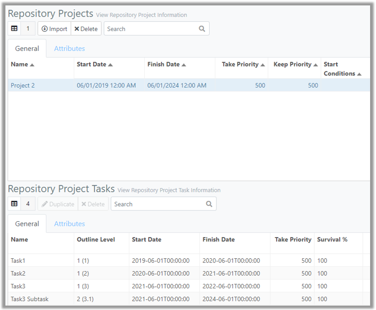

You are here: [Repository](C:/_git/ProModelAutodeskEdition/PorfolioSimulator.Help/wwwroot/Help/Docs/Repository/Repository.md) > Delete Project

---
### _Delete Project_ 

**1.** Select a **Project** to be deleted from the Repository Projects table. The selected Project is indicated with a blue highlight, and the Project Tasks display in the table below. **Note: Deleting a Project will also delete all associated Project Tasks. The Project in this example contains two Tasks and one Subtask.*

**2.** Select the **Delete button** located in the Repository Projects toolbar.

**3.** A 'Confirm Delete' modal populates. Select **Yes** to continue and delete the Project.

**4.** The Project and its associated Tasks are deleted and no longer appear in the Repository Projects or Repository Project Tasks table.

##
Related Content: 
- [Repository (overview)](C:/_git/ProModelAutodeskEdition/PorfolioSimulator.Help/wwwroot/Help/Docs/Repository/Repository.md)
- [Excel Import Template](C:/_git/ProModelAutodeskEdition/PorfolioSimulator.Help/wwwroot/Help/Docs/Repository/ExcelImportTemplate/ExcelImportTemplate.md)
- [Import Project](C:/_git/ProModelAutodeskEdition/PorfolioSimulator.Help/wwwroot/Help/Docs/Repository/ImportProject/ImportProject.md) 
- [Search Projects](C:/_git/ProModelAutodeskEdition/PorfolioSimulator.Help/wwwroot/Help/Docs/Repository/SearchProjects/SearchProjects.md) 
- [Duplicate Task](C:/_git/ProModelAutodeskEdition/PorfolioSimulator.Help/wwwroot/Help/Docs/Repository/DuplicateTask/DuplicateTask.md) 
- [Delete Task](C:/_git/ProModelAutodeskEdition/PorfolioSimulator.Help/wwwroot/Help/Docs/Repository/DeleteTask/DeleteTask.md)
- [Search Tasks](C:/_git/ProModelAutodeskEdition/PorfolioSimulator.Help/wwwroot/Help/Docs/Repository/SearchTasks/SearchTasks.md)
- [Attributes](C:/_git/ProModelAutodeskEdition/PorfolioSimulator.Help/wwwroot/Help/Docs/Repository/Attributes/Attributes.md)

##

  &copy; 2020 ProModel Corporation  705 E Timpanogos Parkway  Orem, UT 84097  Support: 888-776-6633  www.promodel.com

