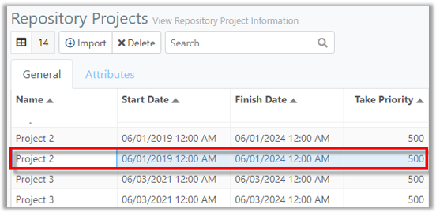
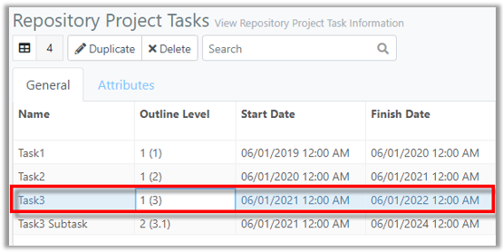
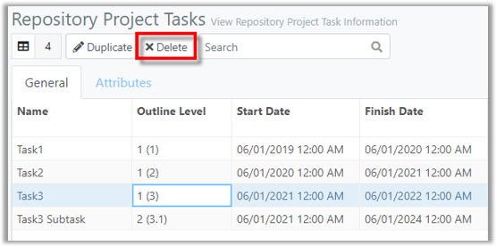
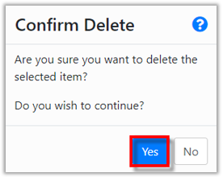
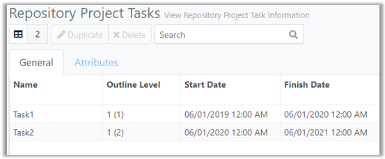

You are here: [Repository](C:/_git/ProModelAutodeskEdition/PorfolioSimulator.Help/wwwroot/Help/Docs/Repository/Repository.md) > Delete Task

---
### _Delete Task_ 

**1.** Select a **Project** in the Repository Projects table that contains a Task to be deleted.

**2.** The associated Tasks populate in the Repository Project Tasks table. Select the **Task** to be deleted. The selected Task is indicated with a blue highlight. **Note: Deleting a Parent Task will also delete any associated Child/Subtasks. In the example below, the user intends to delete a Task containing one Subtask.*

**3.** Select the **Delete button** located in the Repository Project Tasks toolbar.

**4.** A 'Confirm Delete' modal populates. Select **Yes** to continue, and delete the Task.

**5.** The Task and any associated Subtasks are deleted and no longer appear in the Project Repository Tasks table.

##
Related Content: 
- [Repository (overview)](C:/_git/ProModelAutodeskEdition/PorfolioSimulator.Help/wwwroot/Help/Docs/Repository/Repository.md)
- [Excel Import Template](C:/_git/ProModelAutodeskEdition/PorfolioSimulator.Help/wwwroot/Help/Docs/Repository/ExcelImportTemplate/ExcelImportTemplate.md) 
- [Import Project](C:/_git/ProModelAutodeskEdition/PorfolioSimulator.Help/wwwroot/Help/Docs/Repository/ImportProject/ImportProject.md)
- [Delete Project](C:/_git/ProModelAutodeskEdition/PorfolioSimulator.Help/wwwroot/Help/Docs/Repository/DeleteProject/DeleteProject.md) 
- [Search Projects](C:/_git/ProModelAutodeskEdition/PorfolioSimulator.Help/wwwroot/Help/Docs/Repository/SearchProjects/SearchProjects.md) 
- [Duplicate Task](C:/_git/ProModelAutodeskEdition/PorfolioSimulator.Help/wwwroot/Help/Docs/Repository/DuplicateTask/DuplicateTask.md)
- [Search Tasks](C:/_git/ProModelAutodeskEdition/PorfolioSimulator.Help/wwwroot/Help/Docs/Repository/SearchTasks/SearchTasks.md)
- [Attributes](C:/_git/ProModelAutodeskEdition/PorfolioSimulator.Help/wwwroot/Help/Docs/Repository/Attributes/Attributes.md)

##

  &copy; 2020 ProModel Corporation  705 E Timpanogos Parkway  Orem, UT 84097  Support: 888-776-6633  www.promodel.com

