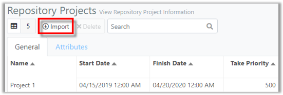
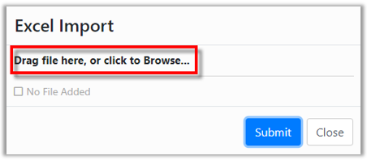
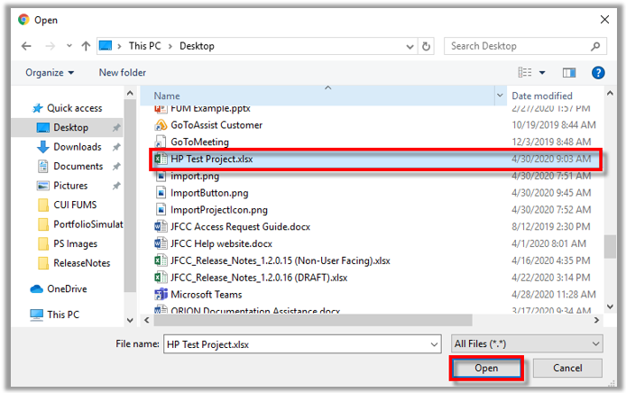
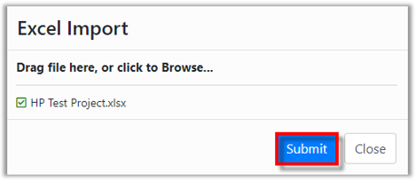
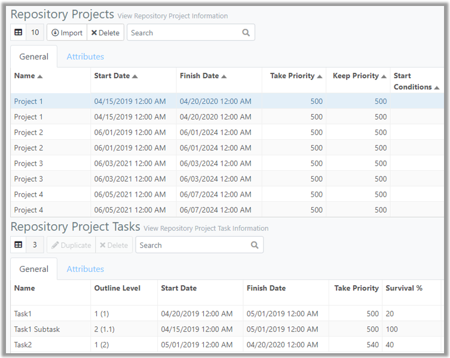

You are here: [Repository](C:/_git/ProModelAutodeskEdition/PorfolioSimulator.Help/wwwroot/Help/Docs/Repository/Repository.md) > Import Project

---
### _Import Project_ 

**1.** Select the **Import button** located in the Repository Projects toolbar. 
  

**2.** The Excel Import modal populates. Drag the desired Excel file to the Excel Import modal (skip step three), or select the text **"click to Browse"**.

**3.** The File Explorer modal populates. Select the desired **Excel spreadsheet**, then select **Open**.

 

**4.** The file is selected for upload in the Excel Import modal. Select **Submit** to import the file.

**5.** An 'Import Job Created' notification populates, as depicted below.

**6.** The Project(s) and associated Task(s) appear in the Repository Projects and Repository Project Tasks tables, as depicted in the image below.

##
Related Content: 
- [Repository (overview)](C:/_git/ProModelAutodeskEdition/PorfolioSimulator.Help/wwwroot/Help/Docs/Repository/Repository.md)
- [Excel Import Template](C:/_git/ProModelAutodeskEdition/PorfolioSimulator.Help/wwwroot/Help/Docs/Repository/ExcelImportTemplate/ExcelImportTemplate.md) 
- [Delete Project](C:/_git/ProModelAutodeskEdition/PorfolioSimulator.Help/wwwroot/Help/Docs/Repository/DeleteProject/DeleteProject.md) 
- [Search Projects](C:/_git/ProModelAutodeskEdition/PorfolioSimulator.Help/wwwroot/Help/Docs/Repository/SearchProjects/SearchProjects.md)
- [Duplicate Task](C:/_git/ProModelAutodeskEdition/PorfolioSimulator.Help/wwwroot/Help/Docs/Repository/DuplicateTask/DuplicateTask.md) 
- [Delete Task](C:/_git/ProModelAutodeskEdition/PorfolioSimulator.Help/wwwroot/Help/Docs/Repository/DeleteTask/DeleteTask.md)
- [Search Tasks](C:/_git/ProModelAutodeskEdition/PorfolioSimulator.Help/wwwroot/Help/Docs/Repository/SearchTasks/SearchTasks.md)
- [Attributes](C:/_git/ProModelAutodeskEdition/PorfolioSimulator.Help/wwwroot/Help/Docs/Repository/Attributes/Attributes.md)

##

  &copy; 2020 ProModel Corporation  705 E Timpanogos Parkway  Orem, UT 84097  Support: 888-776-6633  www.promodel.com

